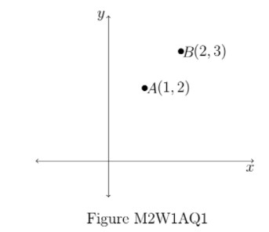
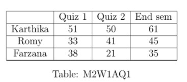
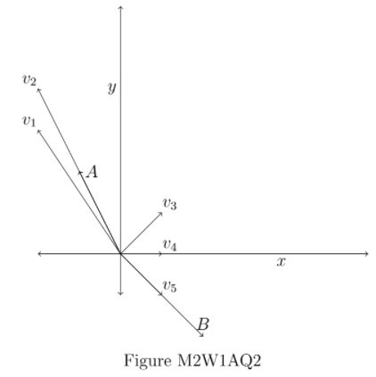

# AQ1.1_ Activity Questions 1 - Not Graded _ IITM Online Degree (4_4_2026 8_44_18 am)

 
**Instructions:
**
 • $(i, j)^{th}$ 
 entry in each given matrix is a real number and scalars are also real numbers.

• If order of a matrix $M$ is not specified, then you may assume that $M$ is a square matrix
of order $2$ or $3$.

4.1 Level 1:

    

 

 
 
 
 
 
 

    

 
 
 
 
 *
 
 
 1 point
 
 *
 
 Choose the set of correct options using Figure M2W1AQ1.

[Hint: Recall that, vector addition and scalar multiplication are done coordinatewise.]
 
 
 
 
 
 
$2A$ is the vector $(2,4)$.
 
 
 
 
 
 
 
$3B$ is the vector $(6,9)$.
 
 
 
 
 
 
 
$A+B$ is the vector $(3,5)$.
 
 
 
 
 
 
 
$A-B$ is the vector $(-1,-1)$.
 
 
 
 
 
###  Yes, the answer is correct. 
Score: 1

### Accepted Answers:

 
$2A$ is the vector $(2,4)$.
 
 
$3B$ is the vector $(6,9)$.
 
 
$A+B$ is the vector $(3,5)$.
 
 
$A-B$ is the vector $(-1,-1)$.
 
 
 
 
 

    

 
 
 
 
 *
 
 
 1 point
 
 *
 
 
Let $V_1=(1,1)$, $V_2=(1,0)$, and $V_3=(0,1)$ be three vectors. Find out the correct set of options.
 
 
 
 
 
 
$(2,3)=2V_1+0V_2+ V_3$
 
 
 
 
 
 
 
$(2,3)=0V_1+2V_2+ 3V_3$
 
 
 
 
 
 
 
$(2,3)=2V_1+V_2+ 0V_3$
 
 
 
 
 
 
 
$(2,3)=0V_1+3V_2+ 2V_3$
 
 
 
 
 
###  Yes, the answer is correct. 
Score: 1

### Accepted Answers:

 
$(2,3)=2V_1+0V_2+ V_3$
 
 
$(2,3)=0V_1+2V_2+ 3V_3$
 
 
 
 
 
 

The marks obtained by Karthika, Romy and Farzana in Quiz 1, Quiz 2 and End sem (with
the maximum marks for each exam being 100) are shown in Table M2W1AQ1.

Use the above information answer questions 3, 4, and 5:

    

 

 
 
 
 
 
 

    

 
 
 
 
 *
 
 
 1 point
 
 *
 
 Choose the following set of correct options.
 
 
 
 
 
 
Marks obtained by Romy in Quiz $1$, Quiz $2$ and End sem represent
a row vector.
 
 
 
 
 
 
 
Quiz $2$ marks of Karthika, Romy and Farzana represent a column
vector.
 
 
 
 
 
 
 
Number of components in column vector representing Quiz $2$ marks
are $9$.
 
 
 
 
 
 
 
Number of components in row vector representing Romy’s marks
are $3$.
 
 
 
 
 
###  Yes, the answer is correct. 
Score: 1

### Accepted Answers:

 
Marks obtained by Romy in Quiz $1$, Quiz $2$ and End sem represent
a row vector.
 
 
Quiz $2$ marks of Karthika, Romy and Farzana represent a column
vector.
 
 
Number of components in row vector representing Romy’s marks
are $3$.
 
 
 
 
 

    

 
 
 
 
 *
 
 
 1 point
 
 *
 
 In order to improve her marks, Farzana undertook project work and succeeded in increasing her marks. Her marks became doubled for each exam. Choose the correct
options.
 
 
 
 
 
 
To obtain the marks obtained by Farzana after completion of the
project, scalar multiplication has to be done by $2$ to the row vector representing
Farzana’s marks.
 
 
 
 
 
 
 
To obtain the marks obtained by Farzana after completion of the
project, scalar multiplication has to be done by $1$ to the row vector representing
Farzana’s marks.
 
 
 
 
 
 
 
After completion of the project the row vector representing Farzana’s
marks is ($76, 42, 70$)
 
 
 
 
 
 
 
After completion of the project the row vector representing Farzana’s
marks is ($76, 21, 35$).
 
 
 
 
 
 
 
After completion of the project the row vector representing Farzana’s
marks is ($66, 82, 90$)
 
 
 
 
 
###  Yes, the answer is correct. 
Score: 1

### Accepted Answers:

 
To obtain the marks obtained by Farzana after completion of the
project, scalar multiplication has to be done by $2$ to the row vector representing
Farzana’s marks.
 
 
After completion of the project the row vector representing Farzana’s
marks is ($76, 42, 70$)
 
 
 
 
 

    

 
 
 
 
 *
 
 
 1 point
 
 *
 
 
Following Farzana's improved marks due to her project (i.e her marks become doubled for each exam), all students were given bonus marks in Quiz 2, which is given by the column vector
$\begin{pmatrix}
10\\
12\\
15
\end{pmatrix}$. What will be the column vector representing the final marks obtained in Quiz 2 by Karthika, Romy and Farzana?
 
 
 
 
 
 
$\begin{pmatrix}
60\\
53\\
57
\end{pmatrix}$
 
 
 
 
 
 
 
$\begin{pmatrix}
60\\
53\\
36
\end{pmatrix}$.
 
 
 
 
 
 
 
$\begin{pmatrix}
61\\
45\\
53
\end{pmatrix}$
 
 
 
 
 
 
 
$\begin{pmatrix}
71\\
57\\
85
\end{pmatrix}$
 
 
 
 
 
###  Yes, the answer is correct. 
Score: 1

### Accepted Answers:

 
$\begin{pmatrix}
60\\
53\\
57
\end{pmatrix}$
 
 
 
 
 
 

4.2 Level 2:

    

 

 
 
 
 
 
 

    

 
 
 
 
 *
 
 
 1 point
 
 *
 
 
Let $A$ and $B$ be two vectors. Which of the following statements is (are) true?
 
 
 
 
 
 
$3A+5B=3(A+B)+[(A+B)-(A-B)]$

 
 
 
 
 
 
 
$3A+5B=5(A+B)-[(A+B)-(A-B)]$

 
 
 
 
 
 
 
$3A+5B=3(A+B)+[(A+B)+(A-B)]$

 
 
 
 
 
 
 
$3A+5B=5(A+B)-[(A+B)+(A-B)]$

 
 
 
 
 
### Partially Correct. 
Score: 0.5

### Accepted Answers:

 
$3A+5B=3(A+B)+[(A+B)-(A-B)]$

 
 
$3A+5B=5(A+B)-[(A+B)+(A-B)]$

 
 
 
 
 

    

 
 
 
 
 *
 
 
 1 point
 
 *
 
 
Let $V_1=(1,0,0)$, $V_2=(0,1,0)$ and $V_3=(0,0,1)$ be three vectors and $a,b, \text{ and } c$ be three real numbers (scalars). Which of the following is (are) true?
 
 
 
 
 
 
$(a,b,c)= aV_1+bV_2+cV_3$
 
 
 
 
 
 
 
$(a,b,c)= abV_1+bcV_2+caV_3$
 
 
 
 
 
 
 
$(a,0,c)= aV_1+cV_2+0V_3$
 
 
 
 
 
 
 
$(a,0,c)= aV_1+0V_2+cV_3$
 
 
 
 
 
###  Yes, the answer is correct. 
Score: 1

### Accepted Answers:

 
$(a,b,c)= aV_1+bV_2+cV_3$
 
 
$(a,0,c)= aV_1+0V_2+cV_3$
 
 
 
 
 

    

 
 
 
 
 *
 
 
 1 point
 
 *
 
 
Consider vectors $A(-1, 2)$ and $B(2, -2)$ in $\mathbb{R}^2$ as shown in Figure M2W1AQ2.

Choose the set of correct options.

[Hint: Recall the geometric representation of vectors, scalar multiplication and vectors addition.]
 
 
 
 
 
 
$v_1$ represents a scalar multiple of $A$.
 
 
 
 
 
 
 
$v_2$ represents a scalar multiple of $A$.
 
 
 
 
 
 
 
$v_5$ represents a scalar multiple of $B$.
 
 
 
 
 
 
 
$v_1$ represents a scalar multiple of $B$.
 
 
 
 
 
 
 
$v_4$ represents a scalar multiple of $A+B$.
 
 
 
 
 
 
 
$v_3$ represents a scalar multiple of $A+B$.`
 
 
 
 
 
###  Yes, the answer is correct. 
Score: 1

### Accepted Answers:

 
$v_2$ represents a scalar multiple of $A$.
 
 
$v_5$ represents a scalar multiple of $B$.
 
 
$v_4$ represents a scalar multiple of $A+B$.
 
 
 
 
 

    

 
 
 
 
 
 
Let $A = (1,1,1)$ and $B = (2,-1,4)$ be two vectors. Suppose $cA + 3B = (4,j,k)$, where $c,j,k$ are real numbers (scalars). Find the value of $c$.
 
 
 
 
 
 
 
 
###  Yes, the answer is correct. 
Score: 1

### Accepted Answers:
(Type: Numeric) -2
 
 
 *
 
 
 1 point
 
 *
 

 
 

    

 
 
 
 
 
 
Let $A = (1,1,1)$ and $B = (2,-1,4)$ be two vectors. Suppose $cA + 3B = (4,j,k)$, where $c,j,k$ are real numbers (scalars). Find the value of $j+k$.
 
 
 
 
 
 
 
 
###  Yes, the answer is correct. 
Score: 1

### Accepted Answers:
(Type: Numeric) 5
 
 
 *
 
 
 1 point
 
 *