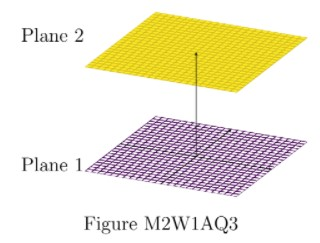
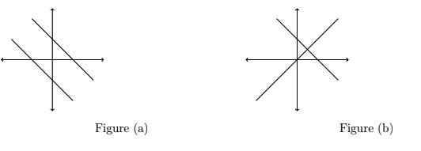
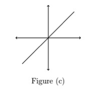

# AQ1.3_ Activity Questions 3 - Not Graded _ IITM Online Degree (4_4_2026 8_47_13 am)

 
3.1 Level 1:

Consider a system of linear equations (System 1):
 

                        $\begin{array} {c c}
 -2x_1+3x_2+x_3 & = 1\\
-x_1+x_3 & = 0\\
2x_2 & = 5
 \end{array}$

Answer questions 1 and 2 based on the above data.

    

 

 
 
 
 
 
 

    

 
 
 
 
 *
 
 
 1 point
 
 *
 
 
If the matrix representation of system (1) is $Ax = b$, where $x=\begin{bmatrix}
x_1\\ x_2\\ x_3
\end{bmatrix}$, then
 
 
 
 
 
 
$A = \begin{bmatrix}
 -2 & 3 & 1\\
 -1 & 0 & 1\\
 0 & 2 & 0
 \end{bmatrix}$
 
 
 
 
 
 
 
$b = \begin{bmatrix}
 5\\
 0\\
 1
 \end{bmatrix}$
 
 
 
 
 
 
 
$A = \begin{bmatrix}
 -2 & -1 & 0\\
 3 & 0 & 2\\
 1 & 1 & 0
 \end{bmatrix}$, and $b = \begin{bmatrix}
 1\\
 0\\
 5
 \end{bmatrix}$
 
 
 
 
 
 
 
$A = \begin{bmatrix}
 -2 & 3 & 1\\
 -1 & 0 & 1\\
 0 & 2 & 0
 \end{bmatrix}$, and $b = \begin{bmatrix}
 1\\
 0\\
 5
 \end{bmatrix}$
 
 
 
 
 
###  Yes, the answer is correct. 
Score: 1

### Targeted Feedback:

- 

 

 

### Feedback:

 

 

### Accepted Answers:

 
$A = \begin{bmatrix}
 -2 & 3 & 1\\
 -1 & 0 & 1\\
 0 & 2 & 0
 \end{bmatrix}$
 
 
$A = \begin{bmatrix}
 -2 & 3 & 1\\
 -1 & 0 & 1\\
 0 & 2 & 0
 \end{bmatrix}$, and $b = \begin{bmatrix}
 1\\
 0\\
 5
 \end{bmatrix}$
 
 
 
 
 

    

 
 
 
 
 *
 
 
 1 point
 
 *
 
 
System (1) has
[Hint: Solve for $x_1, x_2,$ and $x_3$.]
 
 
 
 
 
 a unique solution.
 
 
 
 
 
 
 no solution.
 
 
 
 
 
 
 infinitely many solutions.
 
 
 
 
 
 
 None of the above.
 
 
 
 
 
###  Yes, the answer is correct. 
Score: 1

### Accepted Answers:

 a unique solution.
 
 
 
 
 

    

 
 
 
 
 *
 
 
 1 point
 
 *
 
 
Choose the set of correct options. 
[Hint: Think of $A$ as a $2\times2 \text{ or } 3\times3$ matrix, and $b$ accordingly.]
 
 
 
 
 
 Every system of linear equations has either a unique solution, no solution or infinitely many solutions.
 
 
 
 
 
 
 
If each equation of a system of linear equations is multiplied by a non-zero constant $c$, then the solution of the new system of equations is $c$ times the solution of the old system of equations.
 
 
 
 
 
 
 
If $Ax = b$ is a system of linear equations which has a solution, then the system of linear equations $cAx = b$, where $c\neq 0$, will also have a solution.

 
 
 
 
 
 
 
If $Ax = b$ is a system of linear equations which has a solution, then $\frac{1}{c}Ax = b$, where $c\neq 0$, will also have a solution. 
 
 
 
 
 
###  Yes, the answer is correct. 
Score: 1

### Accepted Answers:

 Every system of linear equations has either a unique solution, no solution or infinitely many solutions.
 
 
If $Ax = b$ is a system of linear equations which has a solution, then the system of linear equations $cAx = b$, where $c\neq 0$, will also have a solution.

 
 
If $Ax = b$ is a system of linear equations which has a solution, then $\frac{1}{c}Ax = b$, where $c\neq 0$, will also have a solution. 
 
 
 
 
 

    

 
 
 
 
 *
 
 
 1 point
 
 *
 
 The Plane 1 and Plane 2 in Figure M2W1AQ3, correspond to two different linear equations, which form a system of linear equations.

The above system of linear equations has

[Hint: If a system of linear equations has a solution, then the point corresponding to
the solution must lie on each plane corresponding to each linear equation of the given
system.]
 
 
 
 
 
 a unique solution.
 
 
 
 
 
 
 no solution.
 
 
 
 
 
 
 infinitely many solutions.
 
 
 
 
 
 
 None of the above.
 
 
 
 
 
###  No, the answer is incorrect. 
Score: 0

### Accepted Answers:

 no solution.
 
 
 
 
 

    

 
 
 
 
 *
 
 
 1 point
 
 *
 
 
Consider the geometric representations (Figures $(a),(b),$ and $(c$)) of three systems of
linear equations.

Choose the set of correct options.

 
 
 
 
 
 
Figure $(a)$ represents a system of linear equations which has no
solution.
 
 
 
 
 
 
 
Figure $(a)$ represents a system of linear equations which has infinitely
many solutions.
 
 
 
 
 
 
 
Figure $(b)$ represents a system of linear equations which has a
unique solution.
 
 
 
 
 
 
 
Figure $(b)$ represents a system of linear equations which has infinitely
many solutions.
 
 
 
 
 
 
 
Figure $(c)$ represents a system of linear equations which has infinitely many solutions.
 
 
 
 
 
 
 
Figure $(c)$ represents a system of linear equations which has no
solution.
 
 
 
 
 
###  Yes, the answer is correct. 
Score: 1

### Accepted Answers:

 
Figure $(a)$ represents a system of linear equations which has no
solution.
 
 
Figure $(b)$ represents a system of linear equations which has a
unique solution.
 
 
Figure $(c)$ represents a system of linear equations which has infinitely many solutions.
 
 
 
 
 
 

3.2 Level 2:

    

 

 
 
 
 
 
 

    

 
 
 
 
 *
 
 
 1 point
 
 *
 
 
Consider a system of equations:
$\begin{aligned}
 2x_1+3x_2 & = 6\\
 -2x_1+kx_2 & = d\\
 4x_1+6x_2 & = 12
\end{aligned}$
Choose the set of correct options.
 
 
 
 
 
 
$Ax = b$ represents the above system, where $x = \begin{bmatrix} 
 x_1\\
 x_2
 \end{bmatrix}$,$A = \begin{bmatrix} 
 2 & 3\\
 -2 & k\\
 4 & 6
 \end{bmatrix}$, and $b = \begin{bmatrix} 
 6\\
 d\\
 12
 \end{bmatrix}$
 
 
 
 
 
 
 
The system has no solution if $k = -3$, $d = 0$.

 
 
 
 
 
 
 
The system has a unique solution if $k = 3$, $d = 0$.
 
 
 
 
 
 
 
The system has infinitely many solutions if $k = -3$, $d = 6$.
 
 
 
 
 
 
 
The system has infinitely many solutions if $k = -3$, $d = -6$.
 
 
 
 
 
###  No, the answer is incorrect. 
Score: 0

### Accepted Answers:

 
$Ax = b$ represents the above system, where $x = \begin{bmatrix} 
 x_1\\
 x_2
 \end{bmatrix}$,$A = \begin{bmatrix} 
 2 & 3\\
 -2 & k\\
 4 & 6
 \end{bmatrix}$, and $b = \begin{bmatrix} 
 6\\
 d\\
 12
 \end{bmatrix}$
 
 
The system has no solution if $k = -3$, $d = 0$.

 
 
The system has a unique solution if $k = 3$, $d = 0$.
 
 
The system has infinitely many solutions if $k = -3$, $d = -6$.
 
 
 
 
 

    

 
 
 
 
 *
 
 
 1 point
 
 *
 
 
Let $x_1$ and $x_2$ be solutions of the system of linear equations $Ax=b$. Which of the following options are correct? 

 
 
 
 
 
 
$x_1+x_2$ is a solution of the system of linear equations $Ax=b$.
 
 
 
 
 
 
 
$x_1+x_2$ is a solution of the system of linear equations $Ax=2b$.
 
 
 
 
 
 
 
$x_1-x_2$ is a solution of the system of linear equations $Ax=b$.
 
 
 
 
 
 
 
$x_1-x_2$ is a solution of the system of linear equations $Ax=0$.
 
 
 
 
 
###  No, the answer is incorrect. 
Score: 0

### Accepted Answers:

 
$x_1+x_2$ is a solution of the system of linear equations $Ax=2b$.
 
 
$x_1-x_2$ is a solution of the system of linear equations $Ax=0$.
 
 
 
 
 

    

 
 
 
 
 *
 
 
 1 point
 
 *
 
 
Let $v$ be a solution of the systems of linear equations $A_1x=b$ and $A_2x=b$. Which of the following options are correct ?
 
 
 
 
 
 
$v$ is a solution of the system of linear equations $(A_1+A_2)x=b$.

 
 
 
 
 
 
 
$v$ is a solution of the system of linear equations $(A_1+A_2)x=2b$.

 
 
 
 
 
 
 
$v$ is a solution of the system of linear equations $(A_1-A_2)x=0$.

 
 
 
 
 
 
 
$v$ is a solution of the system of linear equations $(A_1-A_2)x=b$.

 
 
 
 
 
###  No, the answer is incorrect. 
Score: 0

### Accepted Answers:

 
$v$ is a solution of the system of linear equations $(A_1+A_2)x=2b$.

 
 
$v$ is a solution of the system of linear equations $(A_1-A_2)x=0$.

 
 
 
 
 

    

 
 
 
 
 
 
Consider a system of equations:
$\begin{aligned}
 x_1-3x_2 & = 4\\
 3x_1+kx_2 & = -12
\end{aligned}$
Where $k \in \mathbb{R}$. If the given system has a unique solution, then $k$ should not be equal to 

 
 
 
 
 
 
 
 
###  No, the answer is incorrect. 
Score: 0

### Accepted Answers:
(Type: Numeric) -9
 
 
 *
 
 
 1 point
 
 *
 

 
 

    

 
 
 
 
 
 
Consider two system of linear equations:
System 1:

                   $\begin{aligned}
 x_1+2x_2 & = -5\\
 0x_1-x_2 & = 5
\end{aligned}$

System 2: 

                   $\begin{aligned}
 -2x_3+x_4 & = -5\\
 3x_3+x_4 & = 5
\end{aligned}$

Suppose there is another system of linear equation given by
$\begin{aligned}
 (1-2)(x_1+x_3) + (2+1)(x_2+x_4) & = m\\(0+3)(x_1+x_3) + (-1+1)(x_2+x_4) & = n
\end{aligned}$

for some real values of $m$ and $n$. Find the value of $n-m$.
 
 
 
 
 
 
 
 
###  No, the answer is incorrect. 
Score: 0

### Accepted Answers:
(Type: Numeric) 46
 
 
 *
 
 
 1 point
 
 *