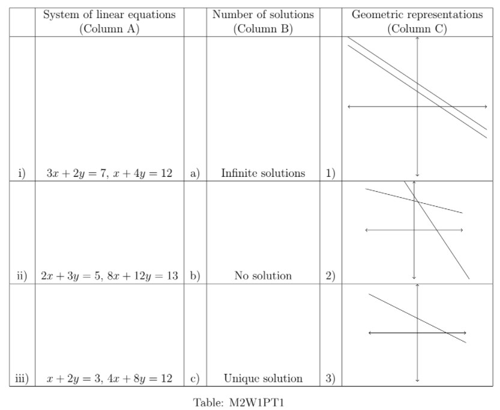
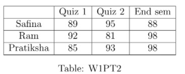
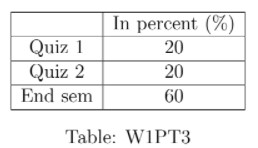

# Practice assignment 1 - Not Graded _ IITM Online Degree (4_4_2026 8_51_49 am)

 
Multiple Select Questions (MSQ):

    

 

 
 
 
 
 
 

    

 
 
 
 
 *
 
 
 1 point
 
 *
 
 Match the systems of linear equations in Column A with their number of solutions in Column B and their geometric representation in Column C.

 
 
 
 
 
 
i) $\rightarrow$ c) $\rightarrow$ 2) 

 
 
 
 
 
 
 
i) $\rightarrow$ a) $\rightarrow$ 1) 

 
 
 
 
 
 
 
ii) $\rightarrow$ c) $\rightarrow$ 3) 

 
 
 
 
 
 
 
iii) $\rightarrow$ a) $\rightarrow 2)$ 

 
 
 
 
 
 
 
ii) $\rightarrow$ b) $\rightarrow$ 1)
 
 
 
 
 
###  No, the answer is incorrect. 
Score: 0

### Accepted Answers:

 
i) $\rightarrow$ c) $\rightarrow$ 2) 

 
 
ii) $\rightarrow$ b) $\rightarrow$ 1)
 
 
 
 
 

    

 
 
 
 
 *
 
 
 1 point
 
 *
 
 Choose the set of correct options

 
 
 
 
 
 
If both $A$ and $B$ are $2\times2$ real matrices and $det(AB) = 0$, then $det(A) = 0$ or $det(B) = 0$. 

 
 
 
 
 
 
 
If $A$ is a $3\times3$ real matrix with non-zero determinant and $k$ is some real number, then $det(k~A) = k^3\times det(A)$.

 
 
 
 
 
 
 
If $A=\begin{bmatrix}
2 & 2 \\
0 & 2
\end{bmatrix}$,
then $A^{10} = 2^{10}\begin{bmatrix}
1 & 10 \\
0 & 1
\end{bmatrix}$ (where $A^n$ is the matrix $A\times A \times \ldots \times A$, $n$-times).

 
 
 
 
 
 
 
The number of scalar additions to be done to compute the matrix $AB$, where $A$ is a $3\times2$ matrix and $B$ is a $2\times3$ matrix, is 9.

 
 
 
 
 
###  No, the answer is incorrect. 
Score: 0

### Accepted Answers:

 
If both $A$ and $B$ are $2\times2$ real matrices and $det(AB) = 0$, then $det(A) = 0$ or $det(B) = 0$. 

 
 
If $A$ is a $3\times3$ real matrix with non-zero determinant and $k$ is some real number, then $det(k~A) = k^3\times det(A)$.

 
 
If $A=\begin{bmatrix}
2 & 2 \\
0 & 2
\end{bmatrix}$,
then $A^{10} = 2^{10}\begin{bmatrix}
1 & 10 \\
0 & 1
\end{bmatrix}$ (where $A^n$ is the matrix $A\times A \times \ldots \times A$, $n$-times).

 
 
The number of scalar additions to be done to compute the matrix $AB$, where $A$ is a $3\times2$ matrix and $B$ is a $2\times3$ matrix, is 9.

 
 
 
 
 

    

 
 
 
 
 *
 
 
 1 point
 
 *
 
 Choose the set of correct options
 
 
 
 
 
 
 
A triangular $3\times 3$ matrix has non-zero determinant if and only if all the diagonal entries are non-zero.
 
 
 
 
 
 
 
 
If $A$ and $B$ are $3\times 3$ matrices then $det(A+B) = det(A) + det(B)$.
 
 
 
 
 
 
 
 
If $A$ is a $3\times3$ matrix and $B$ is a matrix obtained from $A$ by multiplying each column of $A$ by its column number, then $det(B) = 6det(A)$.
 
 
 
 
 
 
 
 
If the sum of the first and the third row vectors of a $3\times 3$
matrix A is equal to the second row vector of $A$, then $det (A) = 0$.

 
 
 
 
 
###  No, the answer is incorrect. 
Score: 0

### Accepted Answers:

 
A triangular $3\times 3$ matrix has non-zero determinant if and only if all the diagonal entries are non-zero.
 
 
 
If $A$ is a $3\times3$ matrix and $B$ is a matrix obtained from $A$ by multiplying each column of $A$ by its column number, then $det(B) = 6det(A)$.
 
 
 
If the sum of the first and the third row vectors of a $3\times 3$
matrix A is equal to the second row vector of $A$, then $det (A) = 0$.

 
 
 
 
 

    

 
 
 
 
 *
 
 
 1 point
 
 *
 
 
Mahesh bought 2 kg potato and $c$ kg dal from a shop, and paid **₹** 200 to the shopkeeper. Gaurav bought 4 kg potato and 4 kg dal, and paid **₹** $d$ to the shopkeeper.
 If $x_1$ represents the price of 1 kg potato and $x_2$ represents the price of 1 kg dal, then
 choose the set of correct options.

 
 
 
 
 
 
The matrix representation to find $x_1$ and $x_2$ is $\begin{bmatrix}
2 & 4 \\
4 & c 
\end{bmatrix} \begin{bmatrix}
x_1 \\x_2
\end{bmatrix}=\begin{bmatrix}
200 \\
d
\end{bmatrix}$

 
 
 
 
 
 
 
The matrix representation to find $x_1$ and $x_2$ is 
$\begin{bmatrix}
2 & c \\
4 & 4 
\end{bmatrix} \begin{bmatrix}
x_1 \\
x_2
\end{bmatrix}=\begin{bmatrix}
200 \\
d
\end{bmatrix}$

 
 
 
 
 
 
 
If Mahesh tries to find the price of 1 kg potato and 1 kg dal using appropriate matrix representation by taking $c=2$ and $d=400$, then the price of 1 kg potato that he thus arrives at, will not be unique.

 
 
 
 
 
 
 
If Mahesh tries to find the price of 1 kg potato and 1 kg dal using appropriate matrix representation by taking $c=2$ and $d=400$, then the price of 1 kg potato that he thus arrives at, will be unique.

 
 
 
 
 
 
 
If Mahesh tries to find the price of 1 kg potato and 1 kg dal using the appropriate matrix representation by taking $c=2$ and $d\neq 400$, then he will be able to find the price (as a numerical value) of 1 kg potato. 

 
 
 
 
 
 
 
If Mahesh tries to find the price of 1 kg potato and 1 kg dal using the appropriate matrix representation by taking $c=2$ and $d \neq 400$, then he will fail to find the price (as a numerical value) of 1 kg potato.
 
 
 
 
 
###  No, the answer is incorrect. 
Score: 0

### Accepted Answers:

 
The matrix representation to find $x_1$ and $x_2$ is 
$\begin{bmatrix}
2 & c \\
4 & 4 
\end{bmatrix} \begin{bmatrix}
x_1 \\
x_2
\end{bmatrix}=\begin{bmatrix}
200 \\
d
\end{bmatrix}$

 
 
If Mahesh tries to find the price of 1 kg potato and 1 kg dal using appropriate matrix representation by taking $c=2$ and $d=400$, then the price of 1 kg potato that he thus arrives at, will not be unique.

 
 
If Mahesh tries to find the price of 1 kg potato and 1 kg dal using the appropriate matrix representation by taking $c=2$ and $d \neq 400$, then he will fail to find the price (as a numerical value) of 1 kg potato.
 
 
 
 
 

    

 
 
 
 
 *
 
 
 1 point
 
 *
 
 The marks obtained by Safina, Ram and Pratiksha in Quiz 1, Quiz 2 and End sem (with the maximum marks for each exam being 100) are shown in Table W1PT2.

                     

The weightage of marks in final grade(in percent) of Quiz 1, Quiz 2, and End sem is shown in Table W1PT3.

                                       

Choose the set of correct options.
 
 
 
 
 
 
Final grades (in 100) of Safina, Ram and Pratiksha can be represented by the matrix: 

                                                     $\begin{bmatrix}
93.4\\
94.4 \\
89.6
\end{bmatrix}$

 
 
 
 
 
 
 
Final grades (in 100) of Safina, Ram and Pratiksha can be represented by the matrix : 

                                                        $\begin{bmatrix}
89.6 \\
93.4\\
94.4
\end{bmatrix}$

 
 
 
 
 
 
 
The order of the matrix which represents final grades(in 100) of Safina, Ram and Pratiksha is $3 \times1$

 
 
 
 
 
 
 
If bonus marks given to Safina, Ram and Pratiksha are represented by the following matrix $\begin{bmatrix}
1.4 \\
2.6 \\
0 
\end{bmatrix}$ then the overall final grades (in 100) can be represented by the matrix: 

                                                     $\begin{bmatrix}
91\\
96 \\
94.4
\end{bmatrix}$

 
 
 
 
 
###  No, the answer is incorrect. 
Score: 0

### Accepted Answers:

 
Final grades (in 100) of Safina, Ram and Pratiksha can be represented by the matrix : 

                                                        $\begin{bmatrix}
89.6 \\
93.4\\
94.4
\end{bmatrix}$

 
 
The order of the matrix which represents final grades(in 100) of Safina, Ram and Pratiksha is $3 \times1$

 
 
If bonus marks given to Safina, Ram and Pratiksha are represented by the following matrix $\begin{bmatrix}
1.4 \\
2.6 \\
0 
\end{bmatrix}$ then the overall final grades (in 100) can be represented by the matrix: 

                                                     $\begin{bmatrix}
91\\
96 \\
94.4
\end{bmatrix}$

 
 
 
 
 
 

Numerical Answer Type (NAT):

    

 

 
 
 
 
 
 

    

 
 
 
 
 
 
Let $A$ be a $3\times 3$ matrix with non-zero determinant and $B$ be a matrix obtained by adding 5 times of first row of$A$ to the third row of $A$ and adding 10 times of second row of $A$ to the first row of $A$.What is the value of $det(2AB^{-1})$?
 
 
 
 
 
 
 
 
###  No, the answer is incorrect. 
Score: 0

### Accepted Answers:
(Type: Numeric) 8
 
 
 *
 
 
 1 point
 
 *
 

 
 
 

    

 

 
 
 
 
 
 

    

 
 
 
 
 
 
If $A= \begin{bmatrix} 4 & 6 & 10 \\ 1 & 4 & -5 \\4 & 1 & 10 \end{bmatrix}$,then find $det(A)$.
 
 
 
 
 
 
 
 
###  No, the answer is incorrect. 
Score: 0

### Accepted Answers:
(Type: Numeric) -150
 
 
 *
 
 
 1 point
 
 *
 

 
 
 

Comprehension Type Question:

(Use the below information for question 8, 9 and 10)
A shopkeeper sells three types of clothes- shirts, jeans, and T- shirts- in three different sizes: small, medium, and large. In a week, he sold 1 small, 1 medium and 2 large sized shirts; 2 small, $c$ medium and 6 large sized jeans, and 1 small, 3 medium and $c-5$ large sized T-shirts (where $c$ is an integer). The price of shirts, jeans, and T-shirts remain the same for different sizes (i.e., small, medium, and large sized shirts have the same price; similarly, small, medium, large sized jeans have the same price; and small, medium, large sized T-shirts have same price). The shopkeeper earned **₹**7 , **₹**27 and **₹**43 (in thousand) in that week, for small, medium, and large sized clothes respectively.

    

 

 
 
 
 
 
 

    

 
 
 
 
 
 
Let $s, j, t$ represents the price (in thousand) of 1 shirt, 1 jeans and 1 T-shirt respectively and we want to find $s, j, t$ by solving a system of linear equations represented by the matrix form $Ax=b$, where $x=(s,j,t)^T$ and $b = (7, 27, 43)^T$. If sum of entries in the first row of $A$ is $p$, sum of entries in the second row of $A$ is $q$ and sum of entries in the third row of $A$ is $r$ (take the topmost row as the fist row ), then find the value of $p+q-r$.
 
 
 
 
 
 
 
 
###  No, the answer is incorrect. 
Score: 0

### Accepted Answers:
(Type: Numeric) 5
 
 
 *
 
 
 1 point
 
 *
 

 
 

    

 
 
 
 
 
 
If $det(A) = 122$, then how many medium sized jeans were sold in the week?
 
 
 
 
 
 
 
 
###  No, the answer is incorrect. 
Score: 0

### Accepted Answers:
(Type: Numeric) 16
 
 
 *
 
 
 1 point
 
 *
 

 
 

    

 
 
 
 
 
 
If $A$ is the matrix as above (in question 8) and $det(A) = 122$, then what is the price(in thousand) of a T-shirt, where price (in thousand) of a shirt is 2 and price (in thousand) of a jeans is 1? 
 
 
 
 
 
 
 
 
###  No, the answer is incorrect. 
Score: 0

### Accepted Answers:
(Type: Numeric) 3
 
 
 *
 
 
 1 point
 
 *