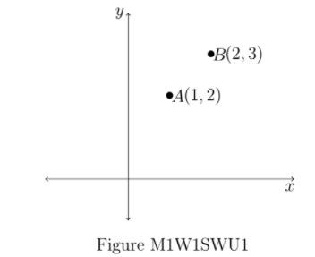

# Solve with us 1.1 - Not Graded _ IITM Online Degree (4_4_2026 8_51_23 am)

 
**Key Points:**

- ** **Vectors in $\mathbb{R}^2$ are represented by ordered pairs $(a,b)$.
-  The first element in the ordered pair denotes the $X$-coordinate and the second one denotes the $Y$-coordinate in the Cartesian plane. 
-  The addition of two vectors $v_1 = (x_1, y_1) \text{ and } v_2 = (x_2, y_2) \in \mathbb{R}^2$, is given by $v_1 + v_2 =(x_1 +x_2, y_1+y_2)$.

-  The scalar multiplication of a vector $v = (x, y) \in \mathbb{R}^2$ with a scalar $c \in \mathbb{R}$, is given by $cv = (cx, cy)$.

    

 

 
 
 
 
 
 

    

 
 
 
 
 *
 
 
 1 point
 
 *
 
 
Let $v_1=(2,-4)$ and $v_2=(-1,2)$ be two vectors in $\mathbb{R}^2$. Which of the following options are true?

[Hint: Recall that vector addition and scalar multiplication are done coordinatewise.]

 
 
 
 
 
 
$2v_2=(-2,4)$
 
 
 
 
 
 
 
$\frac{1}{2}v_1=(1,-2)$
 
 
 
 
 
 
 
$v_1+2v_2=(0,0)$

 
 
 
 
 
 
 
$2v_1+v_2=(0,0)$
 
 
 
 
 
###  No, the answer is incorrect. 
Score: 0

### Accepted Answers:

 
$2v_2=(-2,4)$
 
 
$\frac{1}{2}v_1=(1,-2)$
 
 
$v_1+2v_2=(0,0)$

 
 
 
 
 

    

 
 
 
 
 *
 
 
 1 point
 
 *
 
 Choose the set of correct options using Figure M2W1SWU1.

[Hint: Recall that vector addition and scalar multiplication are done coordinate-wise.]
 
 
 
 
 
 
$2A$ is the vector ($2, 4$).
 
 
 
 
 
 
 
$3B$ is the vector ($6, 9$).
 
 
 
 
 
 
 
$A + B$ is the vector ($3, 5$).
 
 
 
 
 
 
 
$A − B$ is the vector ($−1, −1$).
 
 
 
 
 
###  No, the answer is incorrect. 
Score: 0

### Accepted Answers:

 
$2A$ is the vector ($2, 4$).
 
 
$3B$ is the vector ($6, 9$).
 
 
$A + B$ is the vector ($3, 5$).
 
 
$A − B$ is the vector ($−1, −1$).
 
 
 
 
 
 

2. Key points:

-  The addition of two vectors$V_₁ = (a_1, b_1, C_1)$ and $V_2 = (a_2, b_2, C_2)$are done coordinate-wise, as follows:

-                                 $V_1+V_2 = (a_1, b_1, C_₁) + (a_2, b_2, C_2) = (a_1+a_2, b_₁+ b_2, C_1+C_2)$

-    The scalar multiplication of a vector $V=(a,b,c)$ by a scalar $\alpha$ is given by:   

                         $\alpha (a,b,c)= (\alpha a, \alpha b, \alpha c)$

    

 

 
 
 
 
 
 

    

 
 
 
 
 *
 
 
 1 point
 
 *
 
 
Let $V_1=(1,0,0)$, $V_2=(0,1,0)$ and $V_3=(0,0,1)$ be three vectors and $a,b, \text{ and } c$ be three real numbers (scalars). Then, which of the following is (are) true?

 
 
 
 
 
 
$(a,b,c)= aV_1+bV_2+cV_3$
 
 
 
 
 
 
 
$(a,b,c)= abV_1+bcV_2+caV_3$
 
 
 
 
 
 
 
$(a,0,c)=aV_1+cV_2+0V_3$

 
 
 
 
 
 
 
$(a,0,c)=aV_1+0V_2+cV_3$
 
 
 
 
 
###  No, the answer is incorrect. 
Score: 0

### Accepted Answers:

 
$(a,b,c)= aV_1+bV_2+cV_3$
 
 
$(a,0,c)=aV_1+0V_2+cV_3$
 
 
 
 
 
 

**3. Key Points:
**
- **  **Addition of matrices $A=\begin{bmatrix}
 a_{11} & a_{12} & a_{13} \\
 a_{21} & a_{22} & a_{23} \\
 a_{31} & a_{32} & a_{33}
 \end{bmatrix}$ and $B=\begin{bmatrix}
 b_{11} & b_{12} & b_{13} \\
 b_{21} & b_{22} & b_{23} \\
 b_{31} & b_{32} & b_{33}
 \end{bmatrix}$ is given by 

              $A+B=\begin{bmatrix}
 a_{11}+b_{11} & a_{12}+b_{12} & a_{13}+b_{13} \\
 a_{21}+b_{21} & a_{22}+b_{22} & a_{23}+b_{23} \\
 a_{31}+b_{31} & a_{32}+b_{32} & a_{33}+b_{33}
 \end{bmatrix}$ 

- If $R=\begin{bmatrix}
 a & b & c
 \end{bmatrix}$ and $C=\begin{bmatrix}
 d\\ e \\f
 \end{bmatrix}$, then the product $RC$ is given by
              $\begin{bmatrix} 
 ad+be+cf
 \end{bmatrix}$

- ** **Suppose $A=\begin{bmatrix}
 R_1 \\ R_2 
 \end{bmatrix}$ and $B=\begin{bmatrix} 
 C_1 & C_2 & C_3
 \end{bmatrix}$, where $R_i$'s denote the rows of matrix $A$ and $C_i$'s denote the columns of matrix $B$. Moreover, assume that the number of columns of $A$ and the number of rows of $B$ are the same. The product $AB$ is given by,
                $AB= \begin{bmatrix}
 R_1C_1 & R_1C_2 & R_1C_3 \\
 R_2C_1 & R_2C_2 & R_2C_3 
 \end{bmatrix}$ 

- ** **Addition of two matrices $A$ and $B$ is defined if both $A$ and $B$ have the same number of rows and the same number of columns. If both the matrices $A$ and $B$ have $m$ rows and $n$ columns, then the matrix $A+B$ also has $m$ rows and $n$ columns

- If $A$ is an $m\times n$ matrix and $B$ is an $n\times p$ matrix, then $AB$ is well-defined and is an $m\times p$ matrix.

    

 

 
 
 
 
 
 

    

 
 
 
 
 *
 
 
 1 point
 
 *
 
 
Suppose $P = \begin{bmatrix}
 3 & -1 & 7\\
 4 & 0 & 1\\
 2 & -5 & 2\\
 \end{bmatrix}$, $Q = \begin{bmatrix}
 1 & 4 & -9\\
 \end{bmatrix}$, $R =\begin{bmatrix}
 0 & -3 & 10\\
 \end{bmatrix}$, $D = \begin{bmatrix}
 -2\\
 4\\
 5\\
 \end{bmatrix}$

 [Hint: If $A$ is a matrix of order $m\times n$ and $B$ is a matrix of order $n\times p$, then the order of $AB$ is $m \times p$.]
 
 
 
 
 
 
The matrix $P D$ is of order $3 × 1.$
 
 
 
 
 
 
 
The matrix $P D$ is of order $1 × 3.$
 
 
 
 
 
 
 
The matrix $Q D$ is of order $3 × 3.$
 
 
 
 
 
 
 
The matrix $Q D$ is of order $1 × 1.$
 
 
 
 
 
 
 
The matrix $D Q$ is of order $3 × 3.$
 
 
 
 
 
 
 
The matrix $D Q$ is of order $1 × 1.$
 
 
 
 
 
 
 
The product $QD$ is not defined.
 
 
 
 
 
 
 
The product $QR$ is not defined.
 
 
 
 
 
 
 
The addition $P + Q$ is not defined.
 
 
 
 
 
 
 
The addition $P + D$ is not defined.
 
 
 
 
 
###  No, the answer is incorrect. 
Score: 0

### Feedback:
• P is a 3 × 3 matrix, D is a 3 × 1 matrix. Think about the order of P D.

• Q is a 1 × 3 matrix, D is a 3 × 1 matrix. Think about the order of QD and
DQ.

• Q is a 1 × 3 matrix, R is a 1 × 3 matrix. Think whether is it possible to define
QR or not.

• Figure out which pair of matrices has the same number of rows as well as the
same number of columns.
### Accepted Answers:

 
The matrix $P D$ is of order $3 × 1.$
 
 
The matrix $Q D$ is of order $1 × 1.$
 
 
The matrix $D Q$ is of order $3 × 3.$
 
 
The product $QR$ is not defined.
 
 
The addition $P + Q$ is not defined.
 
 
The addition $P + D$ is not defined.
 
 
 
 
 

    

 
 
 
 
 *
 
 
 1 point
 
 *
 
 
Suppose $A=\begin{bmatrix}
 1 & 0 & 2 \\
 0 & 2 & 5 \\
 3 & 3 & 4
 \end{bmatrix}$ and $B=\begin{bmatrix}
 1 & 0 & 3 \\
 0 & 2 & 3 \\
 2 & 5 & 4
 \end{bmatrix}$. Which of the following options are correct?

 [Hint: Multiplication of matrices $A=\begin{bmatrix}
 a_{11} & a_{12} & a_{13} \\
 a_{21} & a_{22} & a_{23} \\
 a_{31} & a_{32} & a_{33}
 \end{bmatrix}$ and $B=\begin{bmatrix}
 b_{11} & b_{12} & b_{13} \\
 b_{21} & b_{22} & b_{23} \\
 b_{31} & b_{32} & b_{33}
 \end{bmatrix}$ is given by 
 $AB= \begin{bmatrix}
 a_{11}b_{11}+a_{12}b_{21}+a_{13}b_{31} & a_{11}b_{12}+a_{12}b_{22}+a_{13}b_{32} & a_{11}b_{13}+a_{12}b_{23}+a_{13}b_{33} \\
 a_{21}b_{11}+a_{22}b_{21}+a_{23}b_{31} & a_{21}b_{12}+a_{22}b_{22}+a_{23}b_{32} & a_{21}b_{13}+a_{22}b_{23}+a_{23}b_{33} \\
 a_{31}b_{11}+a_{32}b_{21}+a_{33}b_{31} & a_{31}b_{12}+a_{32}b_{22}+a_{33}b_{32} & a_{31}b_{13}+a_{32}b_{23}+a_{33}b_{33} 
 \end{bmatrix}$
 Similarly, $BA$  can be calculated.
 ]
 
 
 
 
 
 
$AB=\begin{bmatrix}
 5 & 10 & 11 \\
 10 & 26 & 29 \\
 11 & 29 & 34
 \end{bmatrix}$
 
 
 
 
 
 
 
$AB=\begin{bmatrix}
 5 & 10 & 11 \\
 10 & 29 & 26 \\
 11 & 26 & 34
 \end{bmatrix}$
 
 
 
 
 
 
 
$BA=\begin{bmatrix}
 10 & 9 & 14 \\
 9 & 13 & 22 \\
 14 & 22 & 45
 \end{bmatrix}$
 
 
 
 
 
 
 
$BA=\begin{bmatrix}
 10 & 9 & 14 \\
 9 & 22 & 13 \\
 14 & 13 & 45
 \end{bmatrix}$
 
 
 
 
 
###  No, the answer is incorrect. 
Score: 0

### Feedback:
Observe that B = AT
(where AT denotes the transpose of A). 
### Accepted Answers:

 
$AB=\begin{bmatrix}
 5 & 10 & 11 \\
 10 & 29 & 26 \\
 11 & 26 & 34
 \end{bmatrix}$
 
 
$BA=\begin{bmatrix}
 10 & 9 & 14 \\
 9 & 13 & 22 \\
 14 & 22 & 45
 \end{bmatrix}$
 
 
 
 
 

    

 
 
 
 
 *
 
 
 1 point
 
 *
 
 
Suppose $A=\begin{bmatrix}
 1 & 0 \\
 0 & -1 
 \end{bmatrix}$ and $B=\begin{bmatrix}
 0 & 1 \\
 0 & 0 
 \end{bmatrix}$
 Which of the following options are true?

 [Hint: Calculate $A^2$ and $B^2$]
 
 
 
 
 
 
$A^2=I$
 
 
 
 
 
 
 
 
$A^2=A$
 
 
 
 
 
 
 
$B^2=I$
 
 
 
 
 
 
 
$B^2=0$

 
 
 
 
 
###  No, the answer is incorrect. 
Score: 0

### Feedback:
Correctly solving this question will give a hint to solve Week 4 Lecture 1.2 :

Activity Question 6.
### Accepted Answers:

 
$A^2=I$
 
 
 
$B^2=0$

 
 
 
 
 
 

**4. Key points:
**
- Consider a system of linear equations as follows:
                             $\begin{aligned}
 a_{11}x_1+ a_{12}x_2+ a_{13}x_3 = b_1\\
 a_{21}x_1+ a_{22}x_2+ a_{23}x_3 = b_2\\
 a_{31}x_1+ a_{32}x_2+ a_{33}x_3 = b_3
\end{aligned}$
Let the matrix representation of the above system be $Ax=b$, where $A=\begin{bmatrix}
a_{11} & a_{12} & a_{13} \\
a_{21} & a_{22} & a_{23} \\
a_{31} & a_{32} & a_{33}
\end{bmatrix}$, 
                    $x=\begin{bmatrix}
x_1 \\
x_2 \\
x_3
\end{bmatrix}$, and $b=\begin{bmatrix}
b_1 \\
b_2 \\
b_3
\end{bmatrix}$.

-   $A$ is called $\textit{Coefficient matrix}$. 

-   Suppose there are $m$ number of equations and $n$ number of variables in the system of linear equations, then the coefficient matrix will be an $m\times n$ matrix, $x$ will be an $n\times 1$ and $b$ will be an $m \times 1$ matrix.

    

 

 
 
 
 
 
 

    

 
 
 
 
 *
 
 
 1 point
 
 *
 
 
Consider a system of linear equations (System 1):
 

                        $\begin{array} {c c}
 -2x_1+3x_2+x_3 & = 1\\
-x_1+x_3 & = 0\\
2x_2 & = 5
 \end{array}$

If the matrix representation of system (1) is $Ax = b$, where $x=\begin{bmatrix}
x_1\\ x_2\\ x_3
\end{bmatrix}$, then

[Hint: If a variable is absent in an equation then the coefficient of the variable must
be taken as 0.]
 
 
 
 
 
 
$A = \begin{bmatrix}
 -2 & 3 & 1\\
 -1 & 0 & 1\\
 0 & 2 & 0
 \end{bmatrix}$
 
 
 
 
 
 
 
$b = \begin{bmatrix}
 5\\
 0\\
 1
 \end{bmatrix}$
 
 
 
 
 
 
 
$A = \begin{bmatrix}
 -2 & -1 & 0\\
 3 & 0 & 2\\
 1 & 1 & 0
 \end{bmatrix}$, and $b = \begin{bmatrix}
 1\\
 0\\
 5
 \end{bmatrix}$
 
 
 
 
 
 
 
$A = \begin{bmatrix}
 -2 & 3 & 1\\
 -1 & 0 & 1\\
 0 & 2 & 0
 \end{bmatrix}$, and $b = \begin{bmatrix}
 1\\
 0\\
 5
 \end{bmatrix}$
 
 
 
 
 
###  No, the answer is incorrect. 
Score: 0

### Accepted Answers:

 
$A = \begin{bmatrix}
 -2 & 3 & 1\\
 -1 & 0 & 1\\
 0 & 2 & 0
 \end{bmatrix}$
 
 
$A = \begin{bmatrix}
 -2 & 3 & 1\\
 -1 & 0 & 1\\
 0 & 2 & 0
 \end{bmatrix}$, and $b = \begin{bmatrix}
 1\\
 0\\
 5
 \end{bmatrix}$
 
 
 
 
 

    

 
 
 
 
 *
 
 
 1 point
 
 *
 
 
Consider a system of equations:

                $\begin{aligned}
 2x_1+3x_2 & = 6\\
 -2x_1+kx_2 & = d\\
 4x_1+6x_2 & = 12
\end{aligned}$

Choose the set of correct options.

[Hint: Observe that third equation is a multiple of the first one (Dividing by 2 from
both the sides of the third equation gives the first equation). So it is enough to
check the solutions for the first and second equation.]
 
 
 
 
 
 
$Ax = b$ represents the above system, where $x = \begin{bmatrix} 
 x_1\\
 x_2
 \end{bmatrix}$,$A = \begin{bmatrix} 
 2 & 3\\
 -2 & k\\
 4 & 6
 \end{bmatrix}$, and $b = \begin{bmatrix} 
 6\\
 d\\
 12
 \end{bmatrix}$
 
 
 
 
 
 
 
The system has no solution if $k = -3$, $d = 0$.

 
 
 
 
 
 
 
The system has a unique solution if $k = 3$, $d = 0$.
 
 
 
 
 
 
 
The system has infinitely many solutions if $k = -3$, $d = 6$.
 
 
 
 
 
 
 
The system has infinitely many solutions if $k = -3$, $d = -6$.
 
 
 
 
 
###  No, the answer is incorrect. 
Score: 0

### Accepted Answers:

 
$Ax = b$ represents the above system, where $x = \begin{bmatrix} 
 x_1\\
 x_2
 \end{bmatrix}$,$A = \begin{bmatrix} 
 2 & 3\\
 -2 & k\\
 4 & 6
 \end{bmatrix}$, and $b = \begin{bmatrix} 
 6\\
 d\\
 12
 \end{bmatrix}$
 
 
The system has no solution if $k = -3$, $d = 0$.

 
 
The system has a unique solution if $k = 3$, $d = 0$.
 
 
The system has infinitely many solutions if $k = -3$, $d = -6$.
 
 
 
 
 
 

**5. Key points:**
-  Let $A$ be a $2\times 2$ matrix as follows:

         $\begin{bmatrix}
 a & b \\
 c & d 
 \end{bmatrix}$

          $det(A)= ad-bc$

-   Let $A$ be a $3\times 3$ matrix as follows:
               $\begin{bmatrix}
 a_{11} & a_{12} & a_{13} \\
 a_{21} & a_{22} & a_{23} \\
 a_{31} & a_{32} & a_{33}
 \end{bmatrix}$
 $det (A)= a_{11} \times det \left ( \begin{bmatrix}
 a_{22} & a_{23} \\
 a_{32} & a_{33}
 \end{bmatrix}\right ) -a_{12} \times det \left ( \begin{bmatrix}
 a_{21} & a_{23} \\
 a_{31} & a_{33}
 \end{bmatrix}\right )+a_{13}\times det \left ( \begin{bmatrix}
 a_{21} & a_{22} \\
 a_{31} & a_{32}
 \end{bmatrix}\right )$ 
 i.e., $det(A)= a_{11} \times (a_{22}a_{33}-a_{32}a_{23}) -a_{12}\times(a_{21}a_{33}-a_{23}a_{31})+a_{13}\times (a_{21}a_{32}-a_{22}a_{31})$ 
 (Expanding with respect to first row)

    

 

 
 
 
 
 
 

    

 
 
 
 
 
 
Find the determinant of the matrix $\begin{bmatrix}
 3 & 2 \\
 1 & 1
 \end{bmatrix}$

[Hint: Use the formula for finding the determinant of a matrix of order $2\times 2$.]

 
 
 
 
 
 
 
 
###  No, the answer is incorrect. 
Score: 0

### Accepted Answers:
(Type: Numeric) 1
 
 
 *
 
 
 1 point
 
 *
 

 
 

    

 
 
 
 
 *
 
 
 1 point
 
 *
 
 
Let $A= \begin{bmatrix}
3 & 2 & 2 \\
2 & 3 & 2 \\
2 & 1 & 1
\end{bmatrix}$ be a $3\times 3$ matrix. Which of the following is(are) correct? 
[Hint: Determinant can be calculated by expanding with respect to different rows or columns.]
 
 
 
 
 
 
$det (A)= 3 \times det\left ( \begin{bmatrix} 
3 & 2 \\
1 & 1
\end{bmatrix}\right) -2 \times det \left ( \begin{bmatrix} 
2 & 2 \\
2 & 1
\end{bmatrix}\right) +2 \times det \left ( \begin{bmatrix} 
2 & 3 \\
2 & 1
\end{bmatrix}\right)$ 
 
 
 
 
 
 
 
$det (A)= 3 \times det\left ( \begin{bmatrix} 
3 & 2 \\
1 & 1
\end{bmatrix}\right) + 2 \times det \left ( \begin{bmatrix} 
2 & 2 \\
1 & 2
\end{bmatrix}\right) +2 \times det \left ( \begin{bmatrix} 
2 & 3 \\
2 & 1
\end{bmatrix}\right)$
 
 
 
 
 
 
 
$det (A)= -2 \times det\left ( \begin{bmatrix} 
2 & 2 \\
1 & 1
\end{bmatrix}\right) + 3 \times det \left ( \begin{bmatrix} 
3 & 2 \\
2 & 1
\end{bmatrix}\right) -2 \times det \left ( \begin{bmatrix} 
3 & 2 \\
2 & 1
\end{bmatrix}\right)$ 
 
 
 
 
 
 
 
$det (A)= 2 \times det\left ( \begin{bmatrix} 
2 & 2 \\
1 & 1
\end{bmatrix}\right) - 3 \times det \left ( \begin{bmatrix} 
3 & 2 \\
2 & 1
\end{bmatrix}\right) +2 \times det \left ( \begin{bmatrix} 
3 & 2 \\
2 & 1
\end{bmatrix}\right)$ 
 
 
 
 
 
###  No, the answer is incorrect. 
Score: 0

### Accepted Answers:

 
$det (A)= 3 \times det\left ( \begin{bmatrix} 
3 & 2 \\
1 & 1
\end{bmatrix}\right) -2 \times det \left ( \begin{bmatrix} 
2 & 2 \\
2 & 1
\end{bmatrix}\right) +2 \times det \left ( \begin{bmatrix} 
2 & 3 \\
2 & 1
\end{bmatrix}\right)$ 
 
 
$det (A)= 3 \times det\left ( \begin{bmatrix} 
3 & 2 \\
1 & 1
\end{bmatrix}\right) + 2 \times det \left ( \begin{bmatrix} 
2 & 2 \\
1 & 2
\end{bmatrix}\right) +2 \times det \left ( \begin{bmatrix} 
2 & 3 \\
2 & 1
\end{bmatrix}\right)$
 
 
$det (A)= -2 \times det\left ( \begin{bmatrix} 
2 & 2 \\
1 & 1
\end{bmatrix}\right) + 3 \times det \left ( \begin{bmatrix} 
3 & 2 \\
2 & 1
\end{bmatrix}\right) -2 \times det \left ( \begin{bmatrix} 
3 & 2 \\
2 & 1
\end{bmatrix}\right)$ 
 
 
 
 
 
 

**6. Key points:
**

-  Row operations and relation with determinants:

        - Type 1: Interchanging two rows of a matrix changes the sign of the determinant.
        - Type 2: Multiplying a real number with a row and adding it to some other row does not change the determinant.
        -  Type 3: The determinant of a new square matrix obtained by multiplying a real number $c$ with a row of square matrix of order $n$, is $c$ times the determinant of the original matrix.

-   Same types of column operations, as discussed above for row operations, gives same type of relation with the determinants. 
-   If two rows or two columns of a matrix are equal, then the determinant of the matrix is $0$. 
-   If all the elements of any row or any column of a matrix are $0$, then the determinant of the matrix is $0$. 
-  $det(A)=det(A^T)$, where $A^T$ denotes the transpose of $A$. 
-  $det(AB)=det(BA) = det(A)det(B)$.

    

 

 
 
 
 
 
 

    

 
 
 
 
 *
 
 
 1 point
 
 *
 
 
Let $A$ be a $3\times 3$ matrix with non-zero determinant. If $det(2A)=k~det(A)$, then what will be the value of $k$?

 [Hint: If a scalar $(c)$ is multiplied with one row of a matrix $A$, then the determinant of the new matrix will be $c$ times the determinant of $A$.]
 
 
 
 
 
 
$2$
 
 
 
 
 
 
 
$4$
 
 
 
 
 
 
 
$8$
 
 
 
 
 
 
 
$16$
 
 
 
 
 
###  No, the answer is incorrect. 
Score: 0

### Accepted Answers:

 
$8$
 
 
 
 
 

    

 
 
 
 
 *
 
 
 1 point
 
 *
 
 
Let $A$ be a $2\times 2$ matrix, which is given as $\begin{bmatrix}
a_{11} & a_{12} \\
a_{21} & a_{22}
\end{bmatrix}$. Define the following matrices :

                    $B=\begin{bmatrix}
a_{11}-a_{21} & a_{12}-a_{22} \\
a_{21} & a_{22}
\end{bmatrix}$, $C=\begin{bmatrix}
a_{11}-a_{12} & a_{12} \\
a_{21}-a_{22} & a_{22}
\end{bmatrix}$, 

                   $D=\begin{bmatrix}
a_{11}+a_{21} & a_{12}-a_{22} \\
a_{21} & a_{22}
\end{bmatrix}$, $E=\begin{bmatrix}
a_{11}-a_{21} & a_{12}+a_{22} \\
a_{21} & a_{22}
\end{bmatrix}$

 
Which of the matrices among $B,C, D, \text{ and } E$ have the same determinant as that of the matrix $A$, for any real numbers $a_{11}, a_{12}, a_{21}, a_{22}$?
[Hint: Try to observe whether $B, C, D,$ and $E$ can be obtained from $A$ by row or
column operations of Type $2$ mentioned in the key points.]
 
 
 
 
 
 
$B$ and $D$

 
 
 
 
 
 
 
$B$ and $E$
 
 
 
 
 
 
 
$B$ and $C$
 
 
 
 
 
 
 
$D$ and $E$
 
 
 
 
 
 
 
$C$ and $E$
 
 
 
 
 
###  No, the answer is incorrect. 
Score: 0

### Feedback:
• B can be obtained by a row operation of Type 2.

• C can be obtained by column operation of Type 2.

• D cannot be obtained by a row operation or column operation of Type 2. Check
the determinant of D and see whether it matches with determinant of A or not.
• E cannot be obtained by a row operation or column operation of Type 2. Check
the determinant of E and see whether it matches with determinant of A or not.
### Accepted Answers:

 
$B$ and $C$
 
 
 
 
 

    

 
 
 
 
 *
 
 
 1 point
 
 *
 
 
If all the elements of a $3 × 3$ real matrix $A$ are the same, then which of the following is
(are) correct?

[Hint:     $\bullet$ If two rows or two columns of a matrix are equal, then the determinant of the matrix is 0.     $\bullet$ $det(A)=det(A^T)$, where $A^T$ denotes the transpose of $A$].
 
 
 
 
 
 
Determinant of matrix $A$ is $0$.
 
 
 
 
 
 
 
Determinant of matrix $A$ cannot be determined from the given
information.
 
 
 
 
 
 
 
Determinant of matrix $A$ will be the sum of the elements of a row.
 
 
 
 
 
 
 
Determinant of matrix $A+A^T$ is $0$, where $A^T$ denotes the transpose of $A$.
 
 
 
 
 
 
 
Determinant of matrix $A+A^T$ cannot be determined from the given information, where $A^T$ denotes the transpose of $A$.

 
 
 
 
 
###  No, the answer is incorrect. 
Score: 0

### Accepted Answers:

 
Determinant of matrix $A$ is $0$.
 
 
Determinant of matrix $A+A^T$ is $0$, where $A^T$ denotes the transpose of $A$.
 
 
 
 
 

    

 
 
 
 
 *
 
 
 1 point
 
 *
 
 
Let $A, B,$ and $C$ be $3×3$ real matrices. Which of the following options is (are) correct?

[Hint: $\bullet$ $det(A)=det(A^T)$, where $A^T$ denotes the transpose of $A$. 
 
$\bullet$ $det(AB)=det(BA)$. ]
 
 
 
 
 
 
$det(ABC) = det(A) det(B) det(C)$
 
 
 
 
 
 
 
$det(A^3)= det(A)^3$
 
 
 
 
 
 
 
$det(A + B + C) = det(A) + det(B) + det(C)$
 
 
 
 
 
 
 
$det(AB^T)=det(A)~det(B)$, where $B^T$ denotes the transpose of $B$.

 
 
 
 
 
###  No, the answer is incorrect. 
Score: 0

### Accepted Answers:

 
$det(ABC) = det(A) det(B) det(C)$
 
 
$det(A^3)= det(A)^3$
 
 
$det(AB^T)=det(A)~det(B)$, where $B^T$ denotes the transpose of $B$.