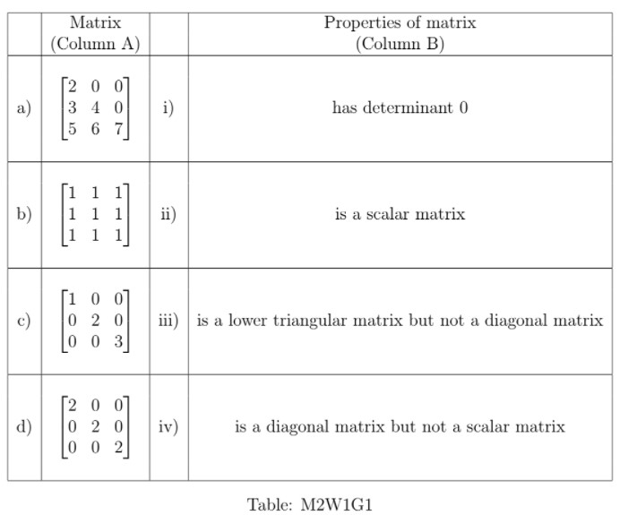
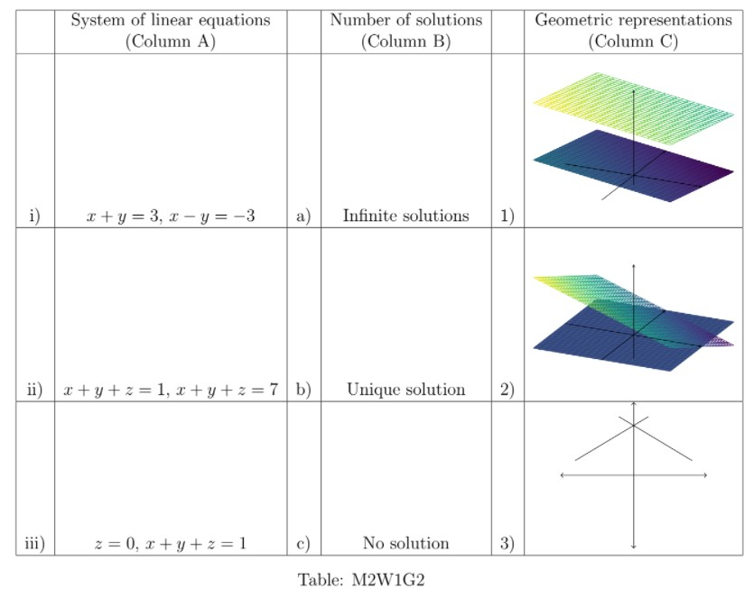

# Week 1 - Graded Assignment 1 _ IITM Online Degree (4_4_2026 8_52_18 am)

 
Note: This assignment will be evaluated after the deadline passes. You will get your score 48 hrs after the deadline. Until then the score will be shown as Zero.

Multiple Select Questions (MSQ):

    

 

 
 
 
 
 
 

    

 
 
 
 
 *
 
 
 1 point
 
 *
 
 Match the matrices in column A with their properties in column B and answer the following question.

Which of the following are true?

 
 
 
 
 
 
a) $\rightarrow$ iii)

 
 
 
 
 
 
 
a) $\rightarrow$ ii)

 
 
 
 
 
 
 
b) $\rightarrow$ i)

 
 
 
 
 
 
 
b) $\rightarrow$ ii)

 
 
 
 
 
 
 
c) $\rightarrow$ iv)

 
 
 
 
 
 
 
c) $\rightarrow$ iii)

 
 
 
 
 
 
 
d) $\rightarrow$ iv)

 
 
 
 
 
 
 
d) $\rightarrow$ ii)
 
 
 
 
 
###  Yes, the answer is correct. 
Score: 1

### Accepted Answers:

 
a) $\rightarrow$ iii)

 
 
b) $\rightarrow$ i)

 
 
c) $\rightarrow$ iv)

 
 
d) $\rightarrow$ ii)
 
 
 
 
 

    

 
 
 
 
 *
 
 
 1 point
 
 *
 
 Match the systems of linear equations in Column A with their number of solutions in column B and their geometric representation in Column C and answer the following question.

Which of the following are true?

 
 
 
 
 
 
i) $\rightarrow$ b) $\rightarrow$ 3)

 
 
 
 
 
 
 
i) $\rightarrow$ a) $\rightarrow$ 3)

 
 
 
 
 
 
 
ii) $\rightarrow$ c) $\rightarrow$ 2)

 
 
 
 
 
 
 
ii) $\rightarrow$ c) $\rightarrow$ 1)

 
 
 
 
 
 
 
iii) $\rightarrow$ a) $\rightarrow$ 2)

 
 
 
 
 
 
 
iii) $\rightarrow$ a) $\rightarrow$ 1)
 
 
 
 
 
###  Yes, the answer is correct. 
Score: 1

### Accepted Answers:

 
i) $\rightarrow$ b) $\rightarrow$ 3)

 
 
ii) $\rightarrow$ c) $\rightarrow$ 1)

 
 
iii) $\rightarrow$ a) $\rightarrow$ 2)

 
 
 
 
 

    

 
 
 
 
 *
 
 
 1 point
 
 *
 
 
Let $B=\begin{bmatrix}
1 & 0 \\
0 & 1 \\ 
-1 & 0 
\end{bmatrix}$ and $C=\begin{bmatrix}
0 & 0 \\
-1 & 2
\end{bmatrix}$. Which of the following options are true for a matrix $A$, such that $AB=C$? 

 
 
 
 
 
 Such a matrix does not exist. 
 
 
 
 
 
 
 
There is a unique matrix $A$ satisfying this property. 

 
 
 
 
 
 
 There are infinitely many such matrices. 
 
 
 
 
 
 
 
$A$ should be a $2\times 3$ matrix.

 
 
 
 
 
 
 
$A$ should be a $3 \times 2$ matrix.
 
 
 
 
 
###  Yes, the answer is correct. 
Score: 1

### Accepted Answers:

 There are infinitely many such matrices. 
 
 
$A$ should be a $2\times 3$ matrix.

 
 
 
 
 

    

 
 
 
 
 *
 
 
 1 point
 
 *
 
 
Let $A$ be a $2\times 2$ real matrix and let $trace(A)$ denote the sum of the elements in the diagonal of $A$. Which of the following are true? 

 
 
 
 
 
 
$det(A-cI)$ is a polynomial in $c$ of degree 1.

 
 
 
 
 
 
 
$det(A-cI)$ is a polynomial in ${c}$ of degree 2.

 
 
 
 
 
 
 
${det(A-cI)=c^2-trace(A)c+det(A)}$

 
 
 
 
 
 
 
$det(A-cI)=c^2+trace(A)c-det(A)$

 
 
 
 
 
 
 
$det(A-cI)= trace(A)c-det(A)$

 
 
 
 
 
 
 
$det(A-cI)= -trace(A)c+det(A)$
 
 
 
 
 
### Partially Correct. 
Score: 0.5

### Accepted Answers:

 
$det(A-cI)$ is a polynomial in ${c}$ of degree 2.

 
 
${det(A-cI)=c^2-trace(A)c+det(A)}$

 
 
 
 
 

    

 
 
 
 
 *
 
 
 1 point
 
 *
 
 
Suppose there are two types of oranges and two types of bananas available in the market. Suppose 1 kg of each type of orange costs **₹**50 and 1 kg of each type of banana costs **₹**40. Gargi bought $x$ kg of the first type of each fruit, orange and banana, and $y$ kg of the second type of each fruit, orange and banana. She paid **₹**250 for oranges and **₹**200 for bananas. Which of the following options are correct with respect to the given information? 
 
 
 
 
 
 
The matrix representation to find $x$ and $y$ can be $\begin{bmatrix}
50 & 50 \\
40 & 40 
\end{bmatrix} \begin{bmatrix}
x \\
y
\end{bmatrix}=\begin{bmatrix}
250 \\
200
\end{bmatrix}$

 
 
 
 
 
 
 
The matrix representation to find $x$ and $y$ can be $\begin{bmatrix}
50 & 40 \\
50 & 40 
\end{bmatrix} \begin{bmatrix}
x \\
y
\end{bmatrix}=\begin{bmatrix}
250 \\
200
\end{bmatrix}$

 
 
 
 
 
 
 
The matrix representation to find $x$ and $y$ can be $\begin{bmatrix}
40 & 40 \\
50 & 50 
\end{bmatrix} \begin{bmatrix}
x \\
y
\end{bmatrix}=\begin{bmatrix}
200 \\
250
\end{bmatrix}$

 
 
 
 
 
 
 
$x$ can be 2 and $y$ can be 3. 

 
 
 
 
 
 
 
There are infinitely many real values possible for $x$ and $y$.

 
 
 
 
 
 
 
There are only finitely many real values possible for $x$ and $y$.

 
 
 
 
 
 
 
There are only finitely many natural numbers possible for $x$ and $y$.

 
 
 
 
 
### Partially Correct. 
Score: 0.6

### Accepted Answers:

 
The matrix representation to find $x$ and $y$ can be $\begin{bmatrix}
50 & 50 \\
40 & 40 
\end{bmatrix} \begin{bmatrix}
x \\
y
\end{bmatrix}=\begin{bmatrix}
250 \\
200
\end{bmatrix}$

 
 
The matrix representation to find $x$ and $y$ can be $\begin{bmatrix}
40 & 40 \\
50 & 50 
\end{bmatrix} \begin{bmatrix}
x \\
y
\end{bmatrix}=\begin{bmatrix}
200 \\
250
\end{bmatrix}$

 
 
$x$ can be 2 and $y$ can be 3. 

 
 
There are infinitely many real values possible for $x$ and $y$.

 
 
There are only finitely many natural numbers possible for $x$ and $y$.

 
 
 
 
 
 

Numerical Answer Type (NAT):

    

 

 
 
 
 
 
 

    

 
 
 
 
 
 
Suppose $det (4A) = n \times det(A)$ for any $5\times 5$ real matrix $A$. What is the value of $n$?
 
 
 
 
 
 
 
 
###  Yes, the answer is correct. 
Score: 1

### Accepted Answers:
(Type: Numeric) 1024
 
 
 *
 
 
 1 point
 
 *
 

 
 

    

 
 
 
 
 
 

$A,B$ are two square matrices of the same order. If $\text{det}(A) = 2$ and $\text{det}(B) = 3$, what is $\text{det}(A^2 B^3)$?

 
 
 
 
 
 
 
 
###  Yes, the answer is correct. 
Score: 1

### Accepted Answers:
(Type: Numeric) 108
 
 
 *
 
 
 1 point
 
 *
 

 
 
 

    

 

 
 
 
 
 
 
 

    

 

 
 
 
 
 
 
 

    

 

 
 
 
 
 
 

    

 
 
 
 
 
 
Let $A$ be a square matrix of order 3 and $B$ be a matrix that is obtained by adding $8$ times the first row of $A$ to the third row of $A$ and adding $9$ times the second row of $A$ to the first row of $A$. If $det(A)=5$, then find out the value of $det(8A^2B^{-1})$.
 
 
 
 
 
 
 
 
###  Yes, the answer is correct. 
Score: 1

### Accepted Answers:
(Type: Numeric) 2560
 
 
 *
 
 
 1 point
 
 *
 

 
 
 

    

 

 
 
 
 
 
 
 

    

 

 
 
 
 
 
 
 

Comprehension Type Question:

    

 

 
 
 
The scores of a student in mathematics, physics and chemistry in her class-12 board exams are $m, p$ and $c$ respectively, where each score is out of $100$. She has applied for three engineering streams in a college. Each stream assigns different weights to these three subjects to calculate her final score, which is again out of $100$.

For example, the weight given to mathematics, physics and chemistry could be $0.2, 0.7$ and $0.1$ respectively by a stream. These weights are then multiplied with the corresponding scores to get the final score. Concretely, if the student has scored $85, 78, 40$ in the three subjects, her final score for this stream is:

$0.2 \times 85 + 0.7 \times 78 + 0.1 \times 40 = 75.6$

This is called a weighted average. Note that the weights always sum to $1$. Now, the weights assigned by the three streams for mathematics, physics and chemistry, in this order, are given below:

**Stream-1:** $0.2, 0.7, 0.1$

**Stream-2:** $0.5, 0.3, 0.2$

**Stream-3:** $0.1, 0.4, 0.5$

The final score of the student in stream-1 is $81$. It is $83$ in stream-2 and $76$ in stream-3. We wish to find the student's marks in the three subjects.

 
 
 

    

 
 
 
 
 *
 
 
 1 point
 
 *
 
 
This is framed as a system of linear equations. Select all true options concerning the coefficient matrix if the vector of unknowns is given as $\begin{bmatrix}m\\p\\c\end{bmatrix}$. Assume that the first equation corresponds to stream-1, second to stream-2 and last to stream-3.
 
 
 
 
 
 
The first row is $0.2, 0.7, 0.1$
 
 
 
 
 
 
 
The last row is $0.1, 0.4, 0.5$
 
 
 
 
 
 
 
The first column is $0.2, 0.7, 0.1$
 
 
 
 
 
 
 
The middle column is $0.5, 0.3, 0.2$
 
 
 
 
 
###  Yes, the answer is correct. 
Score: 1

### Accepted Answers:

 
The first row is $0.2, 0.7, 0.1$
 
 
The last row is $0.1, 0.4, 0.5$
 
 
 
 
 

    

 
 
 
 
 
 
Find $\cfrac{m + p + c}{3}$.
 
 
 
 
 
 
 
 
###  Yes, the answer is correct. 
Score: 1

### Accepted Answers:
(Type: Numeric) 80
 
 
 *
 
 
 1 point
 
 *
 

 
 

    

 
 
 
 
 
 
Find $\text{det}(A)$, where $A$ is the coefficient matrix.
 
 
 
 
 
 
 
 
###  Yes, the answer is correct. 
Score: 1

### Accepted Answers:
(Type: Numeric) -0.13
 
 
 *
 
 
 1 point
 
 *
 

 
 
 

    

 

 
 
 
 
 
 

    

 
 
 
 
 
 
Let A be a $( 4 \times 4 )$ matrix such that

$(A + 3I)(A - 3I) = 0$,

and suppose that $det(A) > 0$. Find $det(A)$.
 
 
 
 
 
 
 
 
###  Yes, the answer is correct. 
Score: 1

### Accepted Answers:
(Type: Numeric) 81
 
 
 *
 
 
 1 point
 
 *