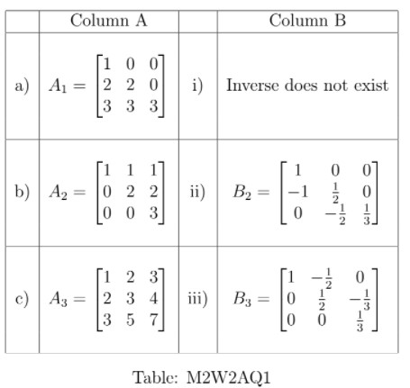

# AQ2.3_ Activity Questions 3 - Not Graded _ IITM Online Degree (4_4_2026 8_58_02 am)

 
**Level 1:

**

    

 
 
 
 
 *
 
 
 1 point
 
 *
 
 Match the matrices in Column A with their inverses in Column B.

 
 
 
 
 
 
a $\rightarrow$ iii

 
 
 
 
 
 
 
a $\rightarrow$ ii

 
 
 
 
 
 
 
b $\rightarrow$ iii

 
 
 
 
 
 
 
b $\rightarrow$ i

 
 
 
 
 
 
 
c $\rightarrow$ i

 
 
 
 
 
 
 
c $\rightarrow$ ii 
 
 
 
 
 
###  No, the answer is incorrect. 
Score: 0

### Accepted Answers:

 
a $\rightarrow$ ii

 
 
b $\rightarrow$ iii

 
 
c $\rightarrow$ i

 
 
 

(Use the below information to answer questions 2 and 3).
Consider a system of linear equations 

                    $\begin{aligned}
 2x_1- x_2 = 3\\
 x_1 - x_3 = 3\\
 x_2 - x_3 = 2
\end{aligned}$

 Let the matrix representation of the above system be $Ax=b$, where $A = \begin{bmatrix} 
 2 & -1 & 0\\
 1 & 0 & -1\\
 0 & 1 & -1
 \end{bmatrix}$, $x = \begin{bmatrix}
x_1\\
x_2\\
x_3
\end{bmatrix}$, and $b=\begin{bmatrix}
3\\
3\\
2
\end{bmatrix}$.

    

 

 
 
 
 
 
 

    

 
 
 
 
 *
 
 
 1 point
 
 *
 
 Choose the set of correct options.
 
 
 
 
 
 
$A^{-1} = \begin{bmatrix} 
 2 & -1 & 0\\
 1 & -1 & 0\\
 1 & 0 & -1
 \end{bmatrix}$
 
 
 
 
 
 
 
 
$A^{-1} = \begin{bmatrix} 
 1 & -1 & 1\\
 1 & -2 & 2\\
 1 & -2 & 1
 \end{bmatrix}$
 
 
 
 
 
 
 
Adjoint of the matrix $A$ is $\begin{bmatrix} 
 1 & -1 & 1\\
 1 & -2 & 2\\
 1 & -2 & 1
 \end{bmatrix}$
 
 
 
 
 
 
 
$det(A) = 1$.
 
 
 
 
 
###  No, the answer is incorrect. 
Score: 0

### Accepted Answers:

 
$A^{-1} = \begin{bmatrix} 
 1 & -1 & 1\\
 1 & -2 & 2\\
 1 & -2 & 1
 \end{bmatrix}$
 
 
Adjoint of the matrix $A$ is $\begin{bmatrix} 
 1 & -1 & 1\\
 1 & -2 & 2\\
 1 & -2 & 1
 \end{bmatrix}$
 
 
$det(A) = 1$.
 
 
 
 
 

    

 
 
 
 
 *
 
 
 1 point
 
 *
 
 Choose the set of correct options.
 
 
 
 
 
 
$x_1 = −2$.
 
 
 
 
 
 
 
$x_2 = 1$.
 
 
 
 
 
 
 
$x_3 = −1$.
 
 
 
 
 
 
 None of the above.
 
 
 
 
 
###  No, the answer is incorrect. 
Score: 0

### Accepted Answers:

 
$x_2 = 1$.
 
 
$x_3 = −1$.
 
 
 
 
 

    

 
 
 
 
 *
 
 
 1 point
 
 *
 
 Choose the set of correct options.
 
 
 
 
 
 
A system of linear equations $Ax = b$ is called a homogeneous system of linear equations if $b \neq 0$.
 
 
 
 
 
 
 
A system of linear equations $Ax = b$ is called a non-homogeneous system of linear equations if $b \neq 0$
 
 
 
 
 
 
 
If $v$ is a solution of the system of linear equations $Ax = b$, then $\frac{1}{c}v$ is a solution of system of linear equations $cAx = b$, where $c\neq 0$.
 
 
 
 
 
 
 
Let $Ax = b$ be a system of linear equations. If $A$ is invertible, then $adj(A)x = b$ also has a solution. 

 
 
 
 
 
###  No, the answer is incorrect. 
Score: 0

### Accepted Answers:

 
A system of linear equations $Ax = b$ is called a non-homogeneous system of linear equations if $b \neq 0$
 
 
If $v$ is a solution of the system of linear equations $Ax = b$, then $\frac{1}{c}v$ is a solution of system of linear equations $cAx = b$, where $c\neq 0$.
 
 
Let $Ax = b$ be a system of linear equations. If $A$ is invertible, then $adj(A)x = b$ also has a solution. 

 
 
 
 
 
 

Suppose $C$ is the cofactor matrix of $\begin{bmatrix}
 3 & 2 & 3 \\
 1 & 0 & 1 \\
 2 & 1 & 1
\end{bmatrix}$. Let $C_{ij}$ be the $ij$-th element of the cofactor matrix $C$. Answer the questions 5,6 and 7.

    

 

 
 
 
 
 
 

    

 
 
 
 
 
 
Find the value of $C_{12}$.
 
 
 
 
 
 
 
 
###  No, the answer is incorrect. 
Score: 0

### Accepted Answers:
(Type: Numeric) 1
 
 
 *
 
 
 1 point
 
 *
 

 
 

    

 
 
 
 
 
 
Find the value of $C_{22}$.
 
 
 
 
 
 
 
 
###  No, the answer is incorrect. 
Score: 0

### Accepted Answers:
(Type: Numeric) -3
 
 
 *
 
 
 1 point
 
 *
 

 
 

    

 
 
 
 
 
 
Find the sum of the elements in the third row of $C$.
 
 
 
 
 
 
 
 
###  No, the answer is incorrect. 
Score: 0

### Accepted Answers:
(Type: Numeric) 0
 
 
 *
 
 
 1 point
 
 *
 

 
 
 

 Level 2:

    

 

 
 
 
 
 
 

    

 
 
 
 
 *
 
 
 1 point
 
 *
 
 Which of the following square matrices of order 3 are the same as their adjoint matrices?
 
 
 
 
 
 Identity matrix. 
 
 
 
 
 
 
 Zero matrix.
 
 
 
 
 
 
 Any scalar matrix.
 
 
 
 
 
 
 Any diagonal matrix.
 
 
 
 
 
###  No, the answer is incorrect. 
Score: 0

### Accepted Answers:

 Identity matrix. 
 
 Zero matrix.
 
 
 
 
 

    

 
 
 
 
 *
 
 
 1 point
 
 *
 
 
Choose the set of correct options.

[Hint: For the first option, find out the adjoint matrix of an arbitrary square upper triangular matrix of order $2$, i.e., take the matrix $\begin{bmatrix}
a & b \\
0 & d
\end{bmatrix}$ and find out its adjoint matrix.]

 
 
 
 
 
 
The adjoint of a $2\times2$ real upper triangular matrix is an upper triangular matrix. 

 
 
 
 
 
 
 
There exists a square matrix of order $3$, such that $A=A^{-1}=adj(A)$.
 
 
 
 
 
 
 
If $A=A^{-1}$, then $det (A)$ must be $1$. 
 
 
 
 
 
 
 
If $A=A^{-1}$, then $A$ must be an identity matrix. 
 
 
 
 
 
 
 
If $A=A^{-1}$, then $A^2=I$. 
 
 
 
 
 
 
 
If $A^{-1}=adj(A)$, then $det(A)$ must be $1$.

 
 
 
 
 
###  No, the answer is incorrect. 
Score: 0

### Accepted Answers:

 
The adjoint of a $2\times2$ real upper triangular matrix is an upper triangular matrix. 

 
 
There exists a square matrix of order $3$, such that $A=A^{-1}=adj(A)$.
 
 
If $A=A^{-1}$, then $A^2=I$. 
 
 
If $A^{-1}=adj(A)$, then $det(A)$ must be $1$.

 
 
 
 
 

    

 
 
 
 
 *
 
 
 1 point
 
 *
 
 
If $A \text{ and } B$ are squares matrices of order $2$, then choose the set of correct options.
[Hint: Find out the adjoint matrix of an arbitrary square matrix of order $2$, i.e., take the matrix $\begin{bmatrix}
a & b \\
c & d
\end{bmatrix}$ and find out its adjoint matrix. ]
 
 
 
 
 
 
$adj(AB) = adj(A)adj(B)$.
 
 
 
 
 
 
 
$adj(AB) = adj(B)adj(A)$.
 
 
 
 
 
 
 
 $adj(A+B) = adj(A) + adj(B)$.
 
 
 
 
 
 
 
$adj(A^T) = adj(A)^T$.
 
 
 
 
 
 
 
$adj(A^{-1}) = adj(A)^{-1}$.
 
 
 
 
 
###  No, the answer is incorrect. 
Score: 0

### Accepted Answers:

 
$adj(AB) = adj(B)adj(A)$.
 
 
 $adj(A+B) = adj(A) + adj(B)$.
 
 
$adj(A^T) = adj(A)^T$.
 
 
$adj(A^{-1}) = adj(A)^{-1}$.
 
 
 
 
 
 
**
**