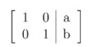

# AQ2.4_ Activity Questions 4 - Not Graded _ IITM Online Degree (4_4_2026 8_58_59 am)

 
**Level 1:

**

    

 
 
 
 
 *
 
 
 1 point
 
 *
 
 
Let $A = \begin{bmatrix}
0 & 1 & 3\\
1 & 0 & 2\\
0 & 0 & 0
\end{bmatrix}$ be a matrix (where the first row denotes the top most row, and the ordering of the rows is in the order top to bottom). Among the given set of options, identify the correct statements.
 
 
 
 
 
 
The first non-zero element in the first row is $3$. 

 
 
 
 
 
 
 
The first non-zero element in the second row is $1$. 
 
 
 
 
 
 
 There is a non-zero element in the third row.
 
 
 
 
 
 
 
Since there is a row with all elements as zero, $det(A) = 0$.
 
 
 
 
 
###  No, the answer is incorrect. 
Score: 0

### Accepted Answers:

 
The first non-zero element in the second row is $1$. 
 
 
Since there is a row with all elements as zero, $det(A) = 0$.
 
 
 
**

**
 
 
Let $I_{3 \times 3}$ denote the identity matrix of order $3$. Answer questions 2 and 3 about the set $S$ defined as 
 : 
 $S =\left\{ A = \begin{bmatrix}
0 & 1 & 0\\
1 & 0 & 1\\
0 & 1 & 0
\end{bmatrix}, B = \begin{bmatrix}
-1 & 2 & 0\\
0 & 0 & 1\\
0 & 0 & 0
\end{bmatrix}, C = \begin{bmatrix}
1 & 2 & 0\\
0 & 0 & 1\\
0 & 0 & 0
\end{bmatrix}, D = \begin{bmatrix}
0 & 0 & 0\\
0 & 0 & 0\\
0 & 0 & 0
\end{bmatrix}, \right.$

$E = \begin{bmatrix}
0 & 1 & 3\\
0 & 1 & 1\\
0 & 0 & 1
\end{bmatrix},F = \begin{bmatrix}
1 & 1 & 0\\
0 & 1 & 0\\
0 & 0 & 1
\end{bmatrix}, G = \begin{bmatrix}
 0 & 1 & 3\\
0 & 0 & 1\\
0 & 0 & 0
\end{bmatrix}, H = \begin{bmatrix}
1 & 0 & 0\\
0 & 1 & 0\\
0 & 0 & 0
\end{bmatrix},$

$\left . I = \begin{bmatrix}
1 & 0 & 0\\
0 & 1 & 0\\
0 & 0 & -1
\end{bmatrix}, 
J = \begin{bmatrix}
 0 & 1 & 0\\
0 & 0 & 1\\
0 & 0 & 0
\end{bmatrix},~ K = I_{3\times3}, ~L = \begin{bmatrix}
 1 & 0 & -1\\
0 & 1 & 1
\end{bmatrix} \right\}.$ 

    

 

 
 
 
 
 
 

    

 
 
 
 
 *
 
 
 1 point
 
 *
 
 
If $S_1$ is the subset of $S$ consisting of all the matrices in $S$ that are in row echelon form, then choose the correct option from the following.

 
 
 
 
 
 
 $S_1 = S$
 
 
 
 
 
 
 
$S_1 = \{A, B, C, D, F, G, I\}$
 
 
 
 
 
 
 
$S_1 = \{B, C, D, E, F, G, H, I, J, K, L\}$
 
 
 
 
 
 
 
$S_1 = \{C, D, E, F, G, H, I, J, K\}$
 
 
 
 
 
 
 
$S_1 = \{C, D, E, F, G, H, J, K, L\}$
 
 
 
 
 
 
 
$S_1 = \{C, D, F, G, H, J, K, L\}$
 
 
 
 
 
 
 
Cardinality of $S_1$ is 7. 

 
 
 
 
 
 
 
Cardinality of $S_1$ is 8. 
 
 
 
 
 
###  No, the answer is incorrect. 
Score: 0

### Accepted Answers:

 
$S_1 = \{C, D, F, G, H, J, K, L\}$
 
 
Cardinality of $S_1$ is 8. 
 
 
 
 
 

    

 
 
 
 
 *
 
 
 1 point
 
 *
 
 
If $S_2$ is the subset of $S$ consisting of all the matrices in $S$ that are in reduced row echelon
form, then choose the correct option from the following.
 
 
 
 
 
 
$S_2 = \{A, C, D, F, G, L\}$
 
 
 
 
 
 
 
$S_2 = \{B, C, D, E, F, G, H, J, K\}$
 
 
 
 
 
 
 
$S_2 = \{C, D, G, H, J, K, L\}$
 
 
 
 
 
 
 
$S_2 = \{C, D, H, J, K, L\}$
 
 
 
 
 
 
 
$S_2 = \{C, D, H, I, J, K, L\}$
 
 
 
 
 
 
 
Cardinality of $S_2$ is 7. 

 
 
 
 
 
 
 
Cardinality of $S_2$ is 6. 
 
 
 
 
 
###  No, the answer is incorrect. 
Score: 0

### Accepted Answers:

 
$S_2 = \{C, D, H, J, K, L\}$
 
 
Cardinality of $S_2$ is 6. 
 
 
 
 
 
 

    

 

 
 
 
 
 
 

    

 
 
 
 
 *
 
 
 1 point
 
 *
 
 
Consider the following system of linear equations:

                   $\begin{aligned}
 0x_1 +x_2 +0x_3 +0x_4 = 1\\
 0x_1 +0x_2 +0x_3 +0x_4 = 1\\
 x_1 +x_2 +0x_3 +0x_4 = 1\\
 0x_1 +0x_2 +x_3 +x_4 = 1.
\end{aligned}$

Choose the set of correct options.

 
 
 
 
 
 The system of linear equations has a solution
 
 
 
 
 
 
 The system of linear equations has no solution.
 
 
 
 
 
 
 
$det(A) = 0$, where $A$ is the coefficient matrix of the given system of linear equations.
 
 
 
 
 
 
 None of the above.
 
 
 
 
 
###  No, the answer is incorrect. 
Score: 0

### Accepted Answers:

 The system of linear equations has no solution.
 
 
$det(A) = 0$, where $A$ is the coefficient matrix of the given system of linear equations.
 
 
 
 
 

    

 
 
 
 
 *
 
 
 1 point
 
 *
 
 
Consider a system of linear equations:

                               $\begin{aligned}
 0x_1 +x_2 +0x_3 +0x_4 = 1\\
 0x_1 +0x_2 +x_3 +0x_4 = 1
\end{aligned}$

Choose the set of correct options.

 [Hint: Recall the definitions of independent and dependent variable with respect to reduced row echelon form.]

 
 
 
 
 
 
$x_1\text{ and } x_2$ are dependent variables.
 
 
 
 
 
 
 
$x_2$ is a dependent variable.
 
 
 
 
 
 
 
$x_3 \text{ and } x_4$ are independent variables.
 
 
 
 
 
 
 
$x_4$ is an independent variable.

 
 
 
 
 
###  No, the answer is incorrect. 
Score: 0

### Accepted Answers:

 
$x_2$ is a dependent variable.
 
 
$x_4$ is an independent variable.

 
 
 
 
 
 

**
****Level 2:
****
**

    

 

 
 
 
 
 
 

    

 
 
 
 
 
 
Suppose a system of linear equations consists of only one equation and four variables as follows:

                  $x_1+x_2+x_3+x_4=a$

 where $a$ is a constant. Find out the number of independent variables. 

[Hint:"Think about" how many variables can be expressed in terms of the other variables in the given system of linear equations?]
 
 
 
 
 
 
 
 
###  No, the answer is incorrect. 
Score: 0

### Accepted Answers:
(Type: Numeric) 3
 
 
 *
 
 
 1 point
 
 *
 

 
 

    

 
 
 
 
 *
 
 
 1 point
 
 *
 
 
Let $[A|b]$ denote the augmented matrix of the system of linear equations

                             $2x_1+x_2=3$

                             $x_1+3x_2=4$

where, $A=\begin{bmatrix}
2 & 1 \\
1 & 3
\end{bmatrix}$, and $b=\begin{bmatrix}
3 \\ 4
\end{bmatrix}$.
Let the matrix

                                       

denote the reduced row echelon form of the augmented matrix corresponding to the system of linear equations above. Which of the following option(s) is (are) correct?

 
 
 
 
 
 
The values of $a$ and $b$ cannot be determined from the given information.
 
 
 
 
 
 
 
$a = b$ but their exact values cannot be determined from the given information. 
 
 
 
 
 
 
 
$a=b=1$
 
 
 
 
 
 
 
$a=2$ and $b=3$
 
 
 
 
 
 
 
The solutions for $x_1$ and $x_2$ are not unique. 
 
 
 
 
 
 
 
$x_1= x_2=1$, and the system of linear equations has a unique solution. 
 
 
 
 
 
 
 
$x_1=x_2=1$ is the solution. However, it is not possible to determine whether the system of equations has a unique solution or not from the given information.
 
 
 
 
 
###  No, the answer is incorrect. 
Score: 0

### Accepted Answers:

 
$a=b=1$
 
 
$x_1= x_2=1$, and the system of linear equations has a unique solution. 
 
 
 
 
 

    

 
 
 
 
 *
 
 
 1 point
 
 *
 
 
Let $Ax=b$ be a matrix representation of a system of linear equations, where $A$ is a $4\times 4$ matrix, $x=\begin{bmatrix}
x_1 \\ x_2 \\x_3 \\ x_4
\end{bmatrix}$, and $b=\begin{bmatrix}
b_1\\ b_2 \\ 0 \\ 0
\end{bmatrix}$.

 Let $A$ be $\begin{bmatrix}
1 & 0 & 0 & 0 \\
0 & 0 & 1 & 1 \\
0 & 0 & 0 & 0 \\
0 & 0 & 0 & 0
\end{bmatrix}$.

 Which of the following options are correct?

 [Hint: Recall the definitions of independent and dependent variable with respect to reduced row echelon form.]
 
 
 
 
 
 
$x_1$ is dependent on $x_2$. 
 
 
 
 
 
 
 
$x_3$ is dependent on $x_4$.
 
 
 
 
 
 
 
$x_2$ is an independent variable. 
 
 
 
 
 
 
 The solution of the system of linear equations (if it exists) is unique. 
 
 
 
 
 
 
 There exist infinitely many solutions for the given system of linear equations.
 
 
 
 
 
###  No, the answer is incorrect. 
Score: 0

### Accepted Answers:

 
$x_3$ is dependent on $x_4$.
 
 
$x_2$ is an independent variable. 
 
 There exist infinitely many solutions for the given system of linear equations.
 
 
 
 
 
 
**
**Let $A = \begin{bmatrix}
1 & 0 & 3\\
0 & 1 & 2\\
0 & 0 & 0
\end{bmatrix}$ be a matrix (where the first row denotes the top most row, and the ordering of the rows is from top to bottom). Consider the system of linear equations given by $Ax=b$ where $x=\begin{bmatrix} x_1 \\ x_2 \\ x_3 \end{bmatrix}$, and $b=\begin{bmatrix}
4 \\3 \\ 0
\end{bmatrix}$. Answer the following questions.

    

 

 
 
 
 
 
 

    

 
 
 
 
 
 Find the number of independent variables.
 
 
 
 
 
 
 
 
###  No, the answer is incorrect. 
Score: 0

### Accepted Answers:
(Type: Numeric) 1
 
 
 *
 
 
 1 point
 
 *
 

 
 

    

 
 
 
 
 
 
If $x_1=0$ is given, then find out the number of solutions of the given system of linear equations.
 
 
 
 
 
 
 
 
###  No, the answer is incorrect. 
Score: 0

### Accepted Answers:
(Type: Numeric) 1
 
 
 *
 
 
 1 point
 
 *