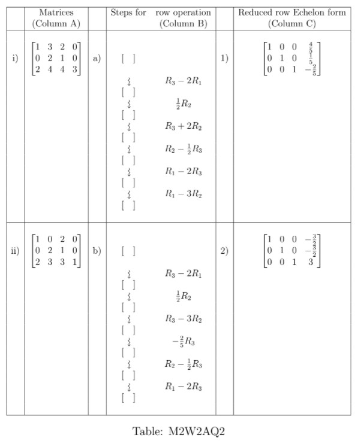

# AQ2.5_ Activity Questions 5- Not Graded _ IITM Online Degree (4_4_2026 8_59_38 am)

 
**Level 1:
 
**

    

 

 
 
 
 
 
 

    

 
 
 
 
 *
 
 
 1 point
 
 *
 
 Match the matrices in Column A with their row operation steps (in the exact sequence
given) in Column B, and their corresponding reduced row Echelon forms in Column C
of Table M2W2AQ2.

Find the correct option.
 
 
 
 
 
 Applying (b) on (i) gives (2). 
 
 
 
 
 
 
 Applying (a) on (ii) gives (1).
 
 
 
 
 
 
 Applying (a) on (i) gives (2). 
 
 
 
 
 
 
 Applying (b) on (ii) gives (1).
 
 
 
 
 
###  No, the answer is incorrect. 
Score: 0

### Accepted Answers:

 Applying (a) on (i) gives (2). 
 
 Applying (b) on (ii) gives (1).
 
 
 
 
 

    

 
 
 
 
 *
 
 
 1 point
 
 *
 
 Choose the correct set of options.
 
 
 
 
 
 
If two matrices $A$ and $B$ have the same reduced row echelon form, then $A$ must be equal to $B$.
 
 
 
 
 
 
 
If two matrices $A$ and $B$ have the same row echelon form, then $A$ must be equal to $B$.
 
 
 
 
 
 
 The reduced row echelom form of a diagonal matrix with non-zero diagonal entries must be the identity matrix.
 
 
 
 
 
 
 The reduced row echelon form of a non-zero scalar matrix must be the identity matrix.
 
 
 
 
 
###  No, the answer is incorrect. 
Score: 0

### Accepted Answers:

 The reduced row echelom form of a diagonal matrix with non-zero diagonal entries must be the identity matrix.
 
 The reduced row echelon form of a non-zero scalar matrix must be the identity matrix.
 
 
 
 
 
 

(Answer questions 3 and 4 based on the below information.)
The three different types of elementary row operations that can be performed on a matrix are:
 

- $\textbf{Type 1:}$ Interchanging two rows. 
 
- $\textbf{Type 2:}$ Multiplying a row by some constant.
-  $\textbf{Type 3:}$ Adding a scalar multiple of a row to another row

    

 

 
 
 
 
 
 

    

 
 
 
 
 *
 
 
 1 point
 
 *
 
 
Consider the four matrices given below:

   $A = \begin{bmatrix}
1 & -1 & 1\\
0 & 1 & -1\\
-1 & -1 & 1
\end{bmatrix}$, $B = \begin{bmatrix}
-1 & -1 & 1\\
0 & 1 & -1\\
1 & -1 & 1
\end{bmatrix}$, $C = \begin{bmatrix}
1 & -1 & 1\\
0 & -1 & 1\\
-1 & -1 & 1
\end{bmatrix}$ and $D = \begin{bmatrix}
1 & -1 & 1\\
0 & -1 & 1\\
1 & -3 & 3
\end{bmatrix}$.

 Choose the set of correct options.
 
 
 
 
 
 
Matrix $B$ is obtained from matrix $A$ by an elementary row operation of Type 1.
 
 
 
 
 
 
 
Matrix $C$ is obtained from matrix $A$ by an elementary row operation of Type 1.
 
 
 
 
 
 
 
Matrix $D$ is obtained from matrix $C$ by an elementary row operation of Type 3.
 
 
 
 
 
 
 
Matrix $A$ is obtained from matrix $C$ by an elementary row operation of Type 2.

 
 
 
 
 
###  No, the answer is incorrect. 
Score: 0

### Accepted Answers:

 
Matrix $B$ is obtained from matrix $A$ by an elementary row operation of Type 1.
 
 
Matrix $D$ is obtained from matrix $C$ by an elementary row operation of Type 3.
 
 
Matrix $A$ is obtained from matrix $C$ by an elementary row operation of Type 2.

 
 
 
 
 

    

 
 
 
 
 *
 
 
 1 point
 
 *
 
 
Let $A$ and $B$ be square matrices of order 3. Consider the three equations below.

- $\textbf{Equation 1:}\,\,det(A) = -det(B)$

- $\textbf{Equation 2:}\,\,det(A) = -c~det(B), c \in \mathbb{R}$

- $\textbf{Equation 3:} \,\,det(A) = det(B)$

  Choose the set of correct options.

 
 
 
 
 
 
If matrix $B$ is obtained from matrix $A$ by an elementary row operation of type 1, then equation 1 is satisfied.

 
 
 
 
 
 
 
If matrix $B$ is obtained from matrix $A$ by an elementary row operation of type 1 followed by an elementary operation of type 2, then equation 2 is satisfied for some $c$. 
 
 
 
 
 
 
 
If matrix $B$ is obtained from $A$ by an elementary row operation of type 2, then equation 3 is satisfied. 
 
 
 
 
 
 
 
If matrix $B$ is obtained from $A$ by an elementary row operation of type 3, then equation 3 is satisfied. 
 
 
 
 
 
###  No, the answer is incorrect. 
Score: 0

### Accepted Answers:

 
If matrix $B$ is obtained from matrix $A$ by an elementary row operation of type 1, then equation 1 is satisfied.

 
 
If matrix $B$ is obtained from matrix $A$ by an elementary row operation of type 1 followed by an elementary operation of type 2, then equation 2 is satisfied for some $c$. 
 
 
If matrix $B$ is obtained from $A$ by an elementary row operation of type 3, then equation 3 is satisfied. 
 
 
 
 
 

    

 
 
 
 
 *
 
 
 1 point
 
 *
 
 
Let $A = \begin{bmatrix}
1 & -1 & 1\\
0 & 1 & 1\\
-1 & 0 & 1
\end{bmatrix}$ be a square matrix of order $3$. Which of the statements below are true for matrix $A$?
 
 
 
 
 
 
$A$ can be transformed via elementary row operations into the matrix $\begin{bmatrix}
1 & -1 & 1\\
0 & 1 & 1\\
0 & 0 & 1
\end{bmatrix}$ which is in row echelon form.

 
 
 
 
 
 
 
The reduced row echelon form of matrix $A$ is $\begin{bmatrix}
1 & 0 & 1\\
0 & 1 & 0\\
0 & 0 & 1
\end{bmatrix}$.
 
 
 
 
 
 
 
The reduced row echelon form of matrix $A$ is $\begin{bmatrix}
1 & 0 & 0\\
0 & 1 & 0\\
0 & 0 & 1
\end{bmatrix}$.
 
 
 
 
 
 
 
$A$ can be transformed via elementary row operations into the matrix $\begin{bmatrix}
1 & 0 & 0\\
0 & 1 & 0\\
0 & 0 & 1
\end{bmatrix}$ which is in row echelon form.
 
 
 
 
 
 
 
$A$ can be transformed via elementary row operations into the matrix $\begin{bmatrix}
1 & -1 & 1\\
0 & 1 & 0\\
0 & 0 & 1
\end{bmatrix}$ which is in row echelon form.
 
 
 
 
 
###  No, the answer is incorrect. 
Score: 0

### Accepted Answers:

 
$A$ can be transformed via elementary row operations into the matrix $\begin{bmatrix}
1 & -1 & 1\\
0 & 1 & 1\\
0 & 0 & 1
\end{bmatrix}$ which is in row echelon form.

 
 
The reduced row echelon form of matrix $A$ is $\begin{bmatrix}
1 & 0 & 0\\
0 & 1 & 0\\
0 & 0 & 1
\end{bmatrix}$.
 
 
$A$ can be transformed via elementary row operations into the matrix $\begin{bmatrix}
1 & 0 & 0\\
0 & 1 & 0\\
0 & 0 & 1
\end{bmatrix}$ which is in row echelon form.
 
 
$A$ can be transformed via elementary row operations into the matrix $\begin{bmatrix}
1 & -1 & 1\\
0 & 1 & 0\\
0 & 0 & 1
\end{bmatrix}$ which is in row echelon form.
 
 
 
 
 
 

**
****Level 2:
**

    

 

 
 
 
 
 
 

    

 
 
 
 
 
 
 Let the reduced row echelon form of a matrix $A$ be $\begin{bmatrix}
1 & 0 & -1 \\
0 & 1 & 1 
\end{bmatrix}.$ 
Suppose the first and third columns of $A$ are $\begin{bmatrix}
-1\\
1
\end{bmatrix}$, $\begin{bmatrix}
2\\
-1
\end{bmatrix}$ respectively. If the second column of the matrix $A$ is given by $\begin{bmatrix}
m_1 \\ m_2
\end{bmatrix}$, then what is the value of $m_1+m_2$. 
 [Hint: Start with an arbitrary column $\begin{bmatrix}
a \\ b
\end{bmatrix}$ as the second column of $A$.]
 
 
 
 
 
 
 
 
###  No, the answer is incorrect. 
Score: 0

### Accepted Answers:
(Type: Numeric) 1
 
 
 *
 
 
 1 point
 
 *
 

 
 

    

 
 
 
 
 *
 
 
 1 point
 
 *
 
 
Let the different types of elementary row operations be defined as follows: 
 

- $\textbf{Type 1:}$ Interchanging two rows.

- $\textbf{Type 2:}$ Multiplying a row by some constant.

- $\textbf{Type 3:}$ Adding a scalar multiple of a row to another row.

 
 
 
 Which of the following statements are true?

 
 
 
 
 
 
If matrix $A$ is obtained from matrix $B$ by a finite number of elementary row operations, then matrix $B$ can also be obtained from matrix $A$ by a finite number of elementary row operations. 

 
 
 
 
 
 
 The reduced row echelon form of a matrix cannot be the identity matrix.
 
 
 
 
 
 
 An upper triangular matrix, with value of all the diagonal elements equal to 1, is in row echelon form.
 
 
 
 
 
 
 Identity matrix is in reduced row echelon form.
 
 
 
 
 
 
 The reduced row echelon form of a scalar matrix (other than identity matrix) can be obtained by applying only elementary row operations of type 1. 
 
 
 
 
 
 
 The reduced row echelon form of a diagonal matrix (other than identity matrix) can be obtained by applying only elementary row operations of type 2. 
 
 
 
 
 
###  No, the answer is incorrect. 
Score: 0

### Accepted Answers:

 
If matrix $A$ is obtained from matrix $B$ by a finite number of elementary row operations, then matrix $B$ can also be obtained from matrix $A$ by a finite number of elementary row operations. 

 
 An upper triangular matrix, with value of all the diagonal elements equal to 1, is in row echelon form.
 
 Identity matrix is in reduced row echelon form.
 
 
 
 
 

    

 
 
 
 
 *
 
 
 1 point
 
 *
 
 
Let $A$ be a $3 × 3$ real matrix whose sum of entries of each column is $5$ and sum of first
two elements of each column is $3$. Which of the following statements is (are) true? 

[Hint:
Row operation: adding one row to other row.]
 
 
 
 
 
 
The determinant of matrix $A$ is a multiple of $5$.
 
 
 
 
 
 
 
The determinant of matrix $A$ is a multiple of $3$.
 
 
 
 
 
 
 
The determinant of matrix $A$ is a multiple of $15$.
 
 
 
 
 
 
 
The determinant of matrix $A$ is a multiple of $2$.
 
 
 
 
 
 
 
The determinant of matrix $A$ is a multiple of $8$.
 
 
 
 
 
###  No, the answer is incorrect. 
Score: 0

### Accepted Answers:

 
The determinant of matrix $A$ is a multiple of $5$.
 
 
The determinant of matrix $A$ is a multiple of $3$.
 
 
The determinant of matrix $A$ is a multiple of $15$.
 
 
The determinant of matrix $A$ is a multiple of $2$.
 
 
The determinant of matrix $A$ is a multiple of $8$.
 
 
 
 
 
 

Let $A = \begin{bmatrix}
0 & 1 & 3\\
1 & 0 & 2\\
1 & -1 & -1
\end{bmatrix}$ be a matrix (where the first row denotes the top most row, and the ordering of the rows is from top to bottom). Consider the system of linear equations given by $Ax=b$ where $x=\begin{bmatrix} x_1 \\ x_2 \\ x_3 \end{bmatrix}$, and $b=\begin{bmatrix}
4 \\3 \\ -1
\end{bmatrix}$. Answer the following questions.

    

 

 
 
 
 
 
 

    

 
 
 
 
 
 
If $R$ be the reduced row echelon form of $A$, then find the number of non-zero rows of $R$.
 
 
 
 
 
 
 
 
###  No, the answer is incorrect. 
Score: 0

### Accepted Answers:
(Type: Numeric) 2
 
 
 *
 
 
 1 point
 
 *
 

 
 

    

 
 
 
 
 
 
If $x_1=0$ is given, then find out the value of $x_2$. 
 
 
 
 
 
 
 
 
###  No, the answer is incorrect. 
Score: 0

### Accepted Answers:
(Type: Numeric) -0.5
 
 
 *
 
 
 1 point
 
 *