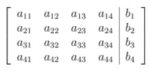

# AQ2.6_ Activity Questions 6 - Not Graded _ IITM Online Degree (4_4_2026 9_00_29 am)

 
**Level 1:

**

    

 
 
 
 
 *
 
 
 1 point
 
 *
 
 
Let $Ax = b$ be a matrix representation of a system of linear equations. Let $[R|c]$ be the reduced row echelon of the augmented matrix $[A|b]$ corresponding to the system. Choose the set of correct options.

[Hint: Recall reduced row echelon form.]
 
 
 
 
 
 
If the system $Rx = c$ has infinitely many solutions, then the system $Ax = b$ has infinite solutions.
 
 
 
 
 
 
 
If the system $Rx = c$ has no solutions, then the system $Ax = b$ has a unique solution.
 
 
 
 
 
 
 
If the system $Rx = c$ has a unique solution, then the system $Ax = b$ has no solution.
 
 
 
 
 
 
 
If the system $Rx = c$ has a unique solution, then the system $Ax = b$ has a unique solution.
 
 
 
 
 
###  No, the answer is incorrect. 
Score: 0

### Accepted Answers:

 
If the system $Rx = c$ has infinitely many solutions, then the system $Ax = b$ has infinite solutions.
 
 
If the system $Rx = c$ has a unique solution, then the system $Ax = b$ has a unique solution.
 
 
 

Consider a system of linear equations $\begin{aligned}
 2x_1 +x_2 = 1\\
 -x_1 +x_3 + x_4 = -1\\
 x_1 +x_2 -x_3 +x_4 = 2\\
 -x_1 +x_3 +x_4 = 1.
\end{aligned}$
If the following matrix represents the augmented matrix of the system, then answer the questions 2,3 and 4. 

                                                

**
**

    

 

 
 
 
 
 
 

    

 
 
 
 
 
 
Find the value of $a_{22}$.
 
 
 
 
 
 
 
 
###  No, the answer is incorrect. 
Score: 0

### Accepted Answers:
(Type: Numeric) 0
 
 
 *
 
 
 1 point
 
 *
 

 
 

    

 
 
 
 
 
 Find the sum of the elements of the 4-th row of the augmented matrix.
 
 
 
 
 
 
 
 
###  No, the answer is incorrect. 
Score: 0

### Accepted Answers:
(Type: Numeric) 2
 
 
 *
 
 
 1 point
 
 *
 

 
 

    

 
 
 
 
 
 Find the sum of the elements of the 3-rd column of the augmented matrix.
 
 
 
 
 
 
 
 
###  No, the answer is incorrect. 
Score: 0

### Accepted Answers:
(Type: Numeric) 1
 
 
 *
 
 
 1 point
 
 *
 

 
 
 
**
**

    

 

 
 
 
 
 
 

    

 
 
 
 
 *
 
 
 1 point
 
 *
 
 
Let $Ax = b$ be a matrix representation of a system of linear equations and $b = 0$. Choose the set of correct options.

 [Hint: Recall the definition of the trivial solution of a system of linear equations and applicability of Gauss Elimination Method.]
 
 
 
 
 
 
 If $A$ is an invertible matrix then the system has no solution.

 
 
 
 
 
 
 
If $A$ is an invertible matrix then the system has a unique solution.
 
 
 
 
 
 
 
If $A$ is an invertible matrix then the trivial solution is the only solution for the system.
 
 
 
 
 
 
 
If $det(A) = 0$, then the system has infinitely many solutions.

 
 
 
 
 
###  No, the answer is incorrect. 
Score: 0

### Accepted Answers:

 
If $A$ is an invertible matrix then the system has a unique solution.
 
 
If $A$ is an invertible matrix then the trivial solution is the only solution for the system.
 
 
If $det(A) = 0$, then the system has infinitely many solutions.

 
 
 
 
 

    

 
 
 
 
 *
 
 
 1 point
 
 *
 
 
Let $Ax = b$ be a matrix representation of a system of linear equations and $b \neq 0$. Choose the set of correct options.
 
 
 
 
 
 
If $A$ is an invertible matrix, then the system has no solution.

 
 
 
 
 
 
 
If $A$ is an invertible matrix, then the system has a unique solution.
 
 
 
 
 
 
 
If $A$ is an invertible matrix, then the trivial solution is a solution for the system.
 
 
 
 
 
 
 
If $det(A) = 0$, then either the system has no solution or the system has infinitely many solutions.
 
 
 
 
 
###  No, the answer is incorrect. 
Score: 0

### Accepted Answers:

 
If $A$ is an invertible matrix, then the system has a unique solution.
 
 
If $det(A) = 0$, then either the system has no solution or the system has infinitely many solutions.
 
 
 
 
 

    

 
 
 
 
 *
 
 
 1 point
 
 *
 
 
Consider the following systems of linear equations:

      $\begin{aligned}
 \text{System I:} & & x - y = 3 \\
 & & -y + 2z = 1 \\
 & & x + y + z = 0 \\
 & & \\
 \text{System II:} & & x-y=3 \\
 & & 2y +z=1 \\
 & & 6y+3z=0 \\
 & & \\
 \text{System III:} & & x-y=3 \\
 & & 2y +z=1 \\
 & & 6y+3z=3 \\
\end{aligned}$

 Choose the correct option. 
 
 
 
 
 
 All the three systems have a unique solution.
 
 
 
 
 
 
 System I has a unique solution.
 
 
 
 
 
 
 System II has no solution. 
 
 
 
 
 
 
 System III has infinitely many solutions.
 
 
 
 
 
 
 Both the System II and III have infinitely many solutions.
 
 
 
 
 
 
 Both the system II and III have no solution.
 
 
 
 
 
###  No, the answer is incorrect. 
Score: 0

### Accepted Answers:

 System I has a unique solution.
 
 System II has no solution. 
 
 System III has infinitely many solutions.
 
 
 
 
 
 

**
****Level 2:
****
**

    

 

 
 
 
 
 
 

    

 
 
 
 
 
 
Suppose $P$ is a $3\times 3$ real matrix as follows: 
$\begin{bmatrix}
1 & 0 & 1 \\
0 & 1 & 1 \\
0 & 0 & 1
\end{bmatrix}$

The vector $X_n$ is defined by the recurrence relation $PX_{n-1}=X_n$. If $X_2= \begin{bmatrix}
7 \\ 8\\ 3
\end{bmatrix}$,
what is the sum of all the elements of $X_0$?
 
 
 
 
 
 
 
 
###  No, the answer is incorrect. 
Score: 0

### Accepted Answers:
(Type: Numeric) 6
 
 
 *
 
 
 1 point
 
 *
 

 
 

    

 
 
 
 
 *
 
 
 1 point
 
 *
 
 
Consider the system of linear equations given below:

                 $\begin{aligned}
 x- y + z & = 2 \\
 \\
 x+ y - z & = 3 \\
 \\
 -x+ y + z & = 4. 
\end{aligned}$

 The system of linear equations has 

 [Hint: Use the relation between a system of linear equations and determinant of corresponding coefficient matrix.]
 
 
 
 
 
 no solution.
 
 
 
 
 
 
 infinitely many solutions.
 
 
 
 
 
 
 a unique solution.
 
 
 
 
 
 
 finitely many solutions.
 
 
 
 
 
 
 3 dependent variable.
 
 
 
 
 
 
 2 dependent and 1 independent variable.
 
 
 
 
 
###  No, the answer is incorrect. 
Score: 0

### Accepted Answers:

 a unique solution.
 
 3 dependent variable.
 
 
 
 
 

    

 
 
 
 
 *
 
 
 1 point
 
 *
 
 
Consider the system of linear equations: 

        $\begin{aligned}
 -x_1+ x_2 + 2x_3 = 1\\
 2x_1 + x_2 -2x_3 = -1\\
 3x_2 + cx_3 = d
\end{aligned}$

 Choose the set of correct options.

 [Hint: Recall the Gauss elimination method.]
 
 
 
 
 
 
If $c = 2 \text{ and } d = 1$, then the system has infinitely many solutions.
 
 
 
 
 
 
 
If $c = 1 \text{ and } d = 1$, then the system has infinitely many solutions.
 
 
 
 
 
 
 
If $c = 1 \text{ and } d = 2$, then the system has no solution.
 
 
 
 
 
 
 
If $c = 3 \text{ and } d = 2$, then the system has a unique solution.

 
 
 
 
 
###  No, the answer is incorrect. 
Score: 0

### Accepted Answers:

 
If $c = 2 \text{ and } d = 1$, then the system has infinitely many solutions.
 
 
If $c = 3 \text{ and } d = 2$, then the system has a unique solution.

 
 
 
 
 
 
**
**