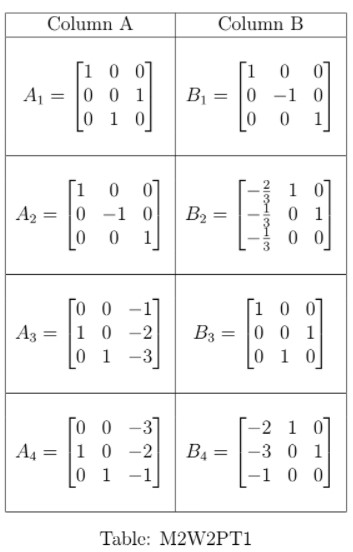
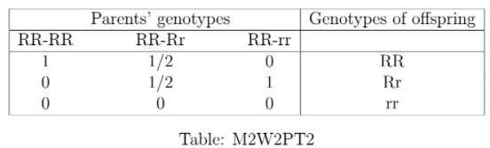

# Practice Assignment 2 - Not Graded _ IITM Online Degree (4_4_2026 9_02_23 am)

 
**
**

    

 

 
 
 
 
 
 

    

 
 
 
 
 *
 
 
 1 point
 
 *
 
 
Consider the following systems of equations and choose the correct option. 

$\begin{aligned}
 \text{System I:} & &-x + 2y - 2z = 2 \\
 & & 2x + z = -1 \\
 & & x - 3y + z = 3 \\
 & & \\
 \text{System II:} & & -2x + y + z = 0 \\
 & & \frac{3}{2} x + 2y - z = -2 \\
 & & 3x + 4y - 2z = 5 \\
 & & \\
 \text{System III:} & & x + 3z = -5 \\
 & & -\frac{2}{5} x -\frac{1}{5}y - 2z = 3 \\
 & & 2x + y + 10z = -15
\end{aligned}$

 
 
 
 
 
 System I has a unique solution. 
 
 
 
 
 
 
 System II has infinitely many solutions. 
 
 
 
 
 
 
 System II has no solution. 
 
 
 
 
 
 
 System III has no solution.
 
 
 
 
 
###  No, the answer is incorrect. 
Score: 0

### Accepted Answers:

 System I has a unique solution. 
 
 System II has no solution. 
 
 
 
 
 

    

 
 
 
 
 *
 
 
 1 point
 
 *
 
 
There are two laptop manufacturers, one is at Adyar and the other is at Tambaram. Suppose the production costs ( in crore of ₹) at Adyar and Tambaram are represented by the equations $A(x)= a_1x^2+b_1x+c_1$ and $T(x)=a_2x+c_2$, respectively, where $x$ represents the number (in hundreds) of laptops produced. At Adyar, the initial investment is known to be ₹3 crore, and the production costs for manufacturing 100 (i.e., $x=1$) and 300 laptops (i.e., $x=3$) are ₹4 crore and ₹12 crore, respectively. At Tambaram, the production costs for manufacturing 100 and 200 laptops are ₹6 crore and ₹7 crore, respectively. Suppose, Parveena and Amenla need new laptops for their start up companies. Parveena needs 500 laptops and Amenla needs 150 laptops. Both of them want their laptops with minimum production cost. Choose the correct option from the given set of options below. 

 
 
 
 
 
 Cost of production of 200 laptops at each Adyar and Tambaram is ₹7 crore.
 
 
 
 
 
 
 Cost of production of 100 laptops at each Adyar and Tambaram is ₹5 crore.
 
 
 
 
 
 
 Parveena should place her order at Adyar and Amenla should place her order at Tambaram to avail the minimum production cost. 
 
 
 
 
 
 
 Parveena should place her order at Tambaram and Amenla should place her order at Adyar to avail the minimum production cost. 
 
 
 
 
 
###  No, the answer is incorrect. 
Score: 0

### Accepted Answers:

 Cost of production of 200 laptops at each Adyar and Tambaram is ₹7 crore.
 
 Parveena should place her order at Tambaram and Amenla should place her order at Adyar to avail the minimum production cost. 
 
 
 
 
 

    

 
 
 
 
 *
 
 
 1 point
 
 *
 
 Choose the set of correct options.

 
 
 
 
 
 
If $A$ is an upper triangular $3 \times 3$ matrix, then the adjoint matrix of $A$ is also an upper triangular matrix. 

 
 
 
 
 
 
 
If $A$ is an invertible upper triangular $3 \times 3$ matrix, then the inverse matrix of $A$ is also an upper triangular matrix. 

 
 
 
 
 
 
 
Let $A$ be an arbitrary real $3\times 3$ matrix. If $C$ is the adjoint matrix of $A$, then $C$ is also the adjoint matrix of $A^T$.

 
 
 
 
 
 
 
$C_{jk}$ denotes the cofactor with respect to the $j$-th row and the $k$-th column of a $3\times 3$ matrix $A$. If another matrix $B$ is obtained from $A$ by replacing the $j$-th row of $A$ with $\begin{bmatrix}
3 & 0 & 0 
\end{bmatrix}$, then $det(B) = 3C_{jk}$

 
 
 
 
 
 
 
If $A$ is an invertible $3\times3$ matrix and $C = adj(adj(A))$, then $det(C) = det(A)^9$ 
 
 
 
 
 
###  No, the answer is incorrect. 
Score: 0

### Accepted Answers:

 
If $A$ is an upper triangular $3 \times 3$ matrix, then the adjoint matrix of $A$ is also an upper triangular matrix. 

 
 
If $A$ is an invertible upper triangular $3 \times 3$ matrix, then the inverse matrix of $A$ is also an upper triangular matrix. 

 
 
 
 
 

    

 
 
 
 
 *
 
 
 1 point
 
 *
 
 Choose the correct set of options based on the matrices given in Table M2W2PT1.

 
 
 
 
 
 
$A_1$ and $B_3$ are inverses to each other. 

 
 
 
 
 
 
 
$A_1$ and $B_1$ are inverses to each other. 

 
 
 
 
 
 
 
$A_2$ and $B_1$ are inverses to each other. 

 
 
 
 
 
 
 
$A_3$ and $B_4$ are inverses to each other. 

 
 
 
 
 
 
 
$A_2$ and $B_3$ are inverses to each other. 

 
 
 
 
 
 
 
$A_3$ and $B_2$ are inverses to each other. 

 
 
 
 
 
 
 
$A_4$ and $B_4$ are inverses to each other. 

 
 
 
 
 
 
 
$A_4$ and $B_2$ are inverses to each other.

 
 
 
 
 
 
 
$A_2$ and $A_3$ have different reduced row echelon form.

 
 
 
 
 
 
 
$A_1$ and $A_2$ have different reduced row echelon form.

 
 
 
 
 
 
 All the matrices in column A have the same reduced row echelon form and that is the identity matrix of order 3. 
 
 
 
 
 
 
 All the matrices in column A have the same reduced row echelon form but that is not the identity matrix of order 3.
 
 
 
 
 
###  No, the answer is incorrect. 
Score: 0

### Accepted Answers:

 
$A_1$ and $B_3$ are inverses to each other. 

 
 
$A_2$ and $B_1$ are inverses to each other. 

 
 
$A_3$ and $B_4$ are inverses to each other. 

 
 
$A_4$ and $B_2$ are inverses to each other.

 
 All the matrices in column A have the same reduced row echelon form and that is the identity matrix of order 3. 
 
 
 
 
 
 

Numerical Answer Type (NAT)

    

 

 
 
 
 
 
 

    

 
 
 
 
 
 
The sum of the diagonal entries of the row reduced echelon form of the matrix $\begin{bmatrix} -99 & 0 & 0 \\ 1 & 20 & 0\\ -1 & 20 & 0 \end{bmatrix}$ is
 
 
 
 
 
 
 
 
###  No, the answer is incorrect. 
Score: 0

### Accepted Answers:
(Type: Numeric) 2
 
 
 *
 
 
 1 point
 
 *
 

 
 
 

    

 

 
 
 
 
 
 

    

 
 
 
 
 
 
A gym trainer suggested Pranjal to include banana, mozzarella cheese, and avocado in his daily diet, for his fitness. In 1 banana, there are $10$ units of protein, 50 units of carbohydrate, and $0$ unit of fat. In $\frac{1}{2}$ cup mozzarella cheese, there are 1 units of protein, 20 units of carbohydrate and 1 unit of fat. In 1 avocado there are 3 units of protein, 10 units of carbohydrate, and 10 units of fat. Suppose the calories intake from 1 banana, $\frac{1}{2}$ cup mozzarella cheese, and 1 avocado are 105, 90 and 115, respectively. If the gym trainer suggested Pranjal to take 18 units of protein, 110 units of carbohydrate, and 22 units of fat by taking only these three items, then find out the calories intake by Pranjal each day from these three items only.
 
 
 
 
 
 
 
 
###  No, the answer is incorrect. 
Score: 0

### Accepted Answers:
(Type: Numeric) 515
 
 
 *
 
 
 1 point
 
 *
 

 
 

    

 
 
 
 
 
 
Consider the system of linear equations $Ax=b$, where $A=\begin{bmatrix}
2 & a & 3 \\
a & -2 & -1 \\
-1 & a & 0
\end{bmatrix}$, $x=\begin{bmatrix} x_1 \\ \frac{5}{4} \\ x_3 \end{bmatrix}$ and $b=\begin{bmatrix}
1 \\
a \\
1
\end{bmatrix}$. The solution $x$ is partially known. What is the value of $a$ if $a>1$ is given? 
 
 
 
 
 
 
 
 
###  No, the answer is incorrect. 
Score: 0

### Accepted Answers:
(Type: Numeric) 2
 
 
 *
 
 
 1 point
 
 *
 

 
 
 

Comprehension Type Question:

In genetics, a classic example of dominance is the inheritance of seed shape (pea shape) in peas. Peas may be round (associated with genotype R) or wrinkled (associated with genotype r). In this case, three combinations of genotypes are possible: RR, rr, and Rr. The RR individuals have round peas and the rr individuals have wrinkled peas. In Rr individuals the R genotype masks the presence of the r genotype, so these individuals also have round peas. Thus, the genotype R is completely dominant to genotype r, and genotype r is recessive to genotype R.
First, assume the crossing of RR with RR. This always gives the genotype RR, therefore the probabilities of an offspring to be RR, Rr, and rr respectively are equal to 1, 0, and 0. Second, assume crossing of Rr with RR. The offspring will have equal chances to be of genotype RR and genotype Rr, therefore the probabilities of RR, Rr, and rr repectively are 1/2, 1/2, and 0. Third, consider crossing of rr with RR. This always results in genotype Rr. Therefore, the probabilities of genotypes RR, Rr, and rr repectively are 0, 1, and 0, respectively.
This can be veiwed as the following Table: M2W2PT2

                                                         

The matrix representing this observation is given by $P=\begin{bmatrix}
1 & 1/2 & 0 \\
0 & 1/2 & 1 \\
0 & 0 & 0
\end{bmatrix}$. Let the probabilities of RR, Rr, and rr in the initial (i.e., at $t=0$) sample space be $X_0^1, X_0^2, \text{ and } X_0^3$, respectively. This is represented by the initial distribution vector ($3\times 1$ matrix) is denoted by $X_0=\begin{bmatrix}
X_0^1\\ X_0^2\\ X_0^3
\end{bmatrix}$.

For any positive integer $n$, the distribution vector after $n$ generations (i.e., at $t=n$) is denoted by $X_n$ and given by the equation $PX_{n-1}=X_n$.

Using the above information answer the following questions.

    

 

 
 
 
 
 
 

    

 
 
 
 
 *
 
 
 1 point
 
 *
 
 Find out the correct set of options from the following. 

 
 
 
 
 
 
The row reduced echelon form of $P$ and $P^2$ are different in this case. 

 
 
 
 
 
 
 
The row reduced echelon form of $P$ and $P^2$ are same in this case. 

 
 
 
 
 
 
 
The row reduced echelon form of $P$ is $\begin{bmatrix}
1 & 0 & -1 \\
0 & 1 & 2 \\
0 & 0 & 0
\end{bmatrix}$

 
 
 
 
 
 
 
The row reduced echelon form of $P$ is $\begin{bmatrix}
1 & 0 & -1 \\
0 & 1 & 2 \\
0 & 0 & 1
\end{bmatrix}$
 
 
 
 
 
###  No, the answer is incorrect. 
Score: 0

### Accepted Answers:

 
The row reduced echelon form of $P$ and $P^2$ are same in this case. 

 
 
The row reduced echelon form of $P$ is $\begin{bmatrix}
1 & 0 & -1 \\
0 & 1 & 2 \\
0 & 0 & 0
\end{bmatrix}$

 
 
 
 
 

    

 
 
 
 
 *
 
 
 1 point
 
 *
 
 
Suppose after 2 years the distribution vector i.e., $X_2$ is calculated to be $\begin{bmatrix}
3/4\\
1/4\\
0
\end{bmatrix}$, and the initial distribution of RR is $\frac{1}{3}$. Find out the initial distibution of Rr and rr. 

 
 
 
 
 
 
The initial distibution of Rr is : $\frac{1}{3}$.

 
 
 
 
 
 
 
The initial distibution of rr is $0$.

 
 
 
 
 
 
 The initial distibutions of Rr and rr are equal. 
 
 
 
 
 
 
 Cannot be determined from the given information.
 
 
 
 
 
###  No, the answer is incorrect. 
Score: 0

### Accepted Answers:

 
The initial distibution of Rr is : $\frac{1}{3}$.

 
 The initial distibutions of Rr and rr are equal. 
 
 
 
 
 

    

 
 
 
 
 *
 
 
 1 point
 
 *
 
 
Suppose after 3 generations the distribution vector i.e., $X_3$ is calculated to be $\begin{bmatrix}
1 \\
0 \\
0
\end{bmatrix}$, and recall that $0 \leq X_0^1 , X_0^2 , X_0^3 \leq 1$. Find out the correct set of options. 

 
 
 
 
 
 
$X_0=\begin{bmatrix}
1 \\
0 \\
0
\end{bmatrix}$

 
 
 
 
 
 
 
$X_0=\begin{bmatrix}
\frac{1}{3} \\
\frac{1}{3} \\
\frac{1}{3}
\end{bmatrix}$

 
 
 
 
 
 
 
$X_0=\begin{bmatrix}
0 \\
0 \\
1
\end{bmatrix}$

 
 
 
 
 
 
 
$X_0$ cannot be determined from the given information. 

 
 
 
 
 
 
 
$X_0=X_n$ for all positive integer $n$. 

 
 
 
 
 
 
 
There can be some positive integer $n$ for which $X_0\neq X_n$.
 
 
 
 
 
###  No, the answer is incorrect. 
Score: 0

### Accepted Answers:

 
$X_0=\begin{bmatrix}
1 \\
0 \\
0
\end{bmatrix}$

 
 
$X_0=X_n$ for all positive integer $n$.