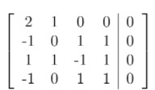
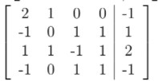
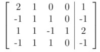
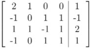
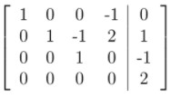
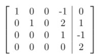
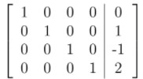
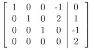

# Solve with us 2.2 - Not Graded _ IITM Online Degree (4_4_2026 9_01_40 am)

 
**Key Points: 1

****A matrix is in row echelon form if :

**• The first non-zero element (the leading entry) in a row is 1.• The column containing the leading 1 of a row is to the right of the column containing the leading 1 of the row above it.• Any non-zero rows are always above rows with all zeros.

A matrix is in reduced row echelon form if :

• The first non-zero element in the first row (the leading entry) is the number 1.• All subsequent non-zero rows must also have their leading entries (i.e. first non-zero entries) as 1 and they should appear to the right of the leading entry in the previous row.• The leading entry in each row must be the only non-zero number in its column.• Any non-zero rows are always above rows with all zeros.

Note: Any matrix which is in reduced row echelon form is also in row echelon form.

    

 

 
 
 
 
 
 

    

 
 
 
 
 *
 
 
 1 point
 
 *
 
 
Choose the correct options for the matrix $A = \begin{bmatrix}
1 & 2 & 0\\
0 & 0 & 1\\
0 & 0 & 0
\end{bmatrix}$

[Hint: Find out the leading entries for each rows and observe whether the matrix is satisfying the conditions of row echelon form and reduced row echelon form.]
 
 
 
 
 
 
$A$ is in row echelon form but not in reduced row echelon form.
 
 
 
 
 
 
 
$A$ is in both row echelon form and reduced row echelon form.
 
 
 
 
 
 
 
$A$ is neither in row echelon form nor reduced row echelon form.
 
 
 
 
 
###  No, the answer is incorrect. 
Score: 0

### Accepted Answers:

 
$A$ is in both row echelon form and reduced row echelon form.
 
 
 
 
 

    

 
 
 
 
 *
 
 
 1 point
 
 *
 
 
Choose the correct options for the matrix $A = \begin{bmatrix}
0 & 1 & 0\\
1 & 0 & 1\\
0 & 1 & 0
\end{bmatrix}$
 
 
 
 
 
 
$A$ is in row echelon form but not in reduced row echelon form.
 
 
 
 
 
 
 
$A$ is in both row echelon form and reduced row echelon form.
 
 
 
 
 
 
 
$A$ is neither in row echelon form nor reduced row echelon
form.
 
 
 
 
 
###  No, the answer is incorrect. 
Score: 0

### Accepted Answers:

 
$A$ is neither in row echelon form nor reduced row echelon
form.
 
 
 
 
 

    

 
 
 
 
 *
 
 
 1 point
 
 *
 
 
Choose the correct options for the matrix $F = \begin{bmatrix}
1 & 1 & 0\\
0 & 1 & 0\\
0 & 0 & 1
\end{bmatrix}$
 
 
 
 
 
 
$A$ is in row echelon form but not in reduced row echelon form.
 
 
 
 
 
 
 
$A$ is in both row echelon form and reduced row echelon form.
 
 
 
 
 
 
 
$A$ is neither in row echelon form nor reduced row echelon form.
 
 
 
 
 
###  No, the answer is incorrect. 
Score: 0

### Accepted Answers:

 
$A$ is in row echelon form but not in reduced row echelon form.
 
 
 
 
 
 

Key Points: 2 

Let $Ax = b$ be a system of linear equations and suppose $A$ is in reduced row echelon form. Assume that for every zero row of $A,$ the corresponding entry of $b$ is also $0$ (i.e., if the $i-th$ row of $A$ is $0$, then so is $b_i$.)

• If the $i-th$ column has the leading entry of some row, we call $x_i$ a dependent variable.

• If the $i-th$ column does not have the leading entry of any row, we call $x_i$ an independent variable.

    

 

 
 
 
 
 
 

    

 
 
 
 
 *
 
 
 1 point
 
 *
 
 
Consider a system of linear equations:

                                     $\begin{aligned}
 0x_1 +x_2 +0x_3 +0x_4 = 1\\
 0x_1 +0x_2 +x_3 +0x_4 = 1
\end{aligned}$

Choose the set of correct options.
[Hint: Recall the definitions of independent and dependent variable with respect to reduced row echelon form.]
 
 
 
 
 
 
$x_1\text{ and } x_2$ are dependent variables.

 
 
 
 
 
 
 
$x_2$ is a dependent variable.

 
 
 
 
 
 
 
$x_3 \text{ and } x_4$ are independent variables.

 
 
 
 
 
 
 
$x_4$ is an independent variable.
 
 
 
 
 
###  No, the answer is incorrect. 
Score: 0

### Accepted Answers:

 
$x_2$ is a dependent variable.

 
 
$x_4$ is an independent variable.
 
 
 
 
 

    

 
 
 
 
 *
 
 
 1 point
 
 *
 
 
 let $Ax=b$ be a system of linear equations, where $A=\begin{bmatrix}
1 & 0 & 0 & 0 \\
0 & 0 & 1 & 1 \\
0 & 0 & 0 & 0 \\
0 & 0 & 0 & 0
\end{bmatrix}$, and $b=\begin{bmatrix}
3 \\
2\\
0\\
0
\end{bmatrix}$. 
Choose the set of correct options. 
 
 
 
 
 
 
$x_1$ is a dependent variable. 

 
 
 
 
 
 
 
$x_2$ is a dependent variable. 

 
 
 
 
 
 
 
$x_3$ is a dependent variable. 

 
 
 
 
 
 
 
The expressions $x_1=3$ and $x_3=2-x_4$ show the dependency of $x_1$ and $x_3$ on the elements of $b$ and the independent variables.
 
 
 
 
 
###  No, the answer is incorrect. 
Score: 0

### Accepted Answers:

 
$x_1$ is a dependent variable. 

 
 
$x_3$ is a dependent variable. 

 
 
The expressions $x_1=3$ and $x_3=2-x_4$ show the dependency of $x_1$ and $x_3$ on the elements of $b$ and the independent variables.
 
 
 
 
 
 

Key Points: 3

The three different types of elementary row operations that can be performed on a matrix are:
• Type 1: Interchanging two rows.• Type 2: Multiplying a row with some constant.• Type 3: Adding a scalar multiple of a row to another row.

Using these row operations one can obtain row echelon form or reduced row echelon form of a given matrix.

Consider the following matrix A and answer the questions (a), (b), (c), (d), and (e).

                                        $\begin{bmatrix}1 & 3 &2&0\\0 & 2&1&0\\2&4&4&3\ \end{bmatrix}$
 

    

 

 
 
 
 
 
 

    

 
 
 
 
 *
 
 
 1 point
 
 *
 
 
What will be the third row of the matrix if we perform the row operation $R_3-2R_1$ on $A$?
 
 
 
 
 
 
 
 
$\begin{pmatrix}
 1 & 1 & 2 & 3 
 \end{pmatrix}$
 
 
 
 
 
 
 
 
$\begin{pmatrix}
 4 & 10 & 8 & 3 
 \end{pmatrix}$
 
 
 
 
 
 
 
 
$\begin{pmatrix}
 0 & -2 & 0 & 3 
 \end{pmatrix}$
 
 
 
 
 
 
 
 
$\begin{pmatrix}
 0 & 4 & 4 & 3 
 \end{pmatrix}$
 
 
 
 
 
###  No, the answer is incorrect. 
Score: 0

### Accepted Answers:

 
$\begin{pmatrix}
 0 & -2 & 0 & 3 
 \end{pmatrix}$
 
 
 
 
 
 

    

 
 
 
 
 *
 
 
 1 point
 
 *
 
 
What will be the second row of the matrix if we perform the row operation $\frac{1}{2}R_2$ on $A$?
 
 
 
 
 
 
 
 
$\begin{pmatrix}
 0 & 1 & 1 & 0 
 \end{pmatrix}$
 
 
 
 
 
 
 
 
$\begin{pmatrix}
 0 & 4 & 2 & 0
 \end{pmatrix}$
 
 
 
 
 
 
 
 
$\begin{pmatrix}
 0 & 1 & \frac{1}{2} & 0 
 \end{pmatrix}$
 
 
 
 
 
 
 
 
$\begin{pmatrix}
 1 & 2 & 2 & \frac{3}{2} 
 \end{pmatrix}$
 
 
 
 
 
###  No, the answer is incorrect. 
Score: 0

### Accepted Answers:

 
$\begin{pmatrix}
 0 & 1 & \frac{1}{2} & 0 
 \end{pmatrix}$
 
 
 
 
 
 

    

 
 
 
 
 *
 
 
 1 point
 
 *
 
 
If we perform the row operations mentioned in question (a) and question (b), simultaneously on $A$, the matrix (let it be called $B$) we get is: 
 
 
 
 
 
 
 
$\begin{bmatrix}
 1 & 3 & 2 & 0 \\
 0 & 1 & \frac{1}{2} & 0 \\
 0 & -2 & 0 & 3
 \end{bmatrix}$
 
 
 
 
 
 
 
 
$\begin{bmatrix}
 1 & 3 & 2 & 0 \\
 0 & 1 & 1 & 0 \\
 1 & 1 & 2 & 3
 \end{bmatrix}$
 
 
 
 
 
 
 
 
$\begin{bmatrix}
 1 & 3 & 2 & 0 \\
 0 & 4 & 2 & 0 \\
 0 & -2 & 0 & 3
 \end{bmatrix}$
 
 
 
 
 
 
 
 
$\begin{bmatrix}
 1 & 3 & 2 & 0 \\
 0 & 1 & \frac{1}{2} & 0 \\
 0 & 4 & 4 & 3
 \end{bmatrix}$
 
 
 
 
 
###  No, the answer is incorrect. 
Score: 0

### Accepted Answers:

 
$\begin{bmatrix}
 1 & 3 & 2 & 0 \\
 0 & 1 & \frac{1}{2} & 0 \\
 0 & -2 & 0 & 3
 \end{bmatrix}$
 
 
 
 
 
 

    

 
 
 
 
 *
 
 
 1 point
 
 *
 
 
Which row operations have to be performed on the matrix $B$ (matrix $B$ is as in question (c)) to make all the entries 0 in the second column, except the leading entry of the second row. 
 
 
 
 
 
 
 
$R_1-3R_2$ and $R_3-2R_2$
 
 
 
 
 
 
 
 
$R_1+3R_2$ and $R_3+2R_2$
 
 
 
 
 
 
 
 
$R_1+3R_2$ and $R_3-2R_2$
 
 
 
 
 
 
 
 
$R_1-3R_2$ and $R_3+2R_2$

 
 
 
 
 
###  No, the answer is incorrect. 
Score: 0

### Accepted Answers:

 
$R_1-3R_2$ and $R_3+2R_2$

 
 
 
 
 

    

 
 
 
 
 *
 
 
 1 point
 
 *
 
 
The reduced row echelon form of $A$ is 

[Hint: Recall the definition of reduced row echelon form.]
 
 
 
 
 
 
 
$\begin{bmatrix}
 1 & 0 & \frac{1}{2} & 0 \\
 0 & 1 & \frac{1}{2} & 0 \\
 0 & 0 & 1 & 3 
 \end{bmatrix}$
 
 
 
 
 
 
 
 
$\begin{bmatrix}
 1 & 0 & 0 & 0 \\
 0 & 1 & 0 & 0 \\
 0 & 0 & 1 & 3 
 \end{bmatrix}$
 
 
 
 
 
 
 
 
$\begin{bmatrix}
 1 & 0 & 0 & 0 \\
 0 & 1 & 0 & -\frac{3}{2} \\
 0 & 0 & 1 & 3 
 \end{bmatrix}$
 
 
 
 
 
 
 
 
$\begin{bmatrix}
 1 & 0 & 0 & -\frac{3}{2} \\
 0 & 1 & 0 & -\frac{3}{2}\\
 0 & 0 & 1 & 3 
 \end{bmatrix}$
 
 
 
 
 
###  No, the answer is incorrect. 
Score: 0

### Accepted Answers:

 
$\begin{bmatrix}
 1 & 0 & 0 & -\frac{3}{2} \\
 0 & 1 & 0 & -\frac{3}{2}\\
 0 & 0 & 1 & 3 
 \end{bmatrix}$
 
 
 
 
 
 

Key Points: 4

Let $Ax=b$ denote the matrix representation of a system of linear equations.

- The augmented matrix is denoted by $[A|b]$.
- The matrix obtained by performing the operations that transform $A$ to its reduced row echelon form $R$ on the augmented matrix is denoted by $[R|c]$. 
- The solutions of $Rx=c$ are the same as the solutions of $Ax=b$.

Consider a system of linear equations 
 
                                            $2x_1 +x_2 = 1\\
 -x_1 +x_3 + x_4 = -1\\
 x_1 +x_2 -x_3 +x_4 = 2\\
 -x_1 +x_3 +x_4 = 1.$

Answer the questions (a), (b) and (c) based on the above information.

    

 

 
 
 
 
 
 

    

 
 
 
 
 *
 
 
 1 point
 
 *
 
 
Which of the following represents an augmented matrix of the system?

[Hint: First try to write down the coefficient matrix $A$ and the corresponding vector $b$.]

 
 
 
 
 
 

 
 
 
 
 
 
 

 
 
 
 
 
 
 

 
 
 
 
 
 
 

 
 
 
 
 
###  No, the answer is incorrect. 
Score: 0

### Accepted Answers:

 

 
 
 
 
 

    

 
 
 
 
 *
 
 
 1 point
 
 *
 
 
What will be the matrix $[R|c]$ obtained by performing the operations that transform $A$ to its reduced row echelon form $R$ on the augmented matrix?
 
 
 
 
 
 

 
 
 
 
 
 
 

 
 
 
 
 
 
 

 
 
 
 
 
 
 

 
 
 
 
 
###  No, the answer is incorrect. 
Score: 0

### Accepted Answers:

 

 
 
 
 
 

    

 
 
 
 
 *
 
 
 1 point
 
 *
 
 Choose the correct option. 
[Hint: Write down the system of linear equations corresponding to the reduced row echelon form of the augmented matrix.]

 
 
 
 
 
 The system of linear equations has an infinite number of solutions. 
 
 
 
 
 
 
 The system of linear equations has a unique solution. 
 
 
 
 
 
 
 The system of linear equations has no solution. 
 
 
 
 
 
 
 
$x_1=x_2=x_3=x_4=1$ is a solution of the system of linear equations. 

 
 
 
 
 
###  No, the answer is incorrect. 
Score: 0

### Accepted Answers:

 The system of linear equations has no solution.