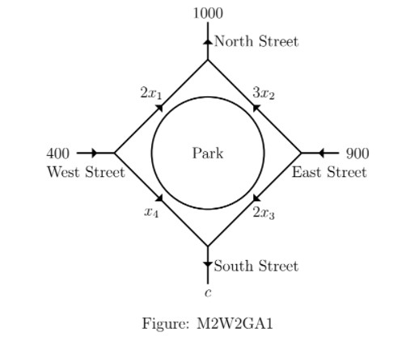
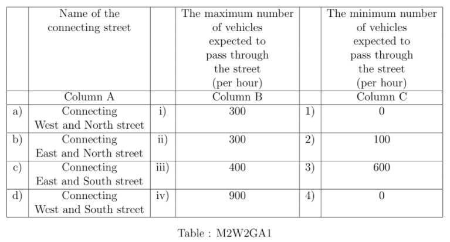

# Week 2 Graded Assignment 2 _ IITM Online Degree (4_4_2026 9_02_47 am)

 
Note: This assignment will be evaluated after the deadline passes. You will get your score 48 hrs after the deadline. Until then the score will be shown as Zero.

Multiple Select Questions (MSQ)

    

 

 
 
 
 
 
 

    

 
 
 
 
 *
 
 
 1 point
 
 *
 
 
In a particular year, the profit (in lakhs of **₹**) of Star Fish company is given by the polynomial $P(x) = ax^2+bx+c$ where $x$ denotes the number of months since the beginning of the year (i.e., $x=1$ denotes January, $x=2$ denotes February, and so on). In January and February the company made a loss of **₹**45(in lakhs), and **₹**19(in lakhs) respectively, and in March the company made a profit of **₹**3(in lakhs). Let the loss be represented by negative of profit. 
 Choose the correct set of options based on the given information.
 
 
 
 
 
 
 The maximum profit will be in the month of May.
 
 
 
 
 
 
 
 The maximum profit will be in the month of August.
 
 
 
 
 
 
 
 The maximum monthly profit amount is **₹**53 lakh.
 
 
 
 
 
 
 
 The maximum monthly profit amount is **₹**35 lakh.
 
 
 
 
 
###  Yes, the answer is correct. 
Score: 1

### Accepted Answers:

 The maximum profit will be in the month of August.
 
 
 The maximum monthly profit amount is **₹**53 lakh.
 
 
 
 
 
 

    

 
 
 
 
 *
 
 
 1 point
 
 *
 
 
If $A$ be a $3\times4$ matrix and $b$ be a $3\times1$ matrix, then choose the set of correct options.

 
 
 
 
 
 
If $(A|b)$ be the augmented matrix and $(A'|b')$ be the matrix obtained from $(A|b)$ after a finite number of elementary row operations then the system $Ax = b$ and the system $A'x = b'$ have the same set of solutions.

 
 
 
 
 
 
 
If $(A'|b')$ is the reduced row echelon form of $(A|b)$ then the system $A'x = b'$ has at least one solution.

 
 
 
 
 
 
 
If $(A'|b')$ is the reduced row echelon form of $(A|b)$, then $A'$ is also in reduced row echelon form.

 
 
 
 
 
 
 
If $(A'|b')$ is the reduced row echelon form of $(A|b)$ and there is no row such that the only non zero entry lies in the last column of $(A'|b')$ then the system $Ax = b$ has at least one solution.
 
 
 
 
 
###  Yes, the answer is correct. 
Score: 1

### Accepted Answers:

 
If $(A|b)$ be the augmented matrix and $(A'|b')$ be the matrix obtained from $(A|b)$ after a finite number of elementary row operations then the system $Ax = b$ and the system $A'x = b'$ have the same set of solutions.

 
 
If $(A'|b')$ is the reduced row echelon form of $(A|b)$, then $A'$ is also in reduced row echelon form.

 
 
If $(A'|b')$ is the reduced row echelon form of $(A|b)$ and there is no row such that the only non zero entry lies in the last column of $(A'|b')$ then the system $Ax = b$ has at least one solution.
 
 
 
 
 

    

 
 
 
 
 *
 
 
 1 point
 
 *
 
 Choose the set of correct options

 
 
 
 
 
 
If the sum of all the elements of each row of a matrix $A$ is 0, then $A$ is not invertible.

 
 
 
 
 
 
 
If $E$ is a matrix of order $3\times 3$ obtained from the identity matrix by a finite number of elementary row operations then $E$ is invertible. 

 
 
 
 
 
 
 Any system of linear equations has at least one solution.
 
 
 
 
 
 
 
If $A$ is a matrix of order $3\times3$ and $det(A) = 3$ then $det(Adj(A)) = 3$. 

 
 
 
 
 
 
 
If $A$ is a matrix of order $3\times3$ and $det(A) = 3$ then $det(Adj(A)) = 9$. 
 
 
 
 
 
###  Yes, the answer is correct. 
Score: 1

### Accepted Answers:

 
If the sum of all the elements of each row of a matrix $A$ is 0, then $A$ is not invertible.

 
 
If $E$ is a matrix of order $3\times 3$ obtained from the identity matrix by a finite number of elementary row operations then $E$ is invertible. 

 
 
If $A$ is a matrix of order $3\times3$ and $det(A) = 3$ then $det(Adj(A)) = 9$. 
 
 
 
 
 

    

 
 
 
 
 *
 
 
 1 point
 
 *
 
 
Ramya bought 1 comic book, 2 horror books, and 1 novel from a bookshop which cost her **₹**1000. Romy bought 2 comic books, 5 horror books, and 1 novel which cost him **₹**2000. Farjana bought 4 comic books, 5 horror books, and $c$ novels from a shop which cost her **₹**$d$. If $x_1, x_2, \text{ and } x_3$ represent the price of each comic book, horror book, and novel, respectively, then choose the set of correct options.
 
 
 
 
 
 
The matrix representation to find $x_1, x_2$ and $x_3$ is 
$\begin{bmatrix}
1 & 2 & 1 \\
2 & 5 & 1 \\
4 & 5 & c
\end{bmatrix} \begin{bmatrix}
x_1 \\
x_2\\
x_3
\end{bmatrix}=\begin{bmatrix}
1000 \\
2000\\
d
\end{bmatrix}$

 
 
 
 
 
 
 
The matrix representation to find $x_1, x_2$ and $x_3$ is 
$\begin{bmatrix}
x_1 & x_2 & x_3
\end{bmatrix}\begin{bmatrix}
1 & 2 & 4 \\
2 & 5 & 5 \\
1 & 1 & c
\end{bmatrix}=\begin{bmatrix}
1000 &
2000 &
d
\end{bmatrix}$

 
 
 
 
 
 
 
The matrix representation to find $x_1, x_2$ and $x_3$ is 
$\begin{bmatrix}
1 & 2 & 4 \\
2 & 5 & 5 \\
1 & 1 & c
\end{bmatrix}\begin{bmatrix}
x_1 & x_2 & x_3
\end{bmatrix}=\begin{bmatrix}
1000 &
2000 &
d
\end{bmatrix}$

 
 
 
 
 
 
 
If Farjana tries to find $x_1, x_2, \text{ and } x_3$ using appropriate matrix representation by taking $c=2$ and $d=4000$, then the price of each comic book that she thus arrives at, will not be unique.

 
 
 
 
 
 
 
If $c = 7$ and $d = 4000$, then the price of each comic book cannot be determined from this data.

 
 
 
 
 
 
 
If $c=7$ and $d=3000$, then the shopkeeper has made a mistake.

 
 
 
 
 
 
 
If $c=2$ and $d=3000$, then the price of each comic book can be determined from the data.
 
 
 
 
 
### Partially Correct. 
Score: 0.8

### Accepted Answers:

 
The matrix representation to find $x_1, x_2$ and $x_3$ is 
$\begin{bmatrix}
1 & 2 & 1 \\
2 & 5 & 1 \\
4 & 5 & c
\end{bmatrix} \begin{bmatrix}
x_1 \\
x_2\\
x_3
\end{bmatrix}=\begin{bmatrix}
1000 \\
2000\\
d
\end{bmatrix}$

 
 
The matrix representation to find $x_1, x_2$ and $x_3$ is 
$\begin{bmatrix}
x_1 & x_2 & x_3
\end{bmatrix}\begin{bmatrix}
1 & 2 & 4 \\
2 & 5 & 5 \\
1 & 1 & c
\end{bmatrix}=\begin{bmatrix}
1000 &
2000 &
d
\end{bmatrix}$

 
 
If $c = 7$ and $d = 4000$, then the price of each comic book cannot be determined from this data.

 
 
If $c=7$ and $d=3000$, then the shopkeeper has made a mistake.

 
 
If $c=2$ and $d=3000$, then the price of each comic book can be determined from the data.
 
 
 
 
 

    

 
 
 
 
 *
 
 
 1 point
 
 *
 
 Let A be an m × n matrix such that m < n. How many solutions does Ax = 0 have?
 
 
 
 
 
 Exactly one solution.
 
 
 
 
 
 
 Infinitely many solutions.
 
 
 
 
 
 
 No solution.
 
 
 
 
 
 
 Insufficient data. This depends on the entries of A.
 
 
 
 
 
###  Yes, the answer is correct. 
Score: 1

### Accepted Answers:

 Infinitely many solutions.
 
 
 
 
 

    

 
 
 
 
 *
 
 
 1 point
 
 *
 
 
$\text{Let } A \text{ be an } n \times n \text{ matrix such that } \sum_{j=1}^n a_{ij} = 0 \text{ for all } i. \text{ How many solutions does } A\mathbf{x} = \mathbf{0} \text{ have?}$

 
 
 
 
 
 Exactly one solution.
 
 
 
 
 
 
 Infinitely many solutions.
 
 
 
 
 
 
 No solution.
 
 
 
 
 
 
 Insufficient data. This depends on the entries of A.
 
 
 
 
 
###  Yes, the answer is correct. 
Score: 1

### Accepted Answers:

 Infinitely many solutions.
 
 
 
 
 
 

Numerical Answer Type (NAT):

    

 

 
 
 
 
 
 

    

 
 
 
 
 
 
How many solutions does the following system have? Enter 1 if there is only one solution, 0 if there are no solutions and -1 if there are infinitely many solutions. The coefficient matrix $A$ and the vector $b$ are given below:

$A = \begin{bmatrix}
1 & 0 & -1\\
1 & 1 & -1\\
2 & 1 & -2
\end{bmatrix}, b = \begin{bmatrix}
1\\
3\\
4
\end{bmatrix}$

 
 
 
 
 
 
 
 
###  Yes, the answer is correct. 
Score: 1

### Accepted Answers:
(Type: Numeric) -1
 
 
 *
 
 
 1 point
 
 *
 

 
 

    

 
 
 
 
 
 
Let the reduced row echelon form of a matrix $A$ be $\begin{bmatrix}
1 & 0 & 0 & -\frac{1}{2} \\
0 & 1 & 0 & -\frac{1}{6} \\
0 & 0 & 1 & \frac{1}{6}
\end{bmatrix}.$ The first, second, third and fourth columns of $A$ are $\begin{bmatrix}
1\\
0\\
-1
\end{bmatrix}$, $\begin{bmatrix}
3\\
2\\
1
\end{bmatrix}$, $\begin{bmatrix}
a\\
b\\
c
\end{bmatrix}$
and $\begin{bmatrix}
-1\\
0\\
0
\end{bmatrix}$, respectively. The value of $a+b+c$ is 
 
 
 
 
 
 
 
 
###  No, the answer is incorrect. 
Score: 0

### Accepted Answers:
(Type: Numeric) 0
 
 
 *
 
 
 1 point
 
 *
 

 
 
 

    

 

 
 
 
 
 
 
 

    

 

 
 
 
 
 
 

    

 
 
 
 
 
 
$A$ is the reduced row echelon form of the matrix $\begin{bmatrix}1 & 3 & 0 & 0 \\ 4 & 1 & 5 & 5 \\ 2 & 2 & 7 & 91 \\ 3 & 9 & 0 & 0\end{bmatrix}.$ Then determinant of $A$ is
 
 
 
 
 
 
 
 
###  Yes, the answer is correct. 
Score: 1

### Accepted Answers:
(Type: Numeric) 0
 
 
 *
 
 
 1 point
 
 *
 

 
 
 

    

 

 
 
 
 
 
 

    

 
 
 
 
 
 
If $\begin{bmatrix} x \\ y \\ z \end{bmatrix}$ is a solution of the system of equations 
 $\begin{aligned} 7x+ 2y + z &= 8 \\ 3y-z &= 2 \\ -3x+4y-2z &= 5 \end{aligned}$, then the value of $x+y+z$ is
 
 
 
 
 
 
 
 
###  Yes, the answer is correct. 
Score: 1

### Accepted Answers:
(Type: Numeric) 121
 
 
 *
 
 
 1 point
 
 *
 

 
 
 

    

 

 
 
 
 
 
 

    

 
 
 
 
 
 
Let $A = [1~7~2~9]$ and $M$ denote the reduced row echelon form of $A^TA$. The number of non-zero rows of $M$ is 
 
 
 
 
 
 
 
 
###  Yes, the answer is correct. 
Score: 1

### Accepted Answers:
(Type: Numeric) 1
 
 
 *
 
 
 1 point
 
 *
 

 
 
 

    

 

 
 
 
 
 
 

    

 
 
 
 
 
 
Consider the curve corresponding to the function $f(x) = ax^3 + bx^2 + cx + d$. The following points lie on the curve: $(1, 1), (2, 7), (-1, -5), (3, 23)$. Find the value of $a - b + c - d$.
 
 
 
 
 
 
 
 
###  Yes, the answer is correct. 
Score: 1

### Accepted Answers:
(Type: Numeric) 5
 
 
 *
 
 
 1 point
 
 *
 

 
 
 

Comprehension Type Question:

The network in Figure: M2W2GA1 shows a proposed plan for flow of traffic around a 
park. All the streets are assumed to be one-way and the arrows denote the direction of flow of traffic. The plan calls for a computerized traffic light at the South Street. Let $2x_1, 3x_2, 2x_3, \text{ and } x_4$ denote the average number (per hour) of vehicles expected to pass through the connecting streets (e.g., $2x_1$ denote the average number (per hour) of vehicles expected to pass through the street connecting the North Street and West Street as shown in Figure: M2W2GA1). 400, 1000, 900, and $c$ denote the average number (per hour) of vehicles expected to pass through West, North, East, and South Streets respectively. 

                                              

    

 

 
 
 
 
 
 

    

 
 
 
 
 *
 
 
 1 point
 
 *
 
 Which of the following options are correct?

 
 
 
 
 
 
The system of equations corresponding to the flow of expected traffic according to the given data above, will be 

                                                         $\begin{aligned}
 2x_1+ 3x_2 &= 1000\\
3x_2 +2x_3 &= 900\\
2x_3 + x_4 &= c\\
2x_1 + x_4 &= 400
\end{aligned}$

 
 
 
 
 
 
 
The system of equations corresponding to the flow of expected traffic according to the given data above, will be

                                               $\begin{aligned}
 2x_1+ 3x_2 &= 900\\
3x_2 +2x_3 &= 1000\\
2x_3 + x_4 &= 400\\
2x_1 + x_4 &= c
\end{aligned}$

 
 
 
 
 
 
 
The matrix representation of the system of equations corresponding to the flow of expected traffic according to the given data above is 

                                  $\begin{bmatrix}
2 & 3 & 0 & 0\\
0 & 3 & 2 & 0 \\
0 & 0 & 2 & 1 \\
2 & 0 & 0 & 1
\end{bmatrix} \begin{bmatrix}
x_1 \\
x_2\\
x_3 \\
x_4
\end{bmatrix}=\begin{bmatrix}
900 \\
1000\\
400 \\
c
\end{bmatrix}$

 
 
 
 
 
 
 
The matrix representation of the system of equations corresponding to the flow of expected traffic according to the given data above is 

                                   $\begin{bmatrix}
2 & 3 & 0 & 0\\
0 & 3 & 2 & 0 \\
0 & 0 & 2 & 1 \\
2 & 0 & 0 & 1
\end{bmatrix} \begin{bmatrix}
x_1 \\
x_2\\
x_3 \\
x_4
\end{bmatrix}=\begin{bmatrix}
1000 \\
900\\
c \\
400
\end{bmatrix}$
 
 
 
 
 
### Partially Correct. 
Score: 0.5

### Accepted Answers:

 
The system of equations corresponding to the flow of expected traffic according to the given data above, will be 

                                                         $\begin{aligned}
 2x_1+ 3x_2 &= 1000\\
3x_2 +2x_3 &= 900\\
2x_3 + x_4 &= c\\
2x_1 + x_4 &= 400
\end{aligned}$

 
 
The matrix representation of the system of equations corresponding to the flow of expected traffic according to the given data above is 

                                   $\begin{bmatrix}
2 & 3 & 0 & 0\\
0 & 3 & 2 & 0 \\
0 & 0 & 2 & 1 \\
2 & 0 & 0 & 1
\end{bmatrix} \begin{bmatrix}
x_1 \\
x_2\\
x_3 \\
x_4
\end{bmatrix}=\begin{bmatrix}
1000 \\
900\\
c \\
400
\end{bmatrix}$
 
 
 
 
 

    

 
 
 
 
 
 How many vehicles are expected to pass through the South Street per hour on an average?
 
 
 
 
 
 
 
 
###  Yes, the answer is correct. 
Score: 1

### Accepted Answers:
(Type: Numeric) 300
 
 
 *
 
 
 1 point
 
 *
 

 
 

    

 
 
 
 
 *
 
 
 1 point
 
 *
 
 Match the names of the street in Column A with the maximum and minimum number of vehicles expected to pass through the street on an average (per hour) in Column B and Column C, respectively; in Table M2W2GA1.

 
 
 
 
 
 
d $\rightarrow$ i $\rightarrow$ 2 

 
 
 
 
 
 
 
b $\rightarrow$ iii $\rightarrow$ 3.

 
 
 
 
 
 
 
b $\rightarrow$ iv $\rightarrow$ 3.

 
 
 
 
 
 
 
d $\rightarrow$ ii $\rightarrow$ 1.

 
 
 
 
 
 
 
a $\rightarrow$ iii $\rightarrow$ 2.

 
 
 
 
 
 
 
a $\rightarrow$ iii $\rightarrow$ 4.

 
 
 
 
 
 
 
c $\rightarrow$ i $\rightarrow$ 4.
 
 
 
 
 
###  Yes, the answer is correct. 
Score: 1

### Accepted Answers:

 
b $\rightarrow$ iv $\rightarrow$ 3.

 
 
d $\rightarrow$ ii $\rightarrow$ 1.

 
 
a $\rightarrow$ iii $\rightarrow$ 2.

 
 
c $\rightarrow$ i $\rightarrow$ 4.
 
 
 
 
 
 

NOTE FOR OPTION-2 IN QUESTION-3: [For elementary row operation of type-2 (scaling rows by a constant), the constant has to be non-zero. Scaling a row by zero is not permitted] Please answer this question keeping this in mind.