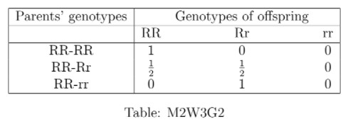

# Week 3 - Graded Assignment - 3 _ IITM Online Degree (5_4_2026 4_40_06 pm)

 
Note: This assignment will be evaluated after the deadline passes. You will get your score 48 hrs after the deadline. Until then the score will be shown as Zero.

Multiple Select Questions (MSQ)

    

 

 
 
 
 
 
 

    

 
 
 
 
 *
 
 
 1 point
 
 *
 
 Which of the following sets with the given addition and scalar multiplication operations (scalars are real numbers in every case) do not form vector spaces? 

 
 
 
 
 
 
$\begin{aligned}
 & V_1 = \lbrace (x,y) | x,y\in \mathbb{R} \rbrace \\
 & \textit{Addition: } (x_1,y_1)+(x_2,y_2)=(x_1+x_2, 1); ~ (x_1,y_1), (x_2,y_2)\in V_1 \\
 & \textit{Scalar multiplication: } c(x,y)=(cx,1);~ (x,y)\in V_1, ~ c\in \mathbb{R}
\end{aligned}$

 
 
 
 
 
 
 
$\begin{aligned}
 & V_2 = \lbrace (x,y) | x,y\in \mathbb{R} \rbrace \\
 & \textit{Addition: } (x_1,y_1)+(x_2,y_2)=(x_1+x_2, y_1+y_2); ~ (x_1,y_1), (x_2,y_2)\in V_2 \\
 & \textit{Scalar multiplication: } c(x,y)=(cx,0);~ (x,y)\in V_2, ~ c\in \mathbb{R}
\end{aligned}$

 
 
 
 
 
 
 
$\begin{aligned}
 & V_3 = \lbrace (x,y) | x,y\in \mathbb{R} \rbrace \\
 & \textit{Addition: } (x_1,y_1)+(x_2,y_2)=(x_1+x_2+y_1+y_2, x_1+x_2+y_1+y_2); \\
 & \hspace{5cm} (x_1,y_1), (x_2,y_2)\in V_3 \\
 & \textit{Scalar multiplication: } c(x,y)=(cx,cy);~ (x,y)\in V_3, ~ c\in \mathbb{R}
\end{aligned}$

 
 
 
 
 
 
 
$\begin{aligned}
 & V_4 = \lbrace (x,y,z) | x,y,z\in \mathbb{R}, x+y=z \rbrace \\
 & \textit{Addition: } (x_1,y_1,z_1)+(x_2,y_2,z_2)=(x_1+x_2, y_1+y_2,z_1+z_2); \\
 &\hspace{5cm} (x_1,y_1,z_1), (x_2,y_2,z_2)\in V_4 \\
 & \textit{Scalar multiplication: } c(x,y,z)=(cx,cy,cz);~ (x,y,z)\in V_4, ~ c\in \mathbb{R}
\end{aligned}$

 
 
 
 
 
###  Yes, the answer is correct. 
Score: 1

### Accepted Answers:

 
$\begin{aligned}
 & V_1 = \lbrace (x,y) | x,y\in \mathbb{R} \rbrace \\
 & \textit{Addition: } (x_1,y_1)+(x_2,y_2)=(x_1+x_2, 1); ~ (x_1,y_1), (x_2,y_2)\in V_1 \\
 & \textit{Scalar multiplication: } c(x,y)=(cx,1);~ (x,y)\in V_1, ~ c\in \mathbb{R}
\end{aligned}$

 
 
$\begin{aligned}
 & V_2 = \lbrace (x,y) | x,y\in \mathbb{R} \rbrace \\
 & \textit{Addition: } (x_1,y_1)+(x_2,y_2)=(x_1+x_2, y_1+y_2); ~ (x_1,y_1), (x_2,y_2)\in V_2 \\
 & \textit{Scalar multiplication: } c(x,y)=(cx,0);~ (x,y)\in V_2, ~ c\in \mathbb{R}
\end{aligned}$

 
 
$\begin{aligned}
 & V_3 = \lbrace (x,y) | x,y\in \mathbb{R} \rbrace \\
 & \textit{Addition: } (x_1,y_1)+(x_2,y_2)=(x_1+x_2+y_1+y_2, x_1+x_2+y_1+y_2); \\
 & \hspace{5cm} (x_1,y_1), (x_2,y_2)\in V_3 \\
 & \textit{Scalar multiplication: } c(x,y)=(cx,cy);~ (x,y)\in V_3, ~ c\in \mathbb{R}
\end{aligned}$

 
 
 
 
 

    

 
 
 
 
 *
 
 
 1 point
 
 *
 
 Choose the set of correct options

 
 
 
 
 
 
If $V$ is a real vector space, then $(\alpha+\beta)(x+y) = \alpha x+\beta y+\alpha y+\beta x$, for all $\alpha,\beta\in \mathbb{R}$ and $x,y\in V$.

 
 
 
 
 
 
 A vector space can have more than one zero vector.
 
 
 
 
 
 
 
(-1, 0 ,0), (-1, 1, -1) and (0, 2, 3) are linearly independent vectors in $\mathbb{R}^3$.

 
 
 
 
 
 
 
$\begin{bmatrix}
-1 & 0 \\
0 & 1
\end{bmatrix}$, $\begin{bmatrix}
0 & -2 \\
1 & 0
\end{bmatrix}$, and $\begin{bmatrix}
-1 & 1 \\
1 & -1
\end{bmatrix}$ are linearly dependent vectors in $M_{2\times 2}(\mathbb{R})$.
 
 
 
 
 
###  Yes, the answer is correct. 
Score: 1

### Accepted Answers:

 
If $V$ is a real vector space, then $(\alpha+\beta)(x+y) = \alpha x+\beta y+\alpha y+\beta x$, for all $\alpha,\beta\in \mathbb{R}$ and $x,y\in V$.

 
 
(-1, 0 ,0), (-1, 1, -1) and (0, 2, 3) are linearly independent vectors in $\mathbb{R}^3$.

 
 
 
 
 

    

 
 
 
 
 *
 
 
 1 point
 
 *
 
 
Consider the set of vectors $S = \{ (-1, 1, 5), (2, 1, 3), (2, 1, 2), (1,-1,7), (-1,3, -5)\}$ from $\mathbb{R}^3$ and choose the set of correct options.

 
 
 
 
 
 
The singleton set $\lbrace (-1, 1, 5) \rbrace$ is linearly dependent.

 
 
 
 
 
 
 
If $\alpha, \beta \in S$ and $\alpha, \beta$ are distinct then $\{\alpha, \beta \}$ is a linearly independent set of vectors. 

 
 
 
 
 
 
 The set {(-1, 1, 5), (2, 1, 3),(-2, 2, 10)} is a linearly dependent set of vectors.
 
 
 
 
 
 
 
The set $S$ is a linearly independent set of vectors.

 
 
 
 
 
 
 
The set $\{\alpha, \beta, \gamma \}$ is a linearly dependent set of vectors for any $\alpha, \beta, \gamma \in S$, where all the three are distinct vectors. 

 
 
 
 
 
 
 
The set $\{\alpha, \beta, \gamma, \delta \}$ is a linearly independent set of vectors for any $\alpha, \beta, \gamma, \delta \in S$, where all the four are distinct vectors.

 
 
 
 
 
 
 
The system $AX = b$, where $A = \begin{bmatrix}
2 & 1 & 2\\ 
1 & -1 & 7\\
-1 & 1 & 5\\
2 & 1 & 3
\end{bmatrix}$ and $b = \begin{bmatrix}
0 \\
0 \\
0 \\
0
\end{bmatrix}$ has unique solution.

 
 
 
 
 
 
 
The system $AX = b$, where $A = \begin{bmatrix}
-1 & 3 & -5\\
2 & 1 & 3\\
\end{bmatrix}$ and $b = \begin{bmatrix}
0 \\
0 \\
\end{bmatrix}$ has infinitely many solutions.

 
 
 
 
 
 
 
The system $AX = b$ where $A = \begin{bmatrix}
2 & 1 & 2\\
-1 & 3 & -5\\
-1 & 1 & 5
\end{bmatrix}$ and $b = \begin{bmatrix}
0 \\
0 \\
0
\end{bmatrix}$ has infinitely many solutions.

 
 
 
 
 
###  Yes, the answer is correct. 
Score: 1

### Accepted Answers:

 
If $\alpha, \beta \in S$ and $\alpha, \beta$ are distinct then $\{\alpha, \beta \}$ is a linearly independent set of vectors. 

 
 The set {(-1, 1, 5), (2, 1, 3),(-2, 2, 10)} is a linearly dependent set of vectors.
 
 
The system $AX = b$, where $A = \begin{bmatrix}
2 & 1 & 2\\ 
1 & -1 & 7\\
-1 & 1 & 5\\
2 & 1 & 3
\end{bmatrix}$ and $b = \begin{bmatrix}
0 \\
0 \\
0 \\
0
\end{bmatrix}$ has unique solution.

 
 
The system $AX = b$, where $A = \begin{bmatrix}
-1 & 3 & -5\\
2 & 1 & 3\\
\end{bmatrix}$ and $b = \begin{bmatrix}
0 \\
0 \\
\end{bmatrix}$ has infinitely many solutions.

 
 
 
 
 
 

Numerical Answer Type (NAT):

    

 

 
 
 
 
 
 

    

 
 
 
 
 
 
Consider the set of three vectors $S=\lbrace (1, 2, -1), (3, 1, 0), (-1, 2, c) \rbrace$ in $\mathbb{R}^3$ with usual addition and scalar multiplication. For which value of $c$ will the above set $S$ be linearly dependent?
 
 
 
 
 
 
 
 
###  Yes, the answer is correct. 
Score: 1

### Accepted Answers:
(Type: Numeric) -1.4
 
 
 *
 
 
 1 point
 
 *
 

 
 
 

    

 

 
 
 
 
 
 

    

 
 
 
 
 
 
Consider the set of three vectors $S=\lbrace (7,7,2), (8,7,4), (5,7,c) \rbrace$ in $\mathbb{R}^3$ with usual addition and scalar multiplication. If $S$ is a linearly independent set, then the value of $c$ can not be equal to
 
 
 
 
 
 
 
 
###  Yes, the answer is correct. 
Score: 1

### Accepted Answers:
(Type: Numeric) -2
 
 
 *
 
 
 1 point
 
 *
 

 
 
 

Comprehension Type Question:

In genetics, a classic example of dominance is the inheritance of shape of seeds in peas. Peas may be round (associated with genotype R) or wrinkled (associated with genotype r). In this case, three combinations of genotypes are possible: RR, rr, and Rr. The RR individuals have round peas and the rr individuals have wrinkled peas. In Rr individuals the R genotype masks the presence of the r genotype, so these individuals also have round peas. 

Consider the crossing of RR with RR. This always gives the genotype RR, therefore the probabilities of an offspring to be RR, Rr, and rr respectively are equal to 1, 0, and 0. Next, consider the crossing of Rr with RR. The offspring will have equal chances to be of genotype RR and genotype Rr, therefore the probabilities of RR, Rr, and rr repectively are 1/2, 1/2, and 0. Finally, consider the crossing of rr with RR. This always results in genotype Rr. Therefore, the probabilities of genotypes RR, Rr, and rr are 0, 1, and 0, respectively.

The following table summarizes these facts :

                                                  

The matrix representing this observation is given by $P=\begin{bmatrix}
1 & 0 & 0 \\
\frac{1}{2} & \frac{1}{2} & 0 \\
0 & 1 & 0
\end{bmatrix}$, and the initial distribution vector ($1\times 3$ matrix) is denoted by $X_0=(
X_0^1, X_0^2, X_0^3)$, where $X_0^1$ denotes the distribution of RR, $X_0^2$ denotes the distribution of Rr, and $X_0^3$ denotes the distribution of rr. For any positive integer $n$, the distribution vector after $n$ generations (i.e., at $t=n$) is denoted by $X_n$ and is given by the equation $X_{n-1}P=X_n$. 

Using the above information, answer the following questions.

    

 

 
 
 
 
 
 

    

 
 
 
 
 *
 
 
 1 point
 
 *
 
 Suppose, in an experiment, 100 pairs of parents with genotype combinations RR-RR, 100 pairs of parents with genotype combinations RR-Rr, and 200 pairs of parents with genotype combination RR-rr are taken to observe the genotypes of their offspring. Suppose from crossing of each pair of parents a single offspring is produced. Find the set of correct options from the following. 

 
 
 
 
 
 There will be at least 200 offspring with wrinkled peas. 
 
 
 
 
 
 
 There will be no offspring with wrinkled peas. 
 
 
 
 
 
 
 There will be no offspring with round peas. 
 
 
 
 
 
 
 All the offspring will have round peas. 
 
 
 
 
 
 
 All the offspring will have wrinkled peas. 
 
 
 
 
 
 
 There will be at least 100 offspring with combination of genotypes RR. 
 
 
 
 
 
 
 There will be at least 200 offspring with combination of genotypes Rr.
 
 
 
 
 
###  Yes, the answer is correct. 
Score: 1

### Accepted Answers:

 There will be no offspring with wrinkled peas. 
 
 All the offspring will have round peas. 
 
 There will be at least 100 offspring with combination of genotypes RR. 
 
 There will be at least 200 offspring with combination of genotypes Rr.
 
 
 
 
 

    

 
 
 
 
 *
 
 
 1 point
 
 *
 
 Which of the following options are correct? 

 
 
 
 
 
 
The rows of the matrix $P$ form a linearly independent set.

 
 
 
 
 
 
 
$\left\{ (\frac{1}{2}, 0 , 0), (0,\frac{1}{2},0) \right\}$ is a linearly independent set in $X$.

 
 
 
 
 
 
 
The columns of the matrix $P$ form a linearly dependent set.
 
 
 
 
 
 
 
$det(P)$ is a non-zero number.
 
 
 
 
 
###  Yes, the answer is correct. 
Score: 1

### Accepted Answers:

 
$\left\{ (\frac{1}{2}, 0 , 0), (0,\frac{1}{2},0) \right\}$ is a linearly independent set in $X$.

 
 
The columns of the matrix $P$ form a linearly dependent set.
 
 
 
 
 

    

 
 
 
 
 *
 
 
 1 point
 
 *
 
 
Suppose $X_0=(\frac{1}{3}, \frac{1}{3}, \frac{1}{3})$. Find out the correct set of correct options. 

 
 
 
 
 
 
$X_0$ and $X_1$ are linearly dependent. 

 
 
 
 
 
 
 
$X_0$ and $X_1$ are linearly independent. 

 
 
 
 
 
 
 
The set $\{ X_0, X_1, X_2 \}$ is a linearly dependent set.

 
 
 
 
 
 
 
The set $\{ X_0, X_1, X_2 \}$ is a linearly independent set.
 
 
 
 
 
###  Yes, the answer is correct. 
Score: 1

### Accepted Answers:

 
$X_0$ and $X_1$ are linearly independent. 

 
 
The set $\{ X_0, X_1, X_2 \}$ is a linearly independent set.
 
 
 
 
 
 

    

 

 
 
 
 
 
 

    

 
 
 
 
 
 
Suppose $X_0=(a, b, 1-a-b)$, where $0 \leq a, b, a+b \leq 1$. If the set $\{ X_0,X_2 \}$ is linearly dependent, then what is the value of $b$?
 
 
 
 
 
 
 
 
###  Yes, the answer is correct. 
Score: 1

### Accepted Answers:
(Type: Numeric) 0
 
 
 *
 
 
 1 point
 
 *
 

 
 
 

Multiple Select Questions (MSQ)

    

 
 
 
 
 *
 
 
 1 point
 
 *
 
 
Consider the set of real numbers $\mathbb{R}$ along with the operations $⊕$ and · defined asfollows.
Addition: For all $x, y ∈ \mathbb{R}, x ⊕ y = xy$Scalar multiplication: For all $c, x ∈ \mathbb{R}, c · x = cx.$
In other words, addition and scalar multiplication are both defined by the usual multi-plication of real numbers. From the options below, choose the set of statements that fail
to hold for $(\mathbb{R}, ⊕, ·)$ as defined above.
 
 
 
 
 
 
Existence of additive identity: There exists $x_0 ∈ \mathbb{R}$ such that $x ⊕ x_0 = x$ for all$x ∈ \mathbb{R}$.
 
 
 
 
 
 
 
Existence of additive inverse: For every $x ∈ \mathbb{R}$, there exists  $x' ∈ \mathbb{R}$ such that $x ⊕ x'$ is equal to the additive identity. 
(Note that this fails to hold if the additive identitydoes not exist.)
 
 
 
 
 
 
 
$1 · x = x$ for all $x ∈ \mathbb{R}$.
 
 
 
 
 
 
 
$c_1 · (c_2 · x) = (c_1c_2) · x \, \, \text{for all}\, \, c_1, c_2, x ∈ \mathbb{R}.$
 
 
 
 
 
 
 
$c · (v_1 ⊕ v_2) = c · v_1 ⊕ c · v_2$ for all $c, v_1, v_2 ∈ \mathbb{R}$.
 
 
 
 
 
 
 
$(c_1 + c_2) · v = c_1 · v ⊕ c_2 · v$, for all $c_1, c_2, v ∈ \mathbb{R}.$
 
 
 
 
 
###  Yes, the answer is correct. 
Score: 1

### Accepted Answers:

 
Existence of additive inverse: For every $x ∈ \mathbb{R}$, there exists  $x' ∈ \mathbb{R}$ such that $x ⊕ x'$ is equal to the additive identity. 
(Note that this fails to hold if the additive identitydoes not exist.)
 
 
$c · (v_1 ⊕ v_2) = c · v_1 ⊕ c · v_2$ for all $c, v_1, v_2 ∈ \mathbb{R}$.
 
 
$(c_1 + c_2) · v = c_1 · v ⊕ c_2 · v$, for all $c_1, c_2, v ∈ \mathbb{R}.$
 
 
 

Numerical Answer Type (NAT):

    

 
 
 
 
 
 
For $c \in \mathbb{R}$, consider the set of vectors S = {(−1, 2, 1),(0, c, −3),(2, 1, c)} in $\mathbb{R}^3$with the usual addition and scalar multiplication. Find the number of values of c forwhich S is linearly dependent.
 
 
 
 
 
 
 
 
###  Yes, the answer is correct. 
Score: 1

### Accepted Answers:
(Type: Numeric) 0
 
 
 *
 
 
 1 point
 
 *