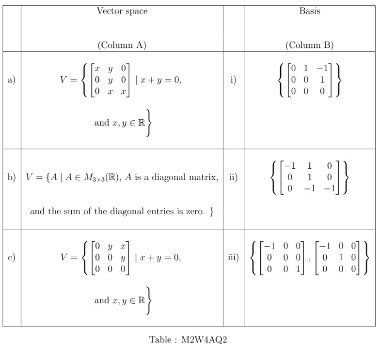

# AQ4.2_ Activity Questions 2 - Not Graded _ IITM Online Degree (5_4_2026 5_04_49 pm)

 **Level 1

**

    

 

 
 
 
 
 
 

    

 
 
 
 
 *
 
 
 1 point
 
 *
 
 
Match the vector spaces (with the usual scalar multiplication and vector addition as in $M_{3\times 3}(\mathbb{R})$ ) in column A with their bases in column B in Table : M2W4AQ2.

Choose the correct option.
 
 
 
 
 
 
a $\rightarrow$ ii 

 
 
 
 
 
 
 
a $\rightarrow$ i 

 
 
 
 
 
 
 
b $\rightarrow$ iii

 
 
 
 
 
 
 
c $\rightarrow$ i
 
 
 
 
 
 
 
 
 
b $\rightarrow$ ii
 
 
 
 
 
 
 
 
c $\rightarrow$ iii
 
 
 
 
 
###  No, the answer is incorrect. 
Score: 0

### Accepted Answers:

 
a $\rightarrow$ ii 

 
 
b $\rightarrow$ iii

 
 
c $\rightarrow$ i
 
 
 
 
 
 
 

    

 
 
 
 
 
 
If $S$ be a subset of $\mathbb{R^5}$ such that $span(S) = \mathbb{R}^5$, then what is the minimum number of elements possible in $S$?
 
 
 
 
 
 
 
 
###  No, the answer is incorrect. 
Score: 0

### Accepted Answers:
(Type: Numeric) 5
 
 
 *
 
 
 1 point
 
 *
 

 
 

    

 
 
 
 
 *
 
 
 1 point
 
 *
 
 
If $S_1$ is a maximal linear independent set and $S_2$ is a minimal spanning set of a vector space $V$, then which of the following option(s) is (are) true?
 
 
 
 
 
 
For any $v\in S_1$, $S_1\setminus \lbrace v \rbrace$ is a linearly independent.

 
 
 
 
 
 
 
For any $v\in S_2$, $S_2\setminus \lbrace v \rbrace$ is a spanning set of $V$.
 
 
 
 
 
 
 
For any $v\in V\setminus S_1$, $S_1\cup \lbrace v \rbrace$ is a linearly dependent. 
 
 
 
 
 
 
 
For any $v\in V$, $S_2\cup \lbrace v \rbrace$ is a spanning set of $V$.

 
 
 
 
 
###  No, the answer is incorrect. 
Score: 0

### Accepted Answers:

 
For any $v\in S_1$, $S_1\setminus \lbrace v \rbrace$ is a linearly independent.

 
 
For any $v\in V\setminus S_1$, $S_1\cup \lbrace v \rbrace$ is a linearly dependent. 
 
 
For any $v\in V$, $S_2\cup \lbrace v \rbrace$ is a spanning set of $V$.

 
 
 
 
 

    

 
 
 
 
 *
 
 
 1 point
 
 *
 
 
Consider the following subset of $\mathbb{R}^2$ with usual addition and scalar multiplication as in $\mathbb{R}^2$.  

- $V_1=\lbrace (x,0) \mid x \in \mathbb{R}\rbrace$
- $V_2=\lbrace (0,y)\mid y \in \mathbb{R}\rbrace$

   Which of the following options are correct?

 
 
 
 
 
 
Both $V_1$ and $V_2$ are subspaces of $\mathbb{R}^2$.
 
 
 
 
 
 
 
$V_1\cap V_2$ is a subspace of $\mathbb{R}^2$.
 
 
 
 
 
 
 
$V_1\cup V_2$ is a subspace of $\mathbb{R}^2$. 
 
 
 
 
 
 
 
$V_1$ is a subspace of $\mathbb{R}^2$, but $V_2$ is not. 
 
 
 
 
 
 
 
$V_2$ is a subspace of $\mathbb{R}^2$, but $V_1$ is not. 
 
 
 
 
 
 
 
$\lbrace (1,0) \rbrace$ is a basis of $V_1$.
 
 
 
 
 
 
 
$\lbrace (0,1) \rbrace$ is a basis of $V_2$. 
 
 
 
 
 
###  No, the answer is incorrect. 
Score: 0

### Accepted Answers:

 
Both $V_1$ and $V_2$ are subspaces of $\mathbb{R}^2$.
 
 
$V_1\cap V_2$ is a subspace of $\mathbb{R}^2$.
 
 
$\lbrace (1,0) \rbrace$ is a basis of $V_1$.
 
 
$\lbrace (0,1) \rbrace$ is a basis of $V_2$. 
 
 
 
 
 

    

 
 
 
 
 *
 
 
 1 point
 
 *
 
 
Consider the following subset of $\mathbb{R}^2$ with usual addition and scalar multiplication as in $\mathbb{R}^2$.  

- $V_1=\lbrace (x,0) \mid x \in \mathbb{R}\rbrace$
- $V_2=\lbrace (2x,0)\mid x \in \mathbb{R}\rbrace$

   Which of the following options are correct?

 
 
 
 
 
 
Both $V_1$ and $V_2$ are subspaces of $\mathbb{R}^2$.
 
 
 
 
 
 
 
$V_1\cap V_2$ is a subspace of $\mathbb{R}^2$.
 
 
 
 
 
 
 
$V_1\cup V_2$ is a subspace of $\mathbb{R}^2$. 
 
 
 
 
 
 
 
$V_1$ is a subspace of $\mathbb{R}^2$, but $V_2$ is not. 
 
 
 
 
 
 
 
$V_2$ is a subspace of $\mathbb{R}^2$, but $V_1$ is not. 
 
 
 
 
 
 
 
$\lbrace (1,0) \rbrace$ is a basis of $V_1$.
 
 
 
 
 
 
 
$\lbrace (1,0) \rbrace$ is a basis of $V_2$. 
 
 
 
 
 
###  No, the answer is incorrect. 
Score: 0

### Accepted Answers:

 
Both $V_1$ and $V_2$ are subspaces of $\mathbb{R}^2$.
 
 
$V_1\cap V_2$ is a subspace of $\mathbb{R}^2$.
 
 
$V_1\cup V_2$ is a subspace of $\mathbb{R}^2$. 
 
 
$\lbrace (1,0) \rbrace$ is a basis of $V_1$.
 
 
$\lbrace (1,0) \rbrace$ is a basis of $V_2$. 
 
 
 
 
 

    

 
 
 
 
 *
 
 
 1 point
 
 *
 
 
Let $V$ be a vector space which is defined as follows:

           $V=\lbrace (x,y,z,w) \mid x+z=y+w \rbrace \subseteq \mathbb{R}^4$

 with usual addition and scalar multiplication.
Which of the following set forms a basis of $V$?
 
 
 
 
 
 
$\lbrace (1,0,0,0), (0,1,0,0), (0,0,0,1) \rbrace$.

 
 
 
 
 
 
 
$\lbrace (1,1,0,0), (0,1,-1,0), (0,-1,0,1) \rbrace$.
 
 
 
 
 
 
 
$\lbrace (1, 0, −1, 0),(1, 1, 0, 0),(1, 0, 0, 1) \rbrace$.
 
 
 
 
 
 
 
$\lbrace (1,1,0,0), (0,1,1,0), (0,-1,0,1) \rbrace$.

 
 
 
 
 
###  No, the answer is incorrect. 
Score: 0

### Accepted Answers:

 
$\lbrace (1, 0, −1, 0),(1, 1, 0, 0),(1, 0, 0, 1) \rbrace$.
 
 
$\lbrace (1,1,0,0), (0,1,1,0), (0,-1,0,1) \rbrace$.

 
 
 
 
 
 

**Level 2
**

    

 

 
 
 
 
 
 

    

 
 
 
 
 *
 
 
 1 point
 
 *
 
 
Which of the following sets form a basis of the vector space of $2\times 2$ lower triangular real matrices with usual matrix addition and scalar multiplication? (More than one option may be correct)
 
 
 
 
 
 
$\left \{ \begin{bmatrix}
1 & 0 \\
0 & 0 
\end{bmatrix}, \begin{bmatrix}
0 & 0 \\
0 & 1
\end{bmatrix}, \begin{bmatrix}
0 & 0 \\
1 & 0 
\end{bmatrix}\right\}$
 
 
 
 
 
 
 
$\left \{ \begin{bmatrix}
1 & 0 \\
1 & 0 
\end{bmatrix}, \begin{bmatrix}
0 & 0 \\
1 & 1
\end{bmatrix}, \begin{bmatrix}
1 & 0 \\
0 & 1 
\end{bmatrix}\right\}$
 
 
 
 
 
 
 
$\left \{ \begin{bmatrix}
0 & 0 \\
1 & 0 
\end{bmatrix}\right\}$
 
 
 
 
 
 
 
$\left \{ \begin{bmatrix}
-1 & 0 \\
0 & 0 
\end{bmatrix}, \begin{bmatrix}
0 & 0 \\
0 & -1
\end{bmatrix}, \begin{bmatrix}
0 & 0 \\
1 & 0 
\end{bmatrix}\right\}$

 
 
 
 
 
###  No, the answer is incorrect. 
Score: 0

### Accepted Answers:

 
$\left \{ \begin{bmatrix}
1 & 0 \\
0 & 0 
\end{bmatrix}, \begin{bmatrix}
0 & 0 \\
0 & 1
\end{bmatrix}, \begin{bmatrix}
0 & 0 \\
1 & 0 
\end{bmatrix}\right\}$
 
 
$\left \{ \begin{bmatrix}
1 & 0 \\
1 & 0 
\end{bmatrix}, \begin{bmatrix}
0 & 0 \\
1 & 1
\end{bmatrix}, \begin{bmatrix}
1 & 0 \\
0 & 1 
\end{bmatrix}\right\}$
 
 
$\left \{ \begin{bmatrix}
-1 & 0 \\
0 & 0 
\end{bmatrix}, \begin{bmatrix}
0 & 0 \\
0 & -1
\end{bmatrix}, \begin{bmatrix}
0 & 0 \\
1 & 0 
\end{bmatrix}\right\}$

 
 
 
 
 

    

 
 
 
 
 
 
If $S$ is a linearly independent set in vector space $V= \{ (x,y) \mid y= 2 x, \text{ where } x,y\in \mathbb{R} \}$
 with usual addition and scalar multiplication as in $\mathbb{R}^2$, then find the maximum possible cardinality of $S$.
 
 
 
 
 
 
 
 
###  No, the answer is incorrect. 
Score: 0

### Accepted Answers:
(Type: Numeric) 1
 
 
 *
 
 
 1 point
 
 *
 

 
 

    

 
 
 
 
 *
 
 
 1 point
 
 *
 
 
If $\lbrace v_1, v_2, v_3 \rbrace$ forms a basis of $\mathbb{R}^3$, then which of the following are true?
 
 
 
 
 
 
$\lbrace v_1, v_2, v_1+v_3 \rbrace$ forms a basis of $\mathbb{R}^3$

 
 
 
 
 
 
 
$\lbrace v_1, v_1+v_2, v_1+v_3 \rbrace$ forms a basis of $\mathbb{R}^3$.
 
 
 
 
 
 
 
$\lbrace v_1, v_1+v_2, v_1-v_3 \rbrace$ forms a basis of $\mathbb{R}^3$.
 
 
 
 
 
 
 
$\lbrace v_1, v_1-v_2, v_1-v_3 \rbrace$ forms a basis of $\mathbb{R}^3$.
 
 
 
 
 
 
###  No, the answer is incorrect. 
Score: 0

### Accepted Answers:

 
$\lbrace v_1, v_2, v_1+v_3 \rbrace$ forms a basis of $\mathbb{R}^3$

 
 
$\lbrace v_1, v_1+v_2, v_1+v_3 \rbrace$ forms a basis of $\mathbb{R}^3$.
 
 
$\lbrace v_1, v_1+v_2, v_1-v_3 \rbrace$ forms a basis of $\mathbb{R}^3$.
 
 
$\lbrace v_1, v_1-v_2, v_1-v_3 \rbrace$ forms a basis of $\mathbb{R}^3$.
 
 
 
 
 
 

    

 
 
 
 
 *
 
 
 1 point
 
 *
 
 Which of the following options is(are) true?

 
 
 
 
 
 
Any minimal spanning set of a vector space $V$ must be a basis of $V$.

 
 
 
 
 
 
 
Any maximal spanning set of a vector space $V$ must be a basis of $V$.
 
 
 
 
 
 
 
Any minimal linear independent set of vector space $V$ must be a basis of $V$. 
 
 
 
 
 
 
 
Any maximal linear independent set of vector space $V$ must be a basis of $V$.
 
 
 
 
 
 
 The basis of a vector space is unique. 
 
 
 
 
 
 
 
The number of elements in a basis of $\mathbb{R}^3$ is $3$. 
 
 
 
 
 
 
 
The number of elements in a basis of $M_{3\times 3}(\mathbb{R})$ is $3$.

 
 
 
 
 
 
 
There are infinite number of bases of $\mathbb{R}^3$. 
 
 
 
 
 
 
 
Any subset of a minimal spanning set of $V$ cannot be a spanning set. 
 
 
 
 
 
###  No, the answer is incorrect. 
Score: 0

### Accepted Answers:

 
Any minimal spanning set of a vector space $V$ must be a basis of $V$.

 
 
Any maximal linear independent set of vector space $V$ must be a basis of $V$.
 
 
The number of elements in a basis of $\mathbb{R}^3$ is $3$. 
 
 
There are infinite number of bases of $\mathbb{R}^3$. 
 
 
Any subset of a minimal spanning set of $V$ cannot be a spanning set.