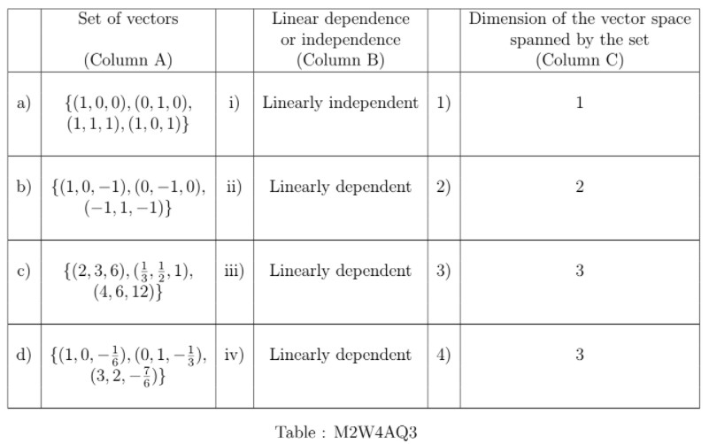

# AQ4.3_ Activity Questions 3 - Not Graded _ IITM Online Degree (5_4_2026 5_06_48 pm)

 **Level 1

**

    

 

 
 
 
 
 
 

    

 
 
 
 
 *
 
 
 1 point
 
 *
 
 The dimension of a vector space is the :

 
 
 
 
 
 Cardinality of any spanning set.
 
 
 
 
 
 
 Cardinality of a basis.
 
 
 
 
 
 
 Cardinality of minimal spanning set.
 
 
 
 
 
 
 Cardinality of maximal linearly independent set.
 
 
 
 
 
###  No, the answer is incorrect. 
Score: 0

### Accepted Answers:

 Cardinality of a basis.
 
 Cardinality of minimal spanning set.
 
 Cardinality of maximal linearly independent set.
 
 
 
 
 

    

 
 
 
 
 *
 
 
 1 point
 
 *
 
 Match the sets of vectors in column A with their properties of linear dependence or independence in column B and the dimension of the vector spaces in column C spanned by the sets.

 
 
 
 
 
 
a $\rightarrow$ ii $\rightarrow$ 3, b $\rightarrow$ iii $\rightarrow$ 2
 
 
 
 
 
 
 
c $\rightarrow$ iii $\rightarrow$ 2, d $\rightarrow$ iv $\rightarrow$ 1 

 
 
 
 
 
 
 
a $\rightarrow$ ii $\rightarrow$ 4, b $\rightarrow$ i $\rightarrow$ 3

 
 
 
 
 
 
 
c $\rightarrow$ iv $\rightarrow$ 1, d $\rightarrow$ iii $\rightarrow$ 2 

 
 
 
 
 
###  No, the answer is incorrect. 
Score: 0

### Accepted Answers:

 
a $\rightarrow$ ii $\rightarrow$ 4, b $\rightarrow$ i $\rightarrow$ 3

 
 
c $\rightarrow$ iv $\rightarrow$ 1, d $\rightarrow$ iii $\rightarrow$ 2 

 
 
 
 
 

    

 
 
 
 
 *
 
 
 1 point
 
 *
 
 Choose the set of correct options.

 
 
 
 
 
 
The dimension of the vector space $M_{1 \times2} (\mathbb{R})$ is 2.

 
 
 
 
 
 
 
The dimension of the vector space $M_{2 \times1} (\mathbb{R})$ is 1.

 
 
 
 
 
 
 
The dimension of the vector space $M_{3 \times3} (\mathbb{R})$ is 3.

 
 
 
 
 
 
 
A basis of $M_{2 \times2} (\mathbb{R})$ is the set $\left \{\begin{bmatrix}
1 & 0\\
0 & 0
\end{bmatrix}\right .$, $\begin{bmatrix}
0 & 1\\
0 & 0
\end{bmatrix}$, $\begin{bmatrix}
0 & 0\\
1 & 0
\end{bmatrix}$, $\left .\begin{bmatrix}
0 & 0\\
0 & 1
\end{bmatrix}\right \}$
 
 
 
 
 
###  No, the answer is incorrect. 
Score: 0

### Accepted Answers:

 
The dimension of the vector space $M_{1 \times2} (\mathbb{R})$ is 2.

 
 
A basis of $M_{2 \times2} (\mathbb{R})$ is the set $\left \{\begin{bmatrix}
1 & 0\\
0 & 0
\end{bmatrix}\right .$, $\begin{bmatrix}
0 & 1\\
0 & 0
\end{bmatrix}$, $\begin{bmatrix}
0 & 0\\
1 & 0
\end{bmatrix}$, $\left .\begin{bmatrix}
0 & 0\\
0 & 1
\end{bmatrix}\right \}$
 
 
 
 
 

    

 
 
 
 
 *
 
 
 1 point
 
 *
 
 
Consider the following sets:
 

- $V_1 = \lbrace A \mid A \in M_{2 \times2}(\mathbb{R}) \text{ and } A \text{ is a symmetric matrix, i.e., } A= A^T \rbrace$
- $V_2 = \lbrace A \mid A \in M_{2 \times2}(\mathbb{R}) \text{ and } A \text{ is a scalar matrix} \rbrace$
- $V_3 = \lbrace A \mid A \in M_{2 \times2}(\mathbb{R}) \text{ and } A \text{ is a diagonal matrix} \rbrace$
- $V_4 = \lbrace A \mid A \in M_{2 \times2}(\mathbb{R}) \text{ and } A \text{ is an upper triangular matrix}\rbrace$
- $V_5 = \lbrace A \mid A \in M_{2 \times2}(\mathbb{R}) \text{ and } A \text{ is a lower triangular matrix} \rbrace$ 

All $V_i, i = 1, 2, 3, 4, 5$ are subspaces of the vector space $M_{2 \times2}(\mathbb{R})$.

Choose the set of correct options.

 
 
 
 
 
 
The dimension of $V_1$ is 3.

 
 
 
 
 
 
 
The dimension of $V_2$ is 3.

 
 
 
 
 
 
 
The dimension of $V_3$ is 1.

 
 
 
 
 
 
 
The dimension of $V_4$ is 3.

 
 
 
 
 
 
 
The dimension of $V_5$ is 3.
 
 
 
 
 
###  No, the answer is incorrect. 
Score: 0

### Accepted Answers:

 
The dimension of $V_1$ is 3.

 
 
The dimension of $V_4$ is 3.

 
 
The dimension of $V_5$ is 3.
 
 
 
 
 

    

 
 
 
 
 *
 
 
 1 point
 
 *
 
 
Consider the following two matrices $M_1$ and $M_2$. 

            $M_1= \begin{bmatrix}
1 & 4 & 3 & 2 \\
2 & 3 & 1 & 4 \\
3 & 4 & 2 & 1 
\end{bmatrix}, M_2= \begin{bmatrix}
1 & 0 & 0 & 0 \\
1 & 0 & 1 & 0 \\
0 & 1 & 0 & 1 
\end{bmatrix}$

Choose the correct set of options.

 
 
 
 
 
 
The row rank of both the matrices, $M_1$ and $M_2$, is 2.

 
 
 
 
 
 
 
The row rank of both the matrices, $M_1$ and $M_2$, is 3.

 
 
 
 
 
 
 
The column rank of $M_1$ is 4, but the column rank of $M_2$ is 3. 

 
 
 
 
 
 
 
The column rank of $M_2$ is 4, but the column rank of $M_1$ is 3.

 
 
 
 
 
 
 
The column rank of both the matrices, $M_1$ and $M_2$, is 4.

 
 
 
 
 
 
 
The column rank of both the matrices, $M_1$ and $M_2$, is 3.
 
 
 
 
 
###  No, the answer is incorrect. 
Score: 0

### Accepted Answers:

 
The row rank of both the matrices, $M_1$ and $M_2$, is 3.

 
 
The column rank of both the matrices, $M_1$ and $M_2$, is 3.
 
 
 
 
 
 

**
****Level 2
****
**

    

 

 
 
 
 
 
 

    

 
 
 
 
 
 
Find the dimension of the vector space 
$V = \{ A \mid \text{ sum of entries in each row is 0, and } A \in M_{3 \times 2} (\mathbb{R})\}.$
 
 
 
 
 
 
 
 
###  No, the answer is incorrect. 
Score: 0

### Accepted Answers:
(Type: Numeric) 3
 
 
 *
 
 
 1 point
 
 *
 

 
 

    

 
 
 
 
 
 
Find the dimension of the vector space 
$V = \{ (x,y,z,w) \mid x+y=z+w, x+w=y+z, \text{ and } x,y,z,w \in \mathbb{R}\}.$
 
 
 
 
 
 
 
 
###  No, the answer is incorrect. 
Score: 0

### Accepted Answers:
(Type: Numeric) 2
 
 
 *
 
 
 1 point
 
 *
 

 
 

    

 
 
 
 
 *
 
 
 1 point
 
 *
 
 Choose the set of correct options.

 
 
 
 
 
 
If $S \subset \mathbb{R}^2$ contains three vectors, then vectors in $S$ must be linearly independent.

 
 
 
 
 
 
 
If $S \subset \mathbb{R}^3$ contains three vectors, then vectors in $S$ may or may not be linearly independent.

 
 
 
 
 
 
 
If $S \subset \mathbb{R}^4$ contains five vectors, then vectors in $S$ must be linearly dependent.

 
 
 
 
 
 
 
If $S \subset \mathbb{R}$ contains one vector, then the vector in $S$ must be linearly dependent.
 
 
 
 
 
###  No, the answer is incorrect. 
Score: 0

### Accepted Answers:

 
If $S \subset \mathbb{R}^3$ contains three vectors, then vectors in $S$ may or may not be linearly independent.

 
 
If $S \subset \mathbb{R}^4$ contains five vectors, then vectors in $S$ must be linearly dependent.

 
 
 
 
 

    

 
 
 
 
 
 
Find the dimension of the vector space $V=\{A\in M_{3\times 3}(\mathbb{R}): A=A^T\}$.
 
 
 
 
 
 
 
 
###  No, the answer is incorrect. 
Score: 0

### Accepted Answers:
(Type: Numeric) 6
 
 
 *
 
 
 1 point
 
 *
 

 
 

    

 
 
 
 
 
 
Find the dimension of the vector space $V=\{A\in M_{3\times 3}(\mathbb{R}): A=-A^T\}$.
 
 
 
 
 
 
 
 
###  No, the answer is incorrect. 
Score: 0

### Accepted Answers:
(Type: Numeric) 3
 
 
 *
 
 
 1 point
 
 *
 

 
 
 
**
**