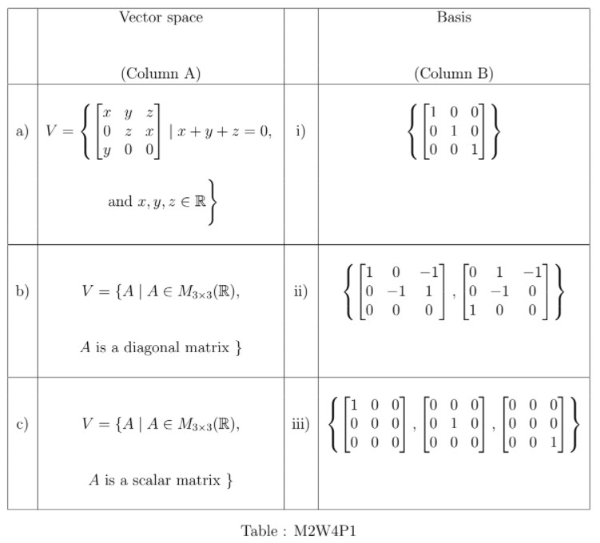
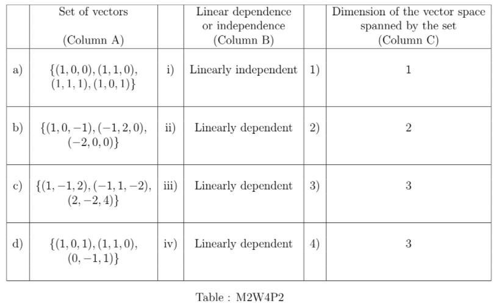

# Practice Assignment 4 - Not Graded _ IITM Online Degree (5_4_2026 5_09_29 pm)

 
Multiple Select Questions (MSQ)

    

 

 
 
 
 
 
 

    

 
 
 
 
 *
 
 
 1 point
 
 *
 
 
Match the vector spaces (with the usual scalar multiplication and vector addition as in $M_{3\times 3}(\mathbb{R})$ ) in column A with their bases in column B in Table : M2W4P1.

Choose the correct option.

 
 
 
 
 
 
a $\rightarrow$ i 
 
 
 
 
 
 
 
a $\rightarrow$ ii
 
 
 
 
 
 
 
b $\rightarrow$ iii 
 
 
 
 
 
 
 
c $\rightarrow$ iii

 
 
 
 
 
 
 
c $\rightarrow$ i 
 
 
 
 
 
###  No, the answer is incorrect. 
Score: 0

### Accepted Answers:

 
a $\rightarrow$ ii
 
 
b $\rightarrow$ iii 
 
 
c $\rightarrow$ i 
 
 
 
 
 

    

 
 
 
 
 *
 
 
 1 point
 
 *
 
 Match the sets of vectors in column A with their properties of linear dependence or independence in column B and the dimension of the vector spaces in column C spanned by the sets.

 
 
 
 
 
 
a $\rightarrow$ ii $\rightarrow$ 4, b $\rightarrow$ i $\rightarrow$ 3

 
 
 
 
 
 
 
c $\rightarrow$ iv $\rightarrow$ 1, d $\rightarrow$ iii $\rightarrow$ 2 

 
 
 
 
 
 
 
c $\rightarrow$ iv $\rightarrow$ 2, d $\rightarrow$ iii $\rightarrow$ 1 
 
 
 
 
 
###  No, the answer is incorrect. 
Score: 0

### Accepted Answers:

 
a $\rightarrow$ ii $\rightarrow$ 4, b $\rightarrow$ i $\rightarrow$ 3

 
 
c $\rightarrow$ iv $\rightarrow$ 1, d $\rightarrow$ iii $\rightarrow$ 2 

 
 
 
 
 

    

 
 
 
 
 *
 
 
 1 point
 
 *
 
 Which of the following options are true?
 
 
 
 
 
 The number of linearly independent vectors in a vector space can be more than the dimension of the vector space.
 
 
 
 
 
 
 
Dimension of the vector space spanned by the vectors $\begin{bmatrix}
1 & -1\\
1 & 1
\end{bmatrix}$, $\begin{bmatrix}
-1 & 1\\
-1 & 1
\end{bmatrix}$, and $\begin{bmatrix}
-1 & 1\\
1 & 1
\end{bmatrix}$ is 2.

 
 
 
 
 
 
 
Dimension of the vector space spanned by the vectors $\begin{bmatrix}
1 & -1\\
1 & 1
\end{bmatrix}$,$\begin{bmatrix}
-1 & 1\\
-1 & -1
\end{bmatrix}$, and $\begin{bmatrix}
-2 & 2\\
-2 & -2
\end{bmatrix}$ is 1.

 
 
 
 
 
 
 The number of spanning vectors can be more than the dimension of the vector space.
 
 
 
 
 
###  No, the answer is incorrect. 
Score: 0

### Accepted Answers:

 
Dimension of the vector space spanned by the vectors $\begin{bmatrix}
1 & -1\\
1 & 1
\end{bmatrix}$,$\begin{bmatrix}
-1 & 1\\
-1 & -1
\end{bmatrix}$, and $\begin{bmatrix}
-2 & 2\\
-2 & -2
\end{bmatrix}$ is 1.

 
 The number of spanning vectors can be more than the dimension of the vector space.
 
 
 
 
 
 

    

 

 
 
 
 
 
 

    

 
 
 
 
 *
 
 
 1 point
 
 *
 
 
Let $A$ be a nonzero $2 \times 2$ matrix. Which of the following options are true?
 
 
 
 
 
 
The rank of $A$ must be strictly less than $2$.
 
 
 
 
 
 
 
If the rank of the matrix is 2, then the dimension of the vector space spanned by the vectors corresponding to each column of $A$, must be 2.
 
 
 
 
 
 
 
The rank of $A$ must be at least 1.
 
 
 
 
 
 
 
The rank of $A$ may be 0.
 
 
 
 
 
 
 
If the rank of the matrix is $2-1$, then there exists one vector corresponding to a column of $A$, which can be expressed as a linear combination of the vectors corresponding to each of the remaining columns of $A$.
 
 
 
 
 
###  No, the answer is incorrect. 
Score: 0

### Accepted Answers:

 
If the rank of the matrix is 2, then the dimension of the vector space spanned by the vectors corresponding to each column of $A$, must be 2.
 
 
The rank of $A$ must be at least 1.
 
 
If the rank of the matrix is $2-1$, then there exists one vector corresponding to a column of $A$, which can be expressed as a linear combination of the vectors corresponding to each of the remaining columns of $A$.
 
 
 
 
 
 

Numerical Answer Type (NAT)

    

 

 
 
 
 
 
 

    

 
 
 
 
 
 
Suppose $A=\begin{pmatrix} 8-m & \ \ 2 & \ \ 4 \\ 3 & 0 & \ \ 0 \\ m & \ \ m & -2 \end{pmatrix}$. For what value of $m$ is the rank of $A$ at most 2?
 
 
 
 
 
 
 
 
###  No, the answer is incorrect. 
Score: 0

### Accepted Answers:
(Type: Numeric) -1.0
 
 
 *
 
 
 1 point
 
 *
 

 
 
 

    

 

 
 
 
 
 
 

    

 
 
 
 
 
 
If rank of the matrix $\begin{bmatrix}
0 & -1 & a \\
2 & 0 & -4\\
3 & -9 & -6
\end{bmatrix}$ is 2 then find the value of $a$.
 
 
 
 
 
 
 
 
###  No, the answer is incorrect. 
Score: 0

### Accepted Answers:
(Type: Numeric) 0
 
 
 *
 
 
 1 point
 
 *
 

 
 
 

    

 

 
 
 
 
 
 

    

 
 
 
 
 
 
Find out the value of $a$ for which the matrix $\begin{bmatrix} a & -5 \\0 & -1 \end{bmatrix}$ will be in the spanning set of the matrices $\begin{bmatrix} 1 & 0 \\ 0 & -1 \end{bmatrix}$ and $\begin{bmatrix} 0 & 1 \\ 0 & 0 \end{bmatrix}$ in $M_{2 \times 2}(\mathbb{R})$ with usual matrix addition and scalar multiplication.
 
 
 
 
 
 
 
 
###  No, the answer is incorrect. 
Score: 0

### Accepted Answers:
(Type: Numeric) 1
 
 
 *
 
 
 1 point
 
 *
 

 
 
 

Comprehension Type Question:

Suppose in a village there are four farmers A, B, C and D, each owning 1 acre of land. They cultivate paddy, pulses and/or sugarcane in their lands as follows: Farmer A uses 50% of his land for paddy, 30% for pulses and the remaining for sugarcane. Farmer B uses 40% of her land for paddy and she divides her remaining land equally for pulses and sugarcane. Farmer C uses the whole land for paddy only, and Farmer D uses 30% for paddy, 30% for pulses and the remaining for sugarcane. Using the above information, answer the following questions.		

    

 

 
 
 
 
 
 

    

 
 
 
 
 *
 
 
 1 point
 
 *
 
 Suppose the area used by a farmer for different crops is denoted by a row vector. Let S be the span of the resulting four row vectors . Choose the correct set of options. 

 
 
 
 
 
 The row vectors corresponding to the area used for different crops by Farmer D can be obtained as a linear combination of the row vectors corresponding to the area used for different crops by Farmers A, B, and C. 
 
 
 
 
 
 
 The row vectors corresponding to the area used for different crops by Farmer D can be obtained as a linear combination of the row vectors corresponding to the area used for different crops by Farmer A and Farmer B.
 
 
 
 
 
 
 The row vectors corresponding to the area used for different crops by Farmer C can be obtained as a linear combination of the row vectors corresponding to the area used for different crops by Farmer A and Farmer B.
 
 
 
 
 
 
 The row vectors corresponding to the area used for different crops by Farmer D can be obtained as a linear combination of the row vectors corresponding to the area used for different crops by Farmer A and Farmer C.
 
 
 
 
 
###  No, the answer is incorrect. 
Score: 0

### Accepted Answers:

 The row vectors corresponding to the area used for different crops by Farmer D can be obtained as a linear combination of the row vectors corresponding to the area used for different crops by Farmers A, B, and C. 
 
 The row vectors corresponding to the area used for different crops by Farmer D can be obtained as a linear combination of the row vectors corresponding to the area used for different crops by Farmer A and Farmer B.
 
 
 
 
 

    

 
 
 
 
 *
 
 
 1 point
 
 *
 
 
Let $S$ be the vectors space defined in the previous question, with the usual addition and scalar multiplication on $\mathbb{R}^3$. Which of the following sets will not be a basis of $S$? 

 
 
 
 
 
 
$\lbrace (5,3,2) \rbrace$

 
 
 
 
 
 
 
$\lbrace (5,3,2),(4,3,3) \rbrace$

 
 
 
 
 
 
 
$\lbrace (5,3,2),(4,3,3), (10,0,0) \rbrace$

 
 
 
 
 
 
 
$\lbrace (5,3,2),(4,3,3), (3,3,4) \rbrace$

 
 
 
 
 
 
 
$\lbrace (5,3,2),(4,3,3), (10,0,0), (3,3,4) \rbrace$
 
 
 
 
 
###  No, the answer is incorrect. 
Score: 0

### Accepted Answers:

 
$\lbrace (5,3,2) \rbrace$

 
 
$\lbrace (5,3,2),(4,3,3) \rbrace$

 
 
$\lbrace (5,3,2),(4,3,3), (3,3,4) \rbrace$

 
 
$\lbrace (5,3,2),(4,3,3), (10,0,0), (3,3,4) \rbrace$