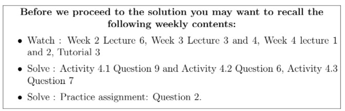

# Reflect with us - Week 4 _ IITM Online Degree (5_4_2026 5_09_04 pm)

 
Find the dimension of the vector space 
 

                  $\begin{aligned}
 & V = \lbrace (x,y,z) \mid x,y,z\in \mathbb{R}, x+y+z = 0, z=0 \rbrace \\
 & \textit{Addition: } (x_1,y_1,z_1)+(x_2,y_2,z_2)=(x_1+x_2, y_1+y_2,z_1+z_2); \\
 &\hspace{5cm} (x_1,y_1,z_1), (x_2,y_2,z_2)\in V \\
 & \textit{Scalar multiplication: } c(x,y,z)=(cx,cy,cz);~ (x,y,z)\in V, ~ c\in \mathbb{R} 
\end{aligned}$ 

$\textbf{Solution:}$

Observe that, in question, you are asked to find the dimension of the vector space . So first you have to find a basis of the vector space.
$\textbf{Note:}$ Consider the system of linear equations 

                                                 $\begin{aligned}
 x+y+z &=0 \\
 z &=0
\end{aligned}$

Find the solution of the system of linear equations.

$\textbf{Step 1:}$

    

 
 
 
 
 *
 
 
 1 point
 
 *
 
 The system of linear equations has
 
 
 
 
 
 unique solution.
 
 
 
 
 
 
 no solution.
 
 
 
 
 
 
 infinitely many solution.
 
 
 
 
 
###  No, the answer is incorrect. 
Score: 0

### Feedback:
Use Gauss elimination method, and observe that $z = 0$ and $x = −y.$
### Accepted Answers:

 infinitely many solution.
 
 
 

    

 
 
 
 
 *
 
 
 1 point
 
 *
 
 Is (1,-1,0) is a solution of the system of linear equations?
 
 
 
 
 
 Yes
 
 
 
 
 
 
 No
 
 
 
 
 
###  No, the answer is incorrect. 
Score: 0

### Feedback:
Substitute $x=1,y=-1$ and $z=0$ in both the equations of system of linear equations and check.
### Accepted Answers:

 Yes
 
 
 

    

 
 
 
 
 *
 
 
 1 point
 
 *
 
 
Is $(1,-1,0)\in V$? 
 
 
 
 
 
 Yes
 
 
 
 
 
 
 No
 
 
 
 
 
###  No, the answer is incorrect. 
Score: 0

### Accepted Answers:

 Yes
 
 
 

$\textbf{Claim:}$ $\{(1,-1,0)\}$ spans $V$.
$\textbf{Step 2:}$

    

 
 
 
 
 *
 
 
 1 point
 
 *
 
 
Let $(a,b,c) \in V$. Which of the following options is/are true?
 
 
 
 
 
 
$a =-b$
 
 
 
 
 
 
 
 
$a+b=1$
 
 
 
 
 
 
 
 
$c=0$
 
 
 
 
 
 
 
 
$c=1$
 
 
 
 
 
###  No, the answer is incorrect. 
Score: 0

### Feedback:
As vector $(a, b, c)$ is a vector of the vector space then it will satisfy the system of linear equations $a+b+c= 0,c=0$
### Accepted Answers:

 
$a =-b$
 
 
 
$c=0$
 
 
 
 

Hence, any vector $(a,b,c)\in V$ can be written as $(a,-a,0)$.
 

    

 
 
 
 
 *
 
 
 1 point
 
 *
 
 
Is $(a,-a,0)$ a scalar multiple of $(1,-1,0)$?
 
 
 
 
 
 Yes
 
 
 
 
 
 
 No
 
 
 
 
 
###  No, the answer is incorrect. 
Score: 0

### Accepted Answers:

 Yes
 
 
 

    

 
 
 
 
 *
 
 
 1 point
 
 *
 
 
If $(a,-a,0)=\alpha (1,-1,0)$, then what is the possible value for $\alpha$?
 
 
 
 
 
 
$a$

 
 
 
 
 
 
 
$-a$

 
 
 
 
 
 
 
$0$
 
 
 
 
 
###  No, the answer is incorrect. 
Score: 0

### Accepted Answers:

 
$a$

 
 
 

Hence, the set $\{(1,-1,0)\}$ spans the vector space $V$.

$\textbf{Step 3:}$ In this step we have to check whether the set $\{(1,-1,0)\}$ is linearly independent or not. 

    

 
 
 
 
 *
 
 
 1 point
 
 *
 
 
Let $S$ be a set which contains only one non-zero vector. Then which of the following options is true?
 
 
 
 
 
 
$S$ is linearly independent set.
 
 
 
 
 
 
 
$S$ is linearly dependent set.
 
 
 
 
 
###  No, the answer is incorrect. 
Score: 0

### Accepted Answers:

 
$S$ is linearly independent set.
 
 
 

$\textbf{Recall:}$ A basis of a vector space is a set of linearly independent vectors which spans the vector space.

From here you can conclude that $\{(1,-1,0)\}$ is the basis of the vector space.

$\textbf{Step 4:}$ In this step we have to find the dimension the vector space $V$.

$\textbf{Recall:}$ The cardinality of the basis is the dimension of $V$.

    

 
 
 
 
 
 
Find the dimension of the vector space $V$.
 
 
 
 
 
 
 
 
###  No, the answer is incorrect. 
Score: 0

### Accepted Answers:
(Type: Numeric) 1
 
 
 *
 
 
 1 point
 
 *