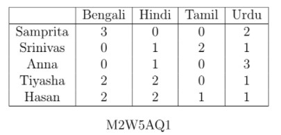

# AQ5.3_ Activity Questions 3 - Not Graded _ IITM Online Degree (13_4_2026 7_06_59 am)

 
A book shop is organizing an year end sale. Price of any Bengali, Hindi, Tamil, and Urdu book is fixed as **₹**200, **₹**180, **₹**230, and **₹**250, respectively. Let $T(x,y,z,w)$ denote the total price of $x$ number of Bengali books, $y$ number of Hindi books, $z$ number of Tamil books, and $w$ number of Urdu books. Table M2W5AQ1 shows the numbers of books of different languages purchased by some customers.

                                                        

Answer Questions 1 to 8 from the given data.

**Level 1
**

    

 

 
 
 
 
 
 

    

 
 
 
 
 *
 
 
 1 point
 
 *
 
 
What will be the correct expression for $T(x,y,z,w)$?

 
 
 
 
 
 
$T(x,y,z,w)=(200 + 180 +230 + 250)(x+y+z+w)$

 
 
 
 
 
 
 
$T(x,y,z,w)= x+y+z+w$

 
 
 
 
 
 
 
$T(x,y,z,w)=200 x+ 230 y +180 z+ 250 w$

 
 
 
 
 
 
 
$T(x,y,z,w)=200 x+ 180 y +230 z+ 250 w$
 
 
 
 
 
###  No, the answer is incorrect. 
Score: 0

### Accepted Answers:

 
$T(x,y,z,w)=200 x+ 180 y +230 z+ 250 w$
 
 
 
 
 

    

 
 
 
 
 *
 
 
 1 point
 
 *
 
 Which of the following expressions represents the total price of the books purchased by Samprita? 

 
 
 
 
 
 
$T(3,0,0,2)$

 
 
 
 
 
 
 
$T(3,0,0,2,2)$

 
 
 
 
 
 
 
$T(3,2)$

 
 
 
 
 
 
 
$T(5)$
 
 
 
 
 
###  No, the answer is incorrect. 
Score: 0

### Accepted Answers:

 
$T(3,0,0,2)$

 
 
 
 
 

    

 
 
 
 
 
 What will be total price (in **₹**) of the books purchased by Tiyasha? 
 
 
 
 
 
 
 
 
###  No, the answer is incorrect. 
Score: 0

### Accepted Answers:
(Type: Numeric) 1010
 
 
 *
 
 
 1 point
 
 *
 

 
 

    

 
 
 
 
 
 What will be total price (in **₹**) of the books purchased by Hasan?
 
 
 
 
 
 
 
 
###  No, the answer is incorrect. 
Score: 0

### Accepted Answers:
(Type: Numeric) 1240
 
 
 *
 
 
 1 point
 
 *
 

 
 
 

**Level 2
**

    

 

 
 
 
 
 
 

    

 
 
 
 
 *
 
 
 1 point
 
 *
 
 Which of the following expressions represent the total price of the books purchased by Srinivas?

 
 
 
 
 
 
$2T(0,1,1,0)+T(0,0,0,1)$

 
 
 
 
 
 
 
$T(0,1,0,0)+T(0,0,1,1)$

 
 
 
 
 
 
 
$T(0,1,0,0)+2T(0,0,1,0)+T(0,0,0,1)$

 
 
 
 
 
 
 
$T(0,1,1,0)+T(0,0,1,1)$
 
 
 
 
 
###  No, the answer is incorrect. 
Score: 0

### Accepted Answers:

 
$T(0,1,0,0)+2T(0,0,1,0)+T(0,0,0,1)$

 
 
$T(0,1,1,0)+T(0,0,1,1)$
 
 
 
 
 

    

 
 
 
 
 *
 
 
 1 point
 
 *
 
 Which of the following expressions represents the total price of the books purchased by Anna?

 
 
 
 
 
 
$T(0,1,0,0)+T(0,0,0,1)$

 
 
 
 
 
 
 
$T(0,1,0,0)+T(0,0,1,0)$

 
 
 
 
 
 
 
$T(0,1,0,0)+3T(0,0,0,1)$

 
 
 
 
 
 
 
$T(0,1,1,0)+2T(0,0,1,0)$
 
 
 
 
 
###  No, the answer is incorrect. 
Score: 0

### Accepted Answers:

 
$T(0,1,0,0)+3T(0,0,0,1)$

 
 
 
 
 

    

 
 
 
 
 *
 
 
 1 point
 
 *
 
 Which of the following expressions represent the total price of the books purchased by Srinivas and Anna together?

 
 
 
 
 
 
$T(0,2,2,4)$

 
 
 
 
 
 
 
$T(2,2,4)$

 
 
 
 
 
 
 
$T(0,2,2,1)$

 
 
 
 
 
 
 
$T(0,1,2,1)+T(0,1,0,3)$
 
 
 
 
 
###  No, the answer is incorrect. 
Score: 0

### Accepted Answers:

 
$T(0,2,2,4)$

 
 
$T(0,1,2,1)+T(0,1,0,3)$
 
 
 
 
 

    

 
 
 
 
 *
 
 
 1 point
 
 *
 
 Which of the following expressions represent the difference between the total price of the books purchased by Samprita and Tiyasha? 

 
 
 
 
 
 
$|T(5,2,0,3)|$

 
 
 
 
 
 
 
$|T(1,-2,0,1)|$

 
 
 
 
 
 
 
$|T(3,0,0,2)-T(2,2,0,1)|$

 
 
 
 
 
 
 
$|T(3,0,0,2)+T(-2,-2,0,-1)|$
 
 
 
 
 
###  No, the answer is incorrect. 
Score: 0

### Accepted Answers:

 
$|T(1,-2,0,1)|$

 
 
$|T(3,0,0,2)-T(2,2,0,1)|$

 
 
$|T(3,0,0,2)+T(-2,-2,0,-1)|$