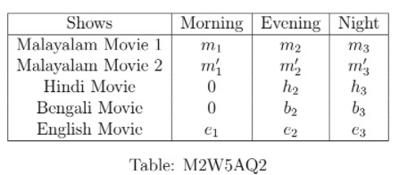

# AQ5.4_ Activity Questions 4 - Not Graded _ IITM Online Degree (13_4_2026 7_07_36 am)

 
Let $T(x,y,z)=mx+ny+pz$ denote the total amount of money a multiplex made from a specific movie, in one day by selling $x$ number of tickets for the morning show, $y$ number of tickets for the evening show, and $z$ number of tickets for the night show, where $m$, $n$ and $p$ are the prices of each ticket of that movie in the morning, evening, and night show, respectively.

In the multiplex, 2 Malayalam movies, 1 Hindi movie, 1 Bengali movie, and 1 English movie are running parallelly in one week. Suppose there are 3 shows (Morning, Evening, Night) per day for each of the Malayalam movies and the English movie, whereas 2 shows (Evening, Night) per day for the Hindi and the Bengali movie. Ticket price (irrespective of morning, evening, and night shows) for each Malayalam movie is **₹**200, Hindi movie is **₹**250, Bengali movie is **₹**250, and English movie is **₹**300. The number of tickets sold in a particular day is given in Table M2W5AQ2: 

                                            

Answer questions 1 to 8 using the given data above.

Level 1

    

 

 
 
 
 
 
 

    

 
 
 
 
 *
 
 
 1 point
 
 *
 
 Which expression accurately expresses the total amount of money the multiplex made in the specific day mentioned above by selling the tickets of the morning shows only?

 
 
 
 
 
 
$200 m_1+200 m_2+ 200 m_3$

 
 
 
 
 
 
 
$200 m_1+250 m'_1+ 300 e_1$

 
 
 
 
 
 
 
$200 m_1+200 m'_1+ 250 e_1$

 
 
 
 
 
 
 
$200 m_1+200 m'_1+ 300 e_1$
 
 
 
 
 
###  No, the answer is incorrect. 
Score: 0

### Accepted Answers:

 
$200 m_1+200 m'_1+ 300 e_1$
 
 
 
 
 

    

 
 
 
 
 *
 
 
 1 point
 
 *
 
 Which expression accurately expresses the total amount of money the multiplex made in the specific day mentioned above by selling the tickets of the Bengali movie only?

 
 
 
 
 
 
$200(b_2+b_3)$

 
 
 
 
 
 
 
$250(b_2+b_3)$

 
 
 
 
 
 
 
$250(h_2+h_3)$

 
 
 
 
 
 
 
$250b_2+ 200 b_3$
 
 
 
 
 
###  No, the answer is incorrect. 
Score: 0

### Accepted Answers:

 
$250(b_2+b_3)$

 
 
 
 
 

    

 
 
 
 
 *
 
 
 1 point
 
 *
 
 Which expression accurately expresses the total amount of money the multiplex made in the specific day mentioned above by selling the tickets of the night shows only?

 
 
 
 
 
 
$200(m_2+m'_2)+250(h_2+b_2)+300 e_2$

 
 
 
 
 
 
 
$200(m_3+m'_3+h_3+b_3)+300 e_3$

 
 
 
 
 
 
 
$200(m_3+m'_3)+250(h_3+b_3)+300 e_3$

 
 
 
 
 
 
 
$200(m_3m'_3)+250(h_3b_3)+300 e_3$
 
 
 
 
 
###  No, the answer is incorrect. 
Score: 0

### Accepted Answers:

 
$200(m_3+m'_3)+250(h_3+b_3)+300 e_3$

 
 
 
 
 

    

 
 
 
 
 *
 
 
 1 point
 
 *
 
 Which expression accurately expresses the total amount of money the multiplex made in the specific day mentioned above by selling the tickets of the Bengali and English movie only?

 
 
 
 
 
 
$250(b_2+b_3)$

 
 
 
 
 
 
 
$300 e_1+ 250 (b_2+e_2)+ 300 (b_3+e_3)$

 
 
 
 
 
 
 
$250(b_2+b_3)+300(e_1+e_2+e_3)$

 
 
 
 
 
 
 
$b_2+b_3+e_1+e_2+e_3$
 
 
 
 
 
###  No, the answer is incorrect. 
Score: 0

### Accepted Answers:

 
$250(b_2+b_3)+300(e_1+e_2+e_3)$

 
 
 
 
 
 

Level 2

    

 

 
 
 
 
 
 

    

 
 
 
 
 *
 
 
 1 point
 
 *
 
 What was the total amount of money the multiplex made in the specific day mentioned above by selling the tickets of the Malayalam movies together?

 
 
 
 
 
 
$T(m_1+m'_1, m_2+m'_2, m_3+m'_3)$

 
 
 
 
 
 
 
$200 T(m_1+m'_1, m_2+m'_2, m_3+m'_3)$

 
 
 
 
 
 
 
$T(m_1m'_1, m_2m'_2, m_3m'_3)$

 
 
 
 
 
 
 
$200 T(m_1m'_1, m_2m'_2, m_3m'_3)$
 
 
 
 
 
###  No, the answer is incorrect. 
Score: 0

### Accepted Answers:

 
$T(m_1+m'_1, m_2+m'_2, m_3+m'_3)$

 
 
 
 
 

    

 
 
 
 
 *
 
 
 1 point
 
 *
 
 Which of the following options are correct?

 
 
 
 
 
 
$T(x,y,z)=T(x,0,0)+T(0,y,0)+T(0,0,z)$

 
 
 
 
 
 
 
$T(x,y,z)=T(x,y,0)+T(0,0,z)$

 
 
 
 
 
 
 
$T(x,y,z)=T(x,0,0)+T(y,0,0)+T(z,0,0)$

 
 
 
 
 
 
 
$T(x,0,0)+T(y,0,0)+T(z,0,0)=T(x+y+z,0,0)$
 
 
 
 
 
###  No, the answer is incorrect. 
Score: 0

### Accepted Answers:

 
$T(x,y,z)=T(x,0,0)+T(0,y,0)+T(0,0,z)$

 
 
$T(x,y,z)=T(x,y,0)+T(0,0,z)$

 
 
$T(x,0,0)+T(y,0,0)+T(z,0,0)=T(x+y+z,0,0)$
 
 
 
 
 

    

 
 
 
 
 *
 
 
 1 point
 
 *
 
 Which of the following equalities correctly represent the total amount of money the multiplex made in the specific day mentioned above by selling the tickets of the Bengali and Hindi movie together?

 
 
 
 
 
 
$T(0,b_2+h_2, b_3+h_3)= T(0, (h_2+b_2), (h_3+b_3))$

 
 
 
 
 
 
 
$T(0,b_2+h_2, b_3+h_3)= T(0,0,0) + T(0,h_2+b_2,0) + T(0,h_3+b_3,0)$

 
 
 
 
 
 
 
$T(0,b_2+h_2, b_3+h_3)= T(0, (h_2+b_2), 0)+ T(0,0,(h_3+b_3))$

 
 
 
 
 
 
 
$T(0,b_2+h_2, b_3+h_3)= T(0,b_2,b_3)+ T(0,h_2,h_3)$
 
 
 
 
 
###  No, the answer is incorrect. 
Score: 0

### Accepted Answers:

 
$T(0,b_2+h_2, b_3+h_3)= T(0, (h_2+b_2), (h_3+b_3))$

 
 
$T(0,b_2+h_2, b_3+h_3)= T(0,0,0) + T(0,h_2+b_2,0) + T(0,h_3+b_3,0)$

 
 
$T(0,b_2+h_2, b_3+h_3)= T(0, (h_2+b_2), 0)+ T(0,0,(h_3+b_3))$

 
 
$T(0,b_2+h_2, b_3+h_3)= T(0,b_2,b_3)+ T(0,h_2,h_3)$
 
 
 
 
 

    

 
 
 
 
 *
 
 
 1 point
 
 *
 
 Which of the following equality correctly represents the total amount of money the multiplex made in the specific day mentioned above by selling the tickets of the English movie?

 
 
 
 
 
 
$T(e_1,e_2,e_3)=200(e_1+e_2+e_3)$

 
 
 
 
 
 
 
$T(e_1,e_2,e_3)=250(e_1+e_2+e_3)$

 
 
 
 
 
 
 
$T(e_1,e_2,e_3)=200e_1+ 250e_2+ 300 e_3$

 
 
 
 
 
 
 
$T(e_1,e_2,e_3)=300(e_1+e_2+e_3)$
 
 
 
 
 
###  No, the answer is incorrect. 
Score: 0

### Accepted Answers:

 
$T(e_1,e_2,e_3)=300(e_1+e_2+e_3)$