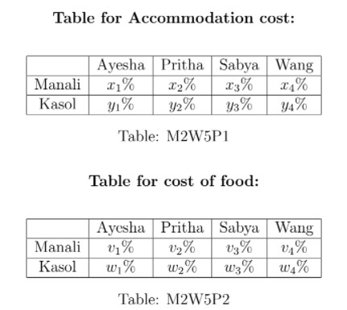

# Practice Assignment 5 - Not Graded _ IITM Online Degree (13_4_2026 7_10_08 am)

 
Multiple Choice Questions (MCQ):

    

 
 
 
 
 *
 
 
 1 point
 
 *
 
 
Let $A$ and $B$ be square matrices of order 2. Which of the following option is true?
 
 
 
 
 
 
$nullity(A B ) = nullity (A ) + nullity (B )$
 
 
 
 
 
 
 
$nullity(A B ) = nullity (A ) nullity (B )$
 
 
 
 
 
 
 
$nullity(A - B ) = nullity (A ) - nullity (B )$
 
 
 
 
 
 
 
$Rank(A + B ) = Rank (A ) + Rank (B )$
 
 
 
 
 
 
 None of the above.
 
 
 
 
 
###  No, the answer is incorrect. 
Score: 0

### Accepted Answers:

 None of the above.
 
 
 

Multiple Select Questions (MSQ):

    

 

 
 
 
 
 
 

    

 
 
 
 
 *
 
 
 1 point
 
 *
 
 
A molecule is composed of atoms. A molecule of Ethylene, with the chemical formula $C_2H_4$, consists of two Carbon atoms and four Hydrogen atoms. A molecule of Oxygen, with the formula $O_2$, consists of two Oxygen atoms. Note that Carbon, Hydrogen and Oxygen are denoted by the letters $C, H, \text{ and } O$ respectively in the formula. When Ethylene comes in contact with Oxygen ($O_2$); Carbon dioxide ($CO_2$) and water ($H_2O$) are produced as the products of the chemical reaction . 
 The equation corresponding to the chemical reaction (R) is given below

                          $x_1C_2H_4 +x_2 O_2 \longrightarrow x_3CO_2 + x_4H_2O. \hspace{2cm}\ldots$ (R) 

To balance the chemical equation we have to choose $x_1, x_2,x_3, \text{and}\,\, x_4$ such that both sides have the same number of carbon atoms on each side, the same number of hydrogen atoms on each side, and the same number of oxygen atoms on each side. 
Note: An example to write the system of linear equations for balancing the chemical equation is the following : 

$x_1C+ x_2O \longrightarrow x_3CO_2$           $\text{corresponding system of linear equations is:}\\
 x_1=x_3 \\
 x_2=2x_3$

Consider the system of linear equations obtained for balancing the chemical equation (R) to answer the question.
Which of the following statements are true?

 
 
 
 
 
 The nullity of the matrix corresponding to this system is 0.
 
 
 
 
 
 
 The nullity of the matrix corresponding to this system is 1.
 
 
 
 
 
 
 
$\{(1,3,1,1)\}$ is a basis of the null space of the matrix corresponding to this system.

 
 
 
 
 
 
 There are an infinite number of ways to balance the chemical equation (R). 
 
 
 
 
 
 
 There is a unique way to balance the chemical equation (R).
 
 
 
 
 
###  No, the answer is incorrect. 
Score: 0

### Accepted Answers:

 The nullity of the matrix corresponding to this system is 1.
 
 There are an infinite number of ways to balance the chemical equation (R). 
 
 
 
 
 

    

 
 
 
 
 *
 
 
 1 point
 
 *
 
 Which of the following option(s) is(are) true?

 
 
 
 
 
 
If $A_{2 \times3}$ is a non zero matrix, then nullity of the matrix $\leq 2$.

 
 
 
 
 
 
 
If $A_{3 \times2 }$ is a non zero matrix, then nullity of the matrix $\leq 1.$

 
 
 
 
 
 
 
Let $A \text{ and } B$ be two square matrices of order 3, If nullity of matrix $AB$ is 0, then nullity of matrix $A$ is also zero.

 
 
 
 
 
 
 
Let $A \text{ and } B$ be two square matrices of order 3, If nullity of matrix $AB$ is 0, then nullity of matrix $B$ is also zero.

 
 
 
 
 
###  No, the answer is incorrect. 
Score: 0

### Accepted Answers:

 
If $A_{2 \times3}$ is a non zero matrix, then nullity of the matrix $\leq 2$.

 
 
If $A_{3 \times2 }$ is a non zero matrix, then nullity of the matrix $\leq 1.$

 
 
Let $A \text{ and } B$ be two square matrices of order 3, If nullity of matrix $AB$ is 0, then nullity of matrix $A$ is also zero.

 
 
Let $A \text{ and } B$ be two square matrices of order 3, If nullity of matrix $AB$ is 0, then nullity of matrix $B$ is also zero.

 
 
 
 
 
 

    

 
 
 
 
 *
 
 
 1 point
 
 *
 
 
Let $T : \mathbb{R}^3 \to \mathbb{R}^3$ be a linear transformation such that $T(1,0,0) = (1,1,1), T(1,1,0) = (0,0,1)$ and $T(1,1,1)= (0,1,1)$. Then which of the following option(s) is/ are true?
 
 
 
 
 
 
$T(x,y,z) = (x-y, x-y+z, y)$
 
 
 
 
 
 
 
$T(x,y,z) = (x-y, x-y+z, x)$
 
 
 
 
 
 
 
$T(x,y,z) = (x+y, x-y+z, x)$
 
 
 
 
 
 
 
$T$ is one-one.
 
 
 
 
 
 
 
$T$ is not onto.
 
 
 
 
 
###  No, the answer is incorrect. 
Score: 0

### Accepted Answers:

 
$T(x,y,z) = (x-y, x-y+z, x)$
 
 
$T$ is one-one.
 
 
 

    

 
 
 
 
 *
 
 
 1 point
 
 *
 
 
Consider a system of linear equations defined as follows:

                                              $\begin{aligned}
 x+y-z+w &= 0\\
 2x+y+3z-w & = 0\\
 3x+2y+2z & = 0
\end{aligned}$

If $A$ is the coefficient matrix of the system of linear equations, then
which of the following options is/are true?

 
 
 
 
 
 
Null space of $A$ = $span\{(-4, 5, 1, 0), (2, -3, 0, 1)\}$
 
 
 
 
 
 
 
Null space of $A$ = $span\{(-6, 8, 1, -1), (-4, 5, 1, 0)\}$
 
 
 
 
 
 
 
Null space of $A$ = $span\{(-3, 5, 1, 0), (2, -3, 0, 1)\}$

 
 
 
 
 
 
 
Null space of $A$ = $span\{(-4, 5, 1, -1), (6, 7, 2, 1)\}$
 
 
 
 
 
###  No, the answer is incorrect. 
Score: 0

### Accepted Answers:

 
Null space of $A$ = $span\{(-4, 5, 1, 0), (2, -3, 0, 1)\}$
 
 
Null space of $A$ = $span\{(-6, 8, 1, -1), (-4, 5, 1, 0)\}$
 
 
 

Numerical Answer Type (NAT):

    

 
 
 
 
 
 
If nullity of a matrix $A_{5 \times7}$ is 2, then find the rank of the matrix $A_{5 \times7}$.
 
 
 
 
 
 
 
 
###  No, the answer is incorrect. 
Score: 0

### Accepted Answers:
(Type: Numeric) 5
 
 
 *
 
 
 1 point
 
 *
 

    

 
 
 
 
 
 
Let $A$ be a non-zero matrix of order $3 \times1$. What is the rank of the matrix $AA^T$?
 
 
 
 
 
 
 
 
###  No, the answer is incorrect. 
Score: 0

### Accepted Answers:
(Type: Numeric) 1
 
 
 *
 
 
 1 point
 
 *
 

**Comprehension Type Question:**

Ayesha, Pritha, Sabya, and Wang went on a trip to Manali and Kasol. Accommodation costs **₹**1500 per day in Manali and **₹**800 per day in Kasol. The total food cost is **₹**2000 per day in Manali and **₹**1200 per day in Kasol. They plan to spend 2 days in Manali and 2 days in Kasol. The first and second rows of the Table M2W5P1 shows the percentage of contribution by each of them for the accomodation at Manali and Kasol, respectively. Similarly, the first and the second row of the Table M2W5P2 shows the percentage of contribution by each of them for the food at Manali and Kasol, respectively.

                                 

Suppose $T(x,y)$ denotes the contribution of a person for accommodation per day, where the first variable $x$ denotes the percentage of contribution by that person for accommodation in Manali and the second variable $y$ denotes the percentage of contribution by that person for accommodation in Kasol. (i.e., if $a$ and $b$ denote the costs for accommodation per day at Manali and Kasol, respectively, then $T(x,y)=\frac{1}{100}(ax+by)$). Similarly, $T'(v,w)$ denotes the contribution by a person for food per day, where the first variable $v$ denotes the percentage of contribution for food in Manali and the second variable $w$ denotes the percentage of contribution for food in Kasol.
Answer the following questions based on the given information. 

    

 

 
 
 
 
 
 

    

 
 
 
 
 *
 
 
 1 point
 
 *
 
 Choose the set of correct options. 

 
 
 
 
 
 
$T(x,y)= 30x+16y$

 
 
 
 
 
 
 
$T(x,y)= 15x+8y$

 
 
 
 
 
 
 
$T'(v,w)=20v+12w$

 
 
 
 
 
 
 
$T'(v,w)=40v+24w$
 
 
 
 
 
###  No, the answer is incorrect. 
Score: 0

### Accepted Answers:

 
$T(x,y)= 15x+8y$

 
 
$T'(v,w)=20v+12w$

 
 
 
 
 

    

 
 
 
 
 *
 
 
 1 point
 
 *
 
 Choose the set of correct options. 
 
 
 
 
 
 
Suppose Ayesha contributes for herslef and also on behalf of Sabya. Then the contribution per day by Ayesha is given by $T(x_1+x_3, y_1+y_3)$ and $T'(v_1+v_3, w_1+w_3)$, for accommodation and food, respectively. 

 
 
 
 
 
 
 
The total contribution (for the whole trip) for the accommodation by Pritha is given by $2T(x_2,y_2)$, which is equal to $T(2x_2,2y_2)$.

 
 
 
 
 
 
 
The total contribution (for the whole trip) for the accommodation by Pritha is given by $2T(x_2,y_2)$, which is not equal to $T(2x_2,2y_2)$.

 
 
 
 
 
 
 
Suppose Pritha contributes for herself and also on behalf of Wang for food. Then the contribution per day by Pritha for food is given by $T'(v_2,w_2)+T'(v_4,w_4)$, which is not equal to $T'(v_2+v_4, w_2+w_4)$.

 
 
 
 
 
 
 
Suppose Pritha contributes for herself and also on behalf of Wang for food. Then the contribution per day by Pritha for food is given by $T'(v_2,w_2)+T'(v_4,w_4)$, which is equal to $T'(v_2+v_4, w_2+w_4)$.
 
 
 
 
 
###  No, the answer is incorrect. 
Score: 0

### Accepted Answers:

 
Suppose Ayesha contributes for herslef and also on behalf of Sabya. Then the contribution per day by Ayesha is given by $T(x_1+x_3, y_1+y_3)$ and $T'(v_1+v_3, w_1+w_3)$, for accommodation and food, respectively. 

 
 
The total contribution (for the whole trip) for the accommodation by Pritha is given by $2T(x_2,y_2)$, which is equal to $T(2x_2,2y_2)$.

 
 
Suppose Pritha contributes for herself and also on behalf of Wang for food. Then the contribution per day by Pritha for food is given by $T'(v_2,w_2)+T'(v_4,w_4)$, which is equal to $T'(v_2+v_4, w_2+w_4)$.
 
 
 
 
 
 

    

 

 
 
 
 
 
 

    

 
 
 
 
 *
 
 
 1 point
 
 *
 
 The total contribution (accommodation and food) per day can be denoted by:
 
 
 
 
 
 
$f(x,y,v,w)= T(x,y)+T'(v,w)$ which is a linear mapping.
 
 
 
 
 
 
 
$f(-4x,-4y,-4v,-4w)= (-4)^4f(x,y,v,w)$.
 
 
 
 
 
 
 
$f(x,y,v,w)= T(x,y)+T'(v,w)$ which is not a linear mapping.
 
 
 
 
 
 
 
$f(-4x,-4y,-4v,-4w)= -4f(x,y,v,w)$.
 
 
 
 
 
###  No, the answer is incorrect. 
Score: 0

### Accepted Answers:

 
$f(x,y,v,w)= T(x,y)+T'(v,w)$ which is a linear mapping.
 
 
$f(-4x,-4y,-4v,-4w)= -4f(x,y,v,w)$.