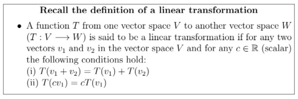
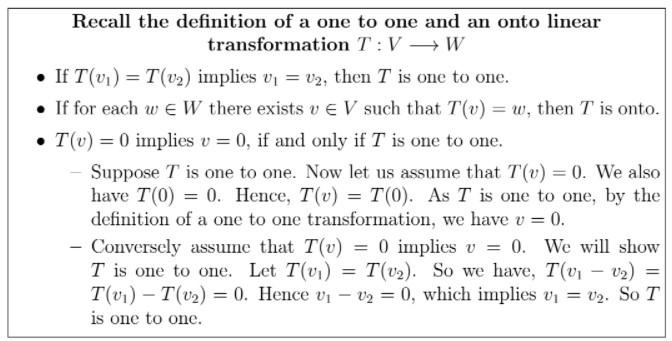

# Reflect with us - Week 5 _ IITM Online Degree (13_4_2026 7_09_23 am)

 

    

 
 
 
 
 *
 
 
 1 point
 
 *
 
 
Consider a map $T: \mathbb{R}^2 \to \mathbb{R}^2$ defined as $T(v)= Av$, where $v=\begin{bmatrix}
x \\
y 
\end{bmatrix}$, $A=\begin{bmatrix}
a & b \\
c & d 
\end{bmatrix}$ and $det(A)\neq 0$. Which of the following options are correct?

 
 
 
 
 
 
$T$ is a linear transformation.

 
 
 
 
 
 
 
$T$ is both one-one and onto.

 
 
 
 
 
 
 
$T$ is neither one-one nor onto.

 
 
 
 
 
 
 
$T$ is one-one but not onto.
 
 
 
 
 
###  No, the answer is incorrect. 
Score: 0

### Accepted Answers:

 
$T$ is a linear transformation.

 
 
$T$ is both one-one and onto.

 
 
 

              

- $\textbf{Step 1:}$ 

    

 
 
 
 
 *
 
 
 1 point
 
 *
 
 
What is $T(v_1+v_2)$? 
 
 
 
 
 
 
$A(v_1+v_2)$. 
 
 
 
 
 
 
 
$Av_1 v_2$.
 
 
 
 
 
###  No, the answer is incorrect. 
Score: 0

### Accepted Answers:

 
$A(v_1+v_2)$. 
 
 
 

            $\textbf{Recall:}$ $A(v_1+v_2)=Av_1+ Av_2$

- $\textbf{Step 2:}$ 

    

 
 
 
 
 *
 
 
 1 point
 
 *
 
 
Is $T(v_1+v_2)=T(v_1)+T(v_2)$?
 
 
 
 
 
 Yes.
 
 
 
 
 
 
 No.
 
 
 
 
 
###  No, the answer is incorrect. 
Score: 0

### Accepted Answers:

 Yes.
 
 
 

           $\textbf{Check:}$ $T(cv)=cT(v)$.

- Hence $T$ is linear transformation. So Option 1 is true.
- $\textbf{Another method:}$ Write the definition of $T$ explicitly as,

                                        $T(x,y)=(ax+by, cx+dy)$
 
 

- $\textbf{Step 1:}$ What is $T((x_1,y_1)+(x_2+y_2))$?
 

                 
                                          $\begin{aligned}
 T(x_1+x_2, y_1+y_2) &= (a(x_1+x_2)+b(y_1+y_2) , c(x_1+x_2)+d(y_1+y_2)) \\
 &= (ax_1+ax_2+by_1+by_2, cx_1+cx_2+dy_1+dy_2) \\
 &= (ax_1+by_1, cx_1+dy_1)+ (ax_2+by_2, cx_2+dy_2) \\
 &= T(x_1,y_1)+ T(x_2,y_2) 
 \end{aligned}$

- $\textbf{Step 2:}$ 

    

 
 
 
 
 *
 
 
 1 point
 
 *
 
 
Is $T(c(x,y))=cT(x,y)$?
 
 
 
 
 
 Yes.
 
 
 
 
 
 
 No.
 
 
 
 
 
###  No, the answer is incorrect. 
Score: 0

### Accepted Answers:

 Yes.
 
 
 

- Hence $T$ is linear transformation. So Option 1 is true.

                

Now in the given problem $T(v)=0$, implies $Av=0$. This is the matrix representation of the system of linear equations:
                                  $\begin{aligned}
 ax+by &= 0 \\
 cx+dy &=0 
 \end{aligned}$
 

- $\textbf{Step 3:}$ 

    

 
 
 
 
 *
 
 
 1 point
 
 *
 
 
If the system of linear equations $Av=0$ has a unique solution, then what is the solution? 
 
 
 
 
 
 
$v=0$
 
 
 
 
 
 
 
$v$ can be any vector in $\mathbb{R}^2$.
 
 
 
 
 
###  No, the answer is incorrect. 
Score: 0

### Accepted Answers:

 
$v=0$
 
 
 

- $\textbf{Step 4:}$ 

    

 
 
 
 
 *
 
 
 1 point
 
 *
 
 
What is the condition on $A$, for which the system of linear equations $Av=0$ has a unique solution? [Recall from Weeks 1 and 2]
 
 
 
 
 
 
$det(A)=0$. 

 
 
 
 
 
 
 
$det(A)\neq 0$. 
 
 
 
 
 
###  No, the answer is incorrect. 
Score: 0

### Accepted Answers:

 
$det(A)\neq 0$. 
 
 
 

   Concluding, we can say that, if $det(A)$ is non-zero, then $T(v)=0$ implies $v=0$. Hence $T$ is one to one. 

- Let $w=\begin{bmatrix} w_1 \\ w_2 \end{bmatrix} \in \mathbb{R}^2$. We are going to find whether there exists a vector $v=\begin{bmatrix} x \\ y \end{bmatrix}\in \mathbb{R}^2$, such that $T(v)=Av=w$. 
 

           $Av=w$ is the matrix representation of the system of linear equation: 
 
                                                    $\begin{aligned}
 ax+by &= w_1 \\
 cx+dy &= w_2
 \end{aligned}$

- $\textbf{Step 5:}$ 

    

 
 
 
 
 *
 
 
 1 point
 
 *
 
 
If $det(A)\neq 0$, then what can we say about the solution of the above system of linear equations?
 
 
 
 
 
 No solution.
 
 
 
 
 
 
 Unique solution.
 
 
 
 
 
###  No, the answer is incorrect. 
Score: 0

### Accepted Answers:

 Unique solution.
 
 
 

Concluding from this, we can say that, if $det(A)\neq 0$, then $T$ is onto. 

$\textbf{Hence, Options 1 and 2 are the correct options.}$