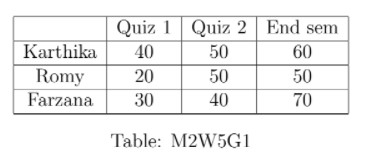
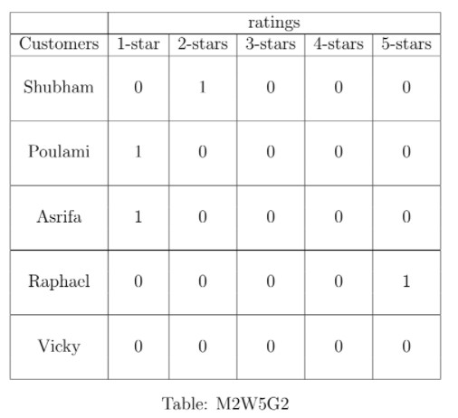

# Week 5 - Graded Assignment - 5 _ IITM Online Degree (13_4_2026 7_11_03 am)

 
Note: This assignment will be evaluated after the deadline passes. You will get your score 48 hrs after the deadline. Until then the score will be shown as Zero.

Multiple Select Questions (MSQ):

    

 

 
 
 
 
 
 

    

 
 
 
 
 *
 
 
 1 point
 
 *
 
 
The marks obtained by Karthika, Romy and Farzana in Quiz 1, Quiz 2 and End sem (with the maximum marks for each exam being 100) are shown in Table M2W5G1.

                     

If $x_1 \%$ of Quiz 1, $x_2 \%$ of Quiz 2, and $x_3 \%$ of End sem is taken to calculate the total marks $T_1(x_1,x_2,x_3), T_2(x_1,x_2,x_3), \text{ and } T_3(x_1,x_2,x_3)$ of Karthika, Romy, and Farzana, respectively, then choose the correct set of options. 
 
 
 
 
 
 
$T_2(x_1,x_2,x_3)=\frac{1}{100}(20x_1+50x_2+50x_3)$. 

 
 
 
 
 
 
 
$T_2(x_1,x_2,x_3)=\frac{1}{100}(40x_1+20x_2+30x_3)$.

 
 
 
 
 
 
 
If $x_1=20\%$, $x_2=20\%$, and $x_3=60\%$, then $T_1(x_1,x_2,x_3)=44$.

 
 
 
 
 
 
 
If $x_1=20\%$, $x_2=20\%$, and $x_3=60\%$, then $T_1(x_1,x_2,x_3)=54$.

 
 
 
 
 
 
 
If $x_1=20\%$, $x_2=20\%$, and $x_3=60\%$, then Farzana obtained the highest total marks.

 
 
 
 
 
 
 
$T_i(x_1,x_2,x_3)$ is a linear mapping from $\mathbb{R}^3$ to $\mathbb{R}$, for each $i=1,2,3$.
 
 
 
 
 
###  Yes, the answer is correct. 
Score: 1

### Accepted Answers:

 
$T_2(x_1,x_2,x_3)=\frac{1}{100}(20x_1+50x_2+50x_3)$. 

 
 
If $x_1=20\%$, $x_2=20\%$, and $x_3=60\%$, then $T_1(x_1,x_2,x_3)=54$.

 
 
If $x_1=20\%$, $x_2=20\%$, and $x_3=60\%$, then Farzana obtained the highest total marks.

 
 
$T_i(x_1,x_2,x_3)$ is a linear mapping from $\mathbb{R}^3$ to $\mathbb{R}$, for each $i=1,2,3$.
 
 
 
 
 

    

 
 
 
 
 *
 
 
 1 point
 
 *
 
 
A molecule of carbon dioxide ($CO_2$) consists of one carbon atom and two oxygen atoms. A molecule of water consists of two hydrogen atoms and one oxygen atom, whereas a molecule of oxygen consists of two oxygen atoms. One molecule of glucose consists of six atoms of carbon, twelve atoms of hydrogen, and six atoms of oxygen.  

In the presence of sunlight, the leaves of trees take carbon dioxide and water to produce glucose and oxygen. 
 The chemical equation corresponding to this chemical reaction (R) is given below.

                    $x_1~CO_2 +x_2~ H_2O \longrightarrow x_3~C_6H_{12}O_6 + x_4~O_2. \hspace{2cm}\ldots$ (R)  

In order to balance the chemical equation, we have to choose $x_1, x_2,x_3,$ and $x_4$ such that both sides have the same number of carbon atoms on each side, the same number of hydrogen atoms on each side, and the same number of oxygen atoms on each side.  

An example of the system of linear equations obtained for balancing a chemical equation is the following :

                                         $x_1~C+ x_2~O \longrightarrow x_3~CO_2$
 

corresponding system of linear equations is: 

                                                          $x_1=x_3$
                                                          $x_2=2x_3$ 

Consider the system of linear equations obtained for balancing the chemical equation (R) and choose the set of correct options.

 
 
 
 
 
 The nullity of the matrix corresponding to this system is 1.
 
 
 
 
 
 
 The nullity of the matrix corresponding to this system is 2.
 
 
 
 
 
 
 
$\{(6,6,1,6)\}$ is a basis of the null space of the matrix corresponding to this system. 

 
 
 
 
 
 
 
$\{(1,1,6,1)\}$ is a basis of the null space of the matrix corresponding to this system. 

 
 
 
 
 
 
 
$\left \{ (1,1,1,6), (6,6,6,1) \right \}$ is a basis of the null space of the matrix corresponding to this system. 

 
 
 
 
 
 
 
$\left \{ (6,6,0,6), (0,0,1,0) \right \}$ is a basis of the null space of the matrix corresponding to this system.

 
 
 
 
 
 
 There are infinitely many ways to balance the chemical equation (R). 
 
 
 
 
 
###  Yes, the answer is correct. 
Score: 1

### Accepted Answers:

 The nullity of the matrix corresponding to this system is 1.
 
 
$\{(6,6,1,6)\}$ is a basis of the null space of the matrix corresponding to this system. 

 
 There are infinitely many ways to balance the chemical equation (R). 
 
 
 
 
 

    

 
 
 
 
 *
 
 
 1 point
 
 *
 
 Choose the set of correct options. 

 
 
 
 
 
 The null-space of a scalar matrix is always the zero vector space. 
 
 
 
 
 
 
 The null-space of a non-zero scalar matrix is always the zero vector space. 
 
 
 
 
 
 
 The nullity of a non-zero scalar matrix is always 0. 
 
 
 
 
 
 
 The rank of a non-zero scalar matrix is always same as the order of the matrix. 
 
 
 
 
 
 
 The rank of a non-zero scalar matrix is always 0.
 
 
 
 
 
###  Yes, the answer is correct. 
Score: 1

### Accepted Answers:

 The null-space of a non-zero scalar matrix is always the zero vector space. 
 
 The nullity of a non-zero scalar matrix is always 0. 
 
 The rank of a non-zero scalar matrix is always same as the order of the matrix. 
 
 
 
 
 

    

 
 
 
 
 *
 
 
 1 point
 
 *
 
 
Let $A \in M_{5\times 3}(\mathbb{R})$ be a non-zero matrix. Select all true statements from the following:
 
 
 
 
 
 
The nullity of $A$ can be at most 2.
 
 
 
 
 
 
 
The nullity of $A$ has to be at least 2.
 
 
 
 
 
 
 
The rank of $A$ can be at most 3.
 
 
 
 
 
 
 
The rank of $A$ has to be at least 3.
 
 
 
 
 
###  Yes, the answer is correct. 
Score: 1

### Accepted Answers:

 
The nullity of $A$ can be at most 2.
 
 
The rank of $A$ can be at most 3.
 
 
 
 
 
 

Numerical Answer Type (NAT):

    

 

 
 
 
 
 
 

    

 
 
 
 
 *
 
 
 1 point
 
 *
 
 Which of the following maps are linear transformations?
 
 
 
 
 
 
$T: \mathbb{R} \to \mathbb{R}^2$ defined by $T(x)= (5|x|, 0)$.
 
 
 
 
 
 
 
$T: \mathbb{R}^2 \to \mathbb{R}$ defined by $T(x,y)= 7x-2y$.
 
 
 
 
 
 
 
$T: \mathbb{R}^2 \to \mathbb{R}^3$ defined by $T(x,y)= (6x+1, 7x, 7x+5y+6)$.
 
 
 
 
 
 
 
$T: \mathbb{R}^2 \to \mathbb{R}^2$ defined by $T(x,y)= (2x+5y, 6x-5y)$.
 
 
 
 
 
###  Yes, the answer is correct. 
Score: 1

### Accepted Answers:

 
$T: \mathbb{R}^2 \to \mathbb{R}$ defined by $T(x,y)= 7x-2y$.
 
 
$T: \mathbb{R}^2 \to \mathbb{R}^2$ defined by $T(x,y)= (2x+5y, 6x-5y)$.
 
 
 
 
 
 

    

 

 
 
 
 
 
 

    

 
 
 
 
 *
 
 
 1 point
 
 *
 
 
Consider a map $T: \mathbb{R}^2 \to \mathbb{R}^2$ defined as $T(v)= Av$, where $v=\begin{bmatrix} x \\ y \end{bmatrix}$ and $A=\begin{bmatrix} 17 & 1 \\ 20 & 6 \end{bmatrix}$. Which of the following options are correct?
 
 
 
 
 
 
$T$ is neither one-one nor onto.
 
 
 
 
 
 
 
 $T$ is a linear transformation.
 
 
 
 
 
 
 
$T$ is one-one but not onto.
 
 
 
 
 
 
 
$T$ is both one-one and onto.
 
 
 
 
 
###  Yes, the answer is correct. 
Score: 1

### Accepted Answers:

 
 $T$ is a linear transformation.
 
 
$T$ is both one-one and onto.
 
 
 
 
 
 

    

 

 
 
 
 
 
 

    

 
 
 
 
 *
 
 
 1 point
 
 *
 
 
Consider the matrix $A$ given as follows: 
 A=$\begin{bmatrix} 2 & 3 & 0 & 0 \\ 0 & 3 & 0 & 0 \\ 3 & 0 & 2 & 0 \\ 0 & 0 & 0 & 0 \end{bmatrix}$ 
 Which of the following sets is a possible basis for the null space of $A$?
 
 
 
 
 
 
$\{(0,0,0,1)\}$
 
 
 
 
 
 
 
$\{(0,0,1,0),(0,0,0,1)\}$
 
 
 
 
 
 
 
$\{(0,0,1,0)\}$
 
 
 
 
 
 
 
$\{(0,1,0,0), (0,0,0,1)\}$
 
 
 
 
 
###  Yes, the answer is correct. 
Score: 1

### Accepted Answers:

 
$\{(0,0,0,1)\}$
 
 
 
 
 
 

    

 

 
 
 
 
 
 

    

 
 
 
 
 
 
Let $A$ be a $4 \times 3$ matrix and $B$ be a $3 \times 4$ matrix. If the null spaces of $A$ and $B$ are $2$ and $2$ dimensional vector spaces, respectively, then what is the maximum possible rank of the matrix $AB$?
 
 
 
 
 
 
 
 
###  Yes, the answer is correct. 
Score: 1

### Accepted Answers:
(Type: Numeric) 1
 
 
 *
 
 
 1 point
 
 *
 

 
 
 

**Comprehension Type Question:**

 Shubham, Poulami, Asrifa, Raphael, and Vicky bought the same type of pen drives from a shop. The shopkeeper asked them to give ratings on the quality of the pen drives, 1-star being the lowest denoting $\textit{not satisfied}$ and 5-stars being the highest denoting $\textit{extremely satisfied}.$ Whenever a customer gives a rating, say 3-stars rating, then the vector we consider corresponding to that rating is $(0,0,1,0,0)$. Note that one customer can rate only once and the same rating can be given by more than one customer. 
$\textbf{Example:}$
 Table M2W5G2 shows an example of the rating given by the customers mentioned above as: Shubham gave 2-stars rating, Poulami gave 1-star rating, Asrifa gave 1-star rating, Raphael gave 5-stars rating, and Vicky did not give any rating.

Based on the above information answer the following questions.

    

 

 
 
 
 
 
 

    

 
 
 
 
 *
 
 
 1 point
 
 *
 
 Choose the set of correct options from the following. 

 
 
 
 
 
 If Shubham and Poulami both gave 2-stars rating, Asrifa and Raphael both gave 1-star rating, and Vicky gave 3-stars rating, then the dimension of the vector space spanned by the row vectors corresponding to the ratings is 3.
 
 
 
 
 
 
 If Shubham and Vicky both gave 3-stars rating, Poulami gave 2-stars rating, Asrifa gave 5-stars rating, and Raphael gave 1-star rating then the dimension of the vector space spanned by the row vectors corresponding to the ratings is 4.
 
 
 
 
 
 
 If Shubham gave 5-stars rating, Poulami gave 3-stars rating, Asrifa gave 1-star rating, Raphael gave 2-stars rating, and Vicky gave 4-stars rating then the dimension of the vector space spanned by the row vectors corresponding to the ratings is 5.
 
 
 
 
 
 
 If Shubham, Poulami, and Asrifa, all gave 2-stars rating, and Raphael and Vicky gave 1-star rating then the dimension of the vector space spanned by the row vectors corresponding to the ratings is 1.
 
 
 
 
 
###  Yes, the answer is correct. 
Score: 1

### Accepted Answers:

 If Shubham and Poulami both gave 2-stars rating, Asrifa and Raphael both gave 1-star rating, and Vicky gave 3-stars rating, then the dimension of the vector space spanned by the row vectors corresponding to the ratings is 3.
 
 If Shubham and Vicky both gave 3-stars rating, Poulami gave 2-stars rating, Asrifa gave 5-stars rating, and Raphael gave 1-star rating then the dimension of the vector space spanned by the row vectors corresponding to the ratings is 4.
 
 If Shubham gave 5-stars rating, Poulami gave 3-stars rating, Asrifa gave 1-star rating, Raphael gave 2-stars rating, and Vicky gave 4-stars rating then the dimension of the vector space spanned by the row vectors corresponding to the ratings is 5.
 
 
 
 
 

    

 
 
 
 
 *
 
 
 1 point
 
 *
 
 
Consider the matrix $A$ corresponding to the ratings given in Table M2W5G2, which is given as follows: 

                                          $A=\begin{bmatrix}
0 & 1 & 0 & 0 & 0 \\
1 & 0 & 0 & 0 & 0 \\
1 & 0 & 0 & 0 & 0 \\
0 & 0 & 0 & 0 & 1 \\
0 & 0 & 0 & 0 & 0 
\end{bmatrix}$

Which of the following statements about the matrix $A$ are true? 

 
 
 
 
 
 
The set $\lbrace (1,0,0,0,0), (0,1,0,0,0), (0,0,0,1,0) \rbrace$ spans the nullspace of $A$.

 
 
 
 
 
 
 
The set $\lbrace (0,0,1,0,0), (0,0,0,1,0) \rbrace$ spans the nullspace of $A$.

 
 
 
 
 
 
 
Nullity of $A$ is $2$.

 
 
 
 
 
 
 
Nullity of $A$ is $3$.
 
 
 
 
 
###  Yes, the answer is correct. 
Score: 1

### Accepted Answers:

 
The set $\lbrace (0,0,1,0,0), (0,0,0,1,0) \rbrace$ spans the nullspace of $A$.

 
 
Nullity of $A$ is $2$.

 
 
 
 
 

    

 
 
 
 
 
 
What will be the rank of the matrix $A$ defined in the above question? 
 
 
 
 
 
 
 
 
###  Yes, the answer is correct. 
Score: 1

### Accepted Answers:
(Type: Numeric) 3
 
 
 *
 
 
 1 point
 
 *
 

 
 
 

    

 

 
 
 
 
 
 

    

 
 
 
 
 *
 
 
 1 point
 
 *
 
 
Let $M$ be an $m\times n$ matrix and let $A$ be the reduced row echelon form (RREF) of $M$. Choose all the options which contain quantities equal to the nullity of $M$.

 
 
 
 
 
 
$m\:-\:$rank$(M)$.
 
 
 
 
 
 
 
$n\: -\:$rank$(A)$.
 
 
 
 
 
 
 
Number of non-zero rows in $M$.
 
 
 
 
 
 
 
Number of pivot elements in $A$.
 
 
 
 
 
 
 
Number of independent variables for the system of equations $Mx= 0$.
 
 
 
 
 
 
 
Number of independent variables for the system of equations $Ax=0$.
 
 
 
 
 
### Partially Correct. 
Score: 0.66

### Accepted Answers:

 
$n\: -\:$rank$(A)$.
 
 
Number of independent variables for the system of equations $Mx= 0$.
 
 
Number of independent variables for the system of equations $Ax=0$.
 
 
 
 
 

    

 
 
 
 
 
 
Let $T:\mathbb{R}^{2}\rightarrow \mathbb{R}^{2}$ be a function for which the following is known:
$T(1,0) = (k,1),\qquad T(0,1) = (1,k), \qquad T(2,1) = (-k^{2}+k+1,\:2-k^{2}),$

where $k\in\mathbb{R}$. Find the value of $k$ for which $T$ is a linear transformation which is not injective.
 
 
 
 
 
 
 
 
###  Yes, the answer is correct. 
Score: 1

### Accepted Answers:
(Type: Numeric) -1
 
 
 *
 
 
 1 point
 
 *