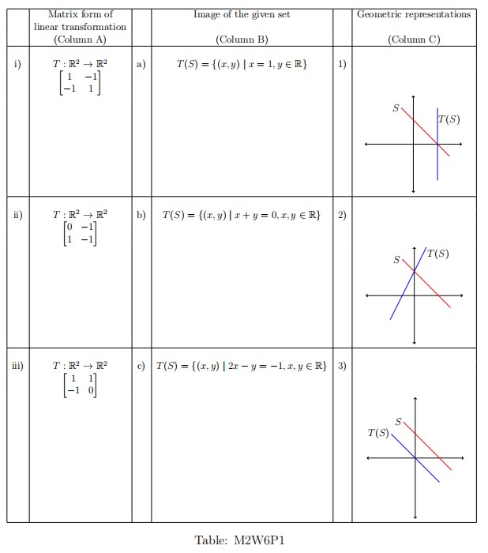
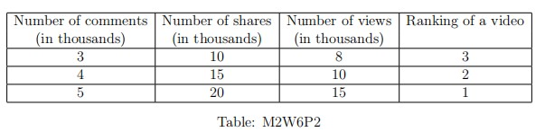

# Practice Assignment 6 - Not Graded _ IITM Online Degree (13_4_2026 7_17_03 am)

 
Multiple Choice Questions (MCQ):

    

 

 
 
 
 
 
 

    

 
 
 
 
 *
 
 
 1 point
 
 *
 
  Which of the following statements are correct?
 
 
 
 
 
 
There exists a linear transformation $T: \mathbb{R}^2\rightarrow \mathbb{R}^2$ such that $T(2,3)=(1,2)$, $T(1,-1)=(1,-1)$, and $T(4,1)=(1,0)$.
 
 
 
 
 
 
 
If there is a linear transformation $T: \mathbb{R}^2 \rightarrow \mathbb{R}^2$ such that $T(2,3) = (1,2),\text{ and } T(1,-1) = (1,-1)$, then $T(x, y) = \frac{1}{5}(4x- y, -x+4y)$.

 
 
 
 
 
 
 
Let $\beta=\{v_1, v_2, v_3\}$ and $\gamma =\{2v_1+v_3, v_2-v_3, v_3-v_1\}$ be bases of a vector space $V$. Consider a linear transformation $T: V \rightarrow V$ such that $T(v_1) = 2v_3+v_1, T(v_2) = 2v_1, \text{ and } T(v_3) = 2v_2$. The matrix representation of $T$, with respect to $\beta$ and $\gamma$ for the domain and codomain respectively, is $\begin{bmatrix}
1 & \frac{2}{3} & \frac{2}{3} \\
0 & 0 & 2 \\
1 & -\frac{2}{3} & \frac{4}{3}
\end{bmatrix}$
 
 
 
 
 
 
 
Let $\{v_1, v_2, v_3\}$ be a basis of a vector space $V$ and $\{2v_1+v_3, v_2-v_3, v_3-v_1\}$ be a basis of vector space $W$. Consider a linear transformation $T: V \rightarrow W$ such that $T(v_1) = 2v_3+v_1, T(v_2) = 2v_1, \text{ and } T(v_3) = 2v_2$. Then, the rank of $T$ is 3.

 
 
 
 
 
###  No, the answer is incorrect. 
Score: 0

### Accepted Answers:

 
If there is a linear transformation $T: \mathbb{R}^2 \rightarrow \mathbb{R}^2$ such that $T(2,3) = (1,2),\text{ and } T(1,-1) = (1,-1)$, then $T(x, y) = \frac{1}{5}(4x- y, -x+4y)$.

 
 
Let $\beta=\{v_1, v_2, v_3\}$ and $\gamma =\{2v_1+v_3, v_2-v_3, v_3-v_1\}$ be bases of a vector space $V$. Consider a linear transformation $T: V \rightarrow V$ such that $T(v_1) = 2v_3+v_1, T(v_2) = 2v_1, \text{ and } T(v_3) = 2v_2$. The matrix representation of $T$, with respect to $\beta$ and $\gamma$ for the domain and codomain respectively, is $\begin{bmatrix}
1 & \frac{2}{3} & \frac{2}{3} \\
0 & 0 & 2 \\
1 & -\frac{2}{3} & \frac{4}{3}
\end{bmatrix}$
 
 
Let $\{v_1, v_2, v_3\}$ be a basis of a vector space $V$ and $\{2v_1+v_3, v_2-v_3, v_3-v_1\}$ be a basis of vector space $W$. Consider a linear transformation $T: V \rightarrow W$ such that $T(v_1) = 2v_3+v_1, T(v_2) = 2v_1, \text{ and } T(v_3) = 2v_2$. Then, the rank of $T$ is 3.

 
 
 
 
 

    

 
 
 
 
 *
 
 
 1 point
 
 *
 
 
Consider the following set $S=\lbrace(x,y)\mid x+y=1, x,y \in \mathbb{R}\rbrace$.
In column A the matrix representation of some linear transformations are given with respect to the standard ordered bases. Match the entries in column A with the set $T(S)$ given in column B and the geometric representations of $S$ and $T(S)$ in column C.
 

 
 
 
 
 
 
i $\rightarrow$ b $\rightarrow$ 2. 
 
 
 
 
 
 
 
ii $\rightarrow$ c $\rightarrow$ 1.
 
 
 
 
 
 
 
ii $\rightarrow$ c $\rightarrow$ 2.
 
 
 
 
 
 
 
iii $\rightarrow$ a $\rightarrow$ 3.
 
 
 
 
 
 
 
i $\rightarrow$ b $\rightarrow$ 3.
 
 
 
 
 
 
 
iii $\rightarrow$ a $\rightarrow$ 1.
 
 
 
 
 
###  No, the answer is incorrect. 
Score: 0

### Accepted Answers:

 
ii $\rightarrow$ c $\rightarrow$ 2.
 
 
i $\rightarrow$ b $\rightarrow$ 3.
 
 
iii $\rightarrow$ a $\rightarrow$ 1.
 
 
 
 
 
 

Multiple Select Questions (MSQ):

    

 

 
 
 
 
 
 

    

 
 
 
 
 *
 
 
 1 point
 
 *
 
 
Consider the following two groups. In Group 1, there are 3 functions from one vector space to another, and in Group 2, there are three properties of functions. All the vector spaces have usual addition and scalar multiplication. 
**Group-1

- P: $T: \mathbb{R}^2 \rightarrow \mathbb{R}^2$ such that 
 $T(x,y) = \begin{cases}
 \left(\frac{x^2}{y},y \right) & \text{if } y\neq 0 \\
 & \\
 (x,0) & \text{otherwise}
 \end{cases}$
- Q:$T: \mathbb{R}^2 \rightarrow \mathbb{R}^2$ such that $T(x, y) = (x, xy)$ 
- R: $T: \mathbb{R}^3 \rightarrow \mathbb{R}$ such that $T(x, y, z) = \frac{x+y+z}{5}$

**
 **Group-2
** 

- 1:$T(v_1+v_2)=T(v_1)+T(v_2)$ for all $v_1, v_2 \in V$ 
- 2:$T(cv)=cT(v)$ for all $v\in V$ and $c\in \mathbb{R}$.
- 3: $T$ is a linear transformation 

Choose the set of correct options. 

 
 
 
 
 
 P satisfies 1 but not 2.
 
 
 
 
 
 
 P satisfies 2 but not 1
 
 
 
 
 
 
 Q satisfies 1
 
 
 
 
 
 
 Q satisfies 3
 
 
 
 
 
 
 P satisfies 3
 
 
 
 
 
 
 R satisfies 2
 
 
 
 
 
 
 R satisfies 3
 
 
 
 
 
 
 R satisfies 1 but not 2
 
 
 
 
 
###  No, the answer is incorrect. 
Score: 0

### Accepted Answers:

 P satisfies 2 but not 1
 
 R satisfies 2
 
 R satisfies 3
 
 
 
 
 
 

Numerical Answer Type (NAT):

    

 

 
 
 
 
 
 

    

 
 
 
 
 
 
Suppose the matrix representation of a linear transformation $T: \mathbb{R}^3\rightarrow \mathbb{R}^3$ with respect to the ordered bases $\beta= \lbrace (1,0,0), (1,1,0), (1,1,1) \rbrace$ for the domain and $\gamma=\lbrace (1,1,1), (0,1,1), (0,0,1) \rbrace$ for the range, is $I_{3\times3}$, i.e., the identity matrix of order 3. Let $A$ be the matrix representation of the linear transformation $T$ with respect to standard ordered basis of $\mathbb{R}^3$ for both domain and range. Then the determinant of $A$ is

 
 
 
 
 
 
 
 
###  No, the answer is incorrect. 
Score: 0

### Accepted Answers:
(Type: Numeric) 1
 
 
 *
 
 
 1 point
 
 *
 

 
 

    

 
 
 
 
 
 
Let $T$ and $S$ be two linear transformations from $\mathbb{R}^3$ to $\mathbb{R}^3$, which are defined as follows: 

                                        $T: \mathbb{R}^3 \rightarrow \mathbb{R}^3$           $S: \mathbb{R}^3 \rightarrow \mathbb{R}^3$   

       $T(x,y,z)=(x-y,y-z,z-x)$                        $S(x,y,z)=(x+y,y+z,z+x)$ 

 Let $S+T$ be defined to be the linear transformation as follows: 

 $(S+T):\mathbb{R}^3 \rightarrow \mathbb{R}^3$   

 $(S+T)(x,y,z)=S(x,y,z)+T(x,y,z)$ 

 Let $C$ be the matrix representation of $S+T$ with respect to the standard ordered bases of $\mathbb{R}^3$. If $C=nI$, where $I$ denotes the identity matrix of order 3, then what will be the value of $n$?
 
 
 
 
 
 
 
 
###  No, the answer is incorrect. 
Score: 0

### Accepted Answers:
(Type: Numeric) 2
 
 
 *
 
 
 1 point
 
 *
 

 
 
 

    

 

 
 
 
 
 
 

    

 
 
 
 
 *
 
 
 1 point
 
 *
 
 
Consider a linear transformation $T: \mathbb{R}^3 \rightarrow \mathbb{R}^3$ defined as $T(x, y ,z) = (x + 5y, z-3x, y + 6z)$. Which of the following options are true about $T$?
 
 
 
 
 
 
Nullity of $T$ is $0$.
 
 
 
 
 
 
 
A basis for the range of $T$ is $\{(1,5,0),(0,1,6) \}$.
 
 
 
 
 
 
 
 A basis for the range of $T$ is $\{(1,0,0),(0,1,0),(0,0,1)\}$.
 
 
 
 
 
 
 
Rank of $T$ is $2$.
 
 
 
 
 
 
 
The matrix representation of $T$ with respect to the standard ordered bases of $\mathbb{R}^3$ is $\begin{bmatrix} 1 & -3 & 0\\ 5 & 0 & 1\\ 0 & 1 & 6 \end{bmatrix}$.
 
 
 
 
 
 
 
The matrix representation of $T$ with respect to the standard ordered bases of $\mathbb{R}^3$ is $\begin{bmatrix} 1 & 5 & 0\\ -3 & 0 & 1\\ 0 & 1 & 6 \end{bmatrix}$.
 
 
 
 
 
 
 
Nullity of $T$ is $1$.
 
 
 
 
 
 
 
Rank of $T$ is $3$.
 
 
 
 
 
###  No, the answer is incorrect. 
Score: 0

### Accepted Answers:

 
Nullity of $T$ is $0$.
 
 
 A basis for the range of $T$ is $\{(1,0,0),(0,1,0),(0,0,1)\}$.
 
 
The matrix representation of $T$ with respect to the standard ordered bases of $\mathbb{R}^3$ is $\begin{bmatrix} 1 & 5 & 0\\ -3 & 0 & 1\\ 0 & 1 & 6 \end{bmatrix}$.
 
 
Rank of $T$ is $3$.
 
 
 
 
 
 

    

 

 
 
 
 
 
 

    

 
 
 
 
 
 
Let $V$ be a vector space with ordered basis $\alpha = \{v_1, v_2, \dots, v_{10} \}$. Consider a linear transformation $T: V \to V$ such that $T(v_1) = v_1$ and $T(v_i) = v_i - v_{i-1}$, where $i > 1$. Let $A$ be the matrix representation of the linear transformation $T$, with respect to $\alpha$ for both the domain and codomain. what is the trace of $A$? 
 
 
 
 
 
 
 
 
###  No, the answer is incorrect. 
Score: 0

### Accepted Answers:
(Type: Numeric) 10
 
 
 *
 
 
 1 point
 
 *
 

 
 
 

Comprehension Type Question:

For each video on YouTube, consider the vector (Number of comments in thousands, Number of shares in thousands, Number of views in thousands) and consider the subset $S$ of $\mathbb{
R}^3$ consisting of these vectors. It is known that the ranking of a YouTube video can be thought of as the restriction of a linear transformation $T:\mathbb{R}^3 \to \mathbb{R}$ to $S$ where $\mathbb{R}^3$ comes with usual addition and scalar multiplication. (assume ranking 0 (zero) is possible and in practice negative rankings can be ignored). 
The following data in Table M2W6P2 shows the correlation between comments, shares, and views - with YouTube rankings of a video.

                             

Use the above information to answer questions 8, 9 and 10.

    

 

 
 
 
 
 
 

    

 
 
 
 
 *
 
 
 1 point
 
 *
 
 
Which of the following sets of vectors in $S$ have the property that the YouTube video corresponding to every linear combination of that set which is in $S$ has ranking $0$? 
 
 
 
 
 
 
$\lbrace (1,1,0), (0,0,1) \rbrace$
 
 
 
 
 
 
 
$\lbrace (6,25,0), (0,0,25) \rbrace$

 
 
 
 
 
 
 
$\lbrace (25,6,0), (0,0,25) \rbrace$
 
 
 
 
 
 
 
$\lbrace (12,50,0), (0,0,1) \rbrace$
 
 
 
 
 
 
 
$\lbrace (24,100,0), (0,0,25) \rbrace$
 
 
 
 
 
 
 
$\lbrace (6,0,0),(0,25,0), (0,0,1) \rbrace$
 
 
 
 
 
 
 
$\lbrace (25,0,0),(0,6,0), (0,0,1) \rbrace$
 
 
 
 
 
###  No, the answer is incorrect. 
Score: 0

### Accepted Answers:

 
$\lbrace (6,25,0), (0,0,25) \rbrace$

 
 
$\lbrace (12,50,0), (0,0,1) \rbrace$
 
 
$\lbrace (24,100,0), (0,0,25) \rbrace$
 
 
 
 
 

    

 
 
 
 
 *
 
 
 1 point
 
 *
 
 
Which of the following sets of vectors in $S$ have the property that the YouTube video corresponding to every linear combination of that set which is in $S$ has ranking a multiple of $15$?
 
 
 
 
 
 
$\lbrace (3,0,0), (0,0,1)\rbrace$
 
 
 
 
 
 
 
$\lbrace (3,0,1)\rbrace$
 
 
 
 
 
 
 
 $\lbrace (3,0,1), (0,0,1)\rbrace$
 
 
 
 
 
 
 
$\lbrace (0,0,1)\rbrace$
 
 
 
 
 
 
 
$\lbrace (9,25,0), (0,0,1)\rbrace$
 
 
 
 
 
 
 
$\lbrace (25,9,0), (0,0,1)\rbrace$
 
 
 
 
 
 
 
$\lbrace (9,0,0),(0,25,0),(0,0,1)\rbrace$
 
 
 
 
 
 
 
$\lbrace (25,0,0),(0,9,0), (0,0,1)\rbrace$
 
 
 
 
 
###  No, the answer is incorrect. 
Score: 0

### Accepted Answers:

 
$\lbrace (3,0,0), (0,0,1)\rbrace$
 
 
$\lbrace (3,0,1)\rbrace$
 
 
 $\lbrace (3,0,1), (0,0,1)\rbrace$
 
 
$\lbrace (0,0,1)\rbrace$
 
 
$\lbrace (9,25,0), (0,0,1)\rbrace$
 
 
$\lbrace (9,0,0),(0,25,0),(0,0,1)\rbrace$
 
 
 
 
 

    

 
 
 
 
 
 Suppose that for a YouTube video there are 5 (in thousands) shares. What must be the number of comments (in thousands) so that the ranking of the video will be 4? [Note: Suppose your answer is 6000, then you have to enter 6 as the answer.]
 
 
 
 
 
 
 
 
###  No, the answer is incorrect. 
Score: 0

### Accepted Answers:
(Type: Numeric) 2
 
 
 *
 
 
 1 point
 
 *
 

 
 
 

