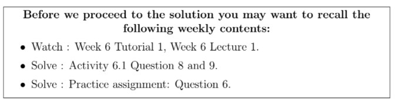

# Reflect with us - Week 6 _ IITM Online Degree (13_4_2026 7_17_32 am)

 
Suppose the matrix representation of a linear transformation $T: \mathbb{R}^3\rightarrow \mathbb{R}^3$ with respect to ordered bases
 $\beta= \lbrace (1,0,1), (0,1,0), (0,0,1) \rbrace$  for the domain and 
 $\gamma=\lbrace (1,0,0), (0,1,0), (1,0,1) \rbrace$  for the range,

  is $I_{3\times3}$, i.e., the identity matrix of order 3. 

Let $A$ denote the matrix representation of the linear transformation $T$ with respect to the standard ordered basis of $\mathbb{R}^3$ for both domain and range. Which of the following are true?

a. $A= I_{3 \times 3}$ i.e., identity matrix of order 3.

b. $A$ is a singular matrix.

c. $\begin{bmatrix}
1 & 0 & 0 \\
0 & 1 & 0 \\
1 & 0 & -1
\end{bmatrix}$

d. $det(A) = 1$

e. $det(A) = -1$

f. $\begin{bmatrix}
0 & 0 & 1 \\
0 & 1 & 0 \\
-1 & 0 & 1
\end{bmatrix}$

 Solution:

Observe that, in question, you are asked to find the matrix representation of $T$ with respect to the standard ordered bases of $\mathbb{R}^3$ for both domain and range. So you have to find the image of each element of the standard ordered basis of $\mathbb{R}^2$ via the linear transformation $T$. 

$\textbf{Note:}$ $I_{3 \times3}$ is matrix representation of the $T$ with respect to the ordered bases $\beta$ and $\gamma$.

 $\textbf{Step 0:}$

    

 
 
 
 
 
 
What is $T(1,0,1)$? (Enter your answer in the form of a row vector in $\mathbb{R}^3$)

**Note:** The answer will be of the form (a, b, c) where a,b and c are in $\mathbb{R}$
 
 
 
 
 
 
 
 
###  No, the answer is incorrect. 
Score: 0

### Feedback:
From the given data, we can calculate

$T(1,0,1)=1(1,0,0)+0(0,1,0)+0(1,0,1)$
### Accepted Answers:
(Type: String) (1, 0, 0)(Type: String) (1,0,0)
 
 
 *
 
 
 1 point
 
 *
 

    

 
 
 
 
 
 
What is $T(0,1,0)$?
 
 
 
 
 
 
 
 
###  No, the answer is incorrect. 
Score: 0

### Feedback:
From the given data, we can calculate

$T(0, 1, 0) = 0(1, 0, 0) + 1(0, 1, 0) + 0(1, 0, 1)$
### Accepted Answers:
(Type: String) (0, 1, 0)(Type: String) (0,1,0)
 
 
 *
 
 
 1 point
 
 *
 

    

 
 
 
 
 
 
What is $T(0,0,1)$?
 
 
 
 
 
 
 
 
###  No, the answer is incorrect. 
Score: 0

### Feedback:
From the given data, we can calculate

$T(0,0,1)=0(1,0,0)+0(0,1,0)+1(1,0,1)$
### Accepted Answers:
(Type: String) (1, 0, 1)(Type: String) (1,0,1)
 
 
 *
 
 
 1 point
 
 *
 

$\textbf{Step 1: }$
Now we have to find the image of $(1,0,0)$ via the linear transformation $T$. We know the image of each element of the basis $\{ (1,0,1),(0,1,0),(0,0,1) \}$. So at first we have to write $(1,0,0)$ in terms of the elements of the basis $\{ (1,0,1),(0,1,0),(0,0,1) \}$.
                    $(1,0,0) = \alpha_1 (1,0,1) +\beta_1 (0,1,0) +\gamma_1 (0,0,1)$

    

 
 
 
 
 
 
What is the value of $\alpha_1$?
 
 
 
 
 
 
 
 
###  No, the answer is incorrect. 
Score: 0

### Accepted Answers:
(Type: Numeric) 1
 
 
 *
 
 
 1 point
 
 *
 

    

 
 
 
 
 
 
What is the value of $\beta_1$?
 
 
 
 
 
 
 
 
###  No, the answer is incorrect. 
Score: 0

### Accepted Answers:
(Type: Numeric) 0
 
 
 *
 
 
 1 point
 
 *
 

    

 
 
 
 
 
 
What is the value of $\gamma_1$?
 
 
 
 
 
 
 
 
###  No, the answer is incorrect. 
Score: 0

### Accepted Answers:
(Type: Numeric) -1
 
 
 *
 
 
 1 point
 
 *
 

    

 
 
 
 
 *
 
 
 1 point
 
 *
 
 
Now, can you find $T(1, 0, 0)$?
 
 
 
 
 
 Yes
 
 
 
 
 
 
 No
 
 
 
 
 
###  No, the answer is incorrect. 
Score: 0

### Feedback:
From the given data, we can calculate

$T(1, 0, 0) = T(1 (1, 0, 1) + 0 (0, 1, 0) − 1 (0, 0, 1))
T(1, 0, 0) = 1 T(1, 0, 1) + 0 T(0, 1, 0) − 1 T(0, 0, 1)$

Here we know the images of $(1, 0, 1),(0, 1, 0)$ and $(0, 0, 1).$

$T(1, 0, 0) = 1 (1, 0, 0) + 0 (0, 1, 0) − 1 (1, 0, 1) = (0, 0, −1)$
### Accepted Answers:

 Yes
 
 No
 
 
 

$\textbf{Step 2:}$
Now we have to find the image of $(0,1,0)$ via the linear transformation $T$. We know the image of each element of the basis $\{ (1,0,1),(0,1,0),(0,0,1) \}$. So at first we have to write $(0,1,0)$ in terms of the elements of the basis $\{ (1,0,1),(0,1,0),(0,0,1) \}$.
 

$(0,1,0) = \alpha_2 (1,0,1) +\beta_2 (0,1,0) +\gamma_2 (0,0,1)$

    

 
 
 
 
 
 
What is the value of $\alpha_2$?
 
 
 
 
 
 
 
 
###  No, the answer is incorrect. 
Score: 0

### Accepted Answers:
(Type: Numeric) 0
 
 
 *
 
 
 1 point
 
 *
 

    

 
 
 
 
 
 
What is the value of $\beta_2$?
 
 
 
 
 
 
 
 
###  No, the answer is incorrect. 
Score: 0

### Accepted Answers:
(Type: Numeric) 1
 
 
 *
 
 
 1 point
 
 *
 

    

 
 
 
 
 
 
What is the value of $\gamma_2$?
 
 
 
 
 
 
 
 
###  No, the answer is incorrect. 
Score: 0

### Accepted Answers:
(Type: Numeric) 0
 
 
 *
 
 
 1 point
 
 *
 

    

 
 
 
 
 *
 
 
 1 point
 
 *
 
 
Now, can you find $T(0, 1, 0)$?
 
 
 
 
 
 Yes
 
 
 
 
 
 
 No
 
 
 
 
 
###  No, the answer is incorrect. 
Score: 0

### Feedback:
$T(0, 1, 0) = T(0 (1, 0, 1) + 1 (0, 1, 0) + 0 (0, 0, 1))$

$T(0, 1, 0) = 0 T(1, 0, 1) + 1 T(0, 1, 0) + 0 T(0, 0, 1)$

$T(0, 1, 0) = (0, 1, 0)$
### Accepted Answers:

 Yes
 
 No
 
 
 

$\textbf{Step 3:}$ 
Now we have to find the image of $(0,0,1)$ via the linear transformation $T$. We know the image of each element of the basis $\{ (1,0,1),(0,1,0),(0,0,1) \}$. So at first we have to write $(0,0,1)$ in terms of the elements of the basis $\{ (1,0,1),(0,1,0),(0,0,1) \}$.
 

$(0,0,1) = \alpha_3 (1,0,1) +\beta_3 (0,1,0) +\gamma_3 (0,0,1)$

    

 
 
 
 
 
 
What is the value of $\alpha_3$?
 
 
 
 
 
 
 
 
###  No, the answer is incorrect. 
Score: 0

### Accepted Answers:
(Type: Numeric) 0
 
 
 *
 
 
 1 point
 
 *
 

    

 
 
 
 
 
 
What is the value of $\beta_3$?
 
 
 
 
 
 
 
 
###  No, the answer is incorrect. 
Score: 0

### Accepted Answers:
(Type: Numeric) 0
 
 
 *
 
 
 1 point
 
 *
 

    

 
 
 
 
 
 
What is the value of $\gamma_3$?
 
 
 
 
 
 
 
 
###  No, the answer is incorrect. 
Score: 0

### Accepted Answers:
(Type: Numeric) 1
 
 
 *
 
 
 1 point
 
 *
 

    

 
 
 
 
 *
 
 
 1 point
 
 *
 
 
Now, can you find $T(0, 0, 1)$?
 
 
 
 
 
 Yes
 
 
 
 
 
 
 No
 
 
 
 
 
###  No, the answer is incorrect. 
Score: 0

### Feedback:
$T(0, 0, 1) = T(0 (1, 0, 1) + 0 (0, 1, 0) + 1 (0, 0, 1))$

$T(0, 0, 1) = 0 T(1, 0, 1) + 0 T(0, 1, 0) + 1 T(0, 0, 1)$

$T(0, 0, 1) = (1, 0, 1)$
### Accepted Answers:

 Yes
 
 No
 
 
 

$\textbf{Step 4:}$ Now we have to find out the matrix $A$. For that we have to write down the images with respect to the standard ordered basis. 
 
 

$T(1,0,0)= 0~(1,0,0)+0~(0,1,0)-1~(0,0,1)$
 
$T(0,1,0)=0~(1,0,0)+1~(0,1,0)+0~(0,0,1)$
 
$T(0,0,1)= 1~(1,0,0)+0~(0,1,0)+1~(0,0,1)$
 Write the coefficients column wise to get the matrix $A$. 

$A=\begin{bmatrix}
 0 & 0 & 1 \\
 0 & 1 & 0 \\
 -1 & 0 & 1
 \end{bmatrix}$

$\textbf{Step 5:}$ 
In this step, you have to find the determinant of the matrix $A$.

    

 
 
 
 
 *
 
 
 1 point
 
 *
 
 
Can you find the $det(A)$?
 
 
 
 
 
 Yes
 
 
 
 
 
 
 No
 
 
 
 
 
###  No, the answer is incorrect. 
Score: 0

### Accepted Answers:

 Yes
 
 No
 
 
 

- Expanding with respect to the first row:

                     $det(A)=0 (1-0)-0(0-0)+1(0+1)$

- Expanding with respect to the first column: 

                   $det(A)= 0(1-0)-0(0-0)-1(0-1)$

- You can expand with respect to any other rows or column.

    

 
 
 
 
 
 
Enter the value of $\mathbf{determinant~ of~ the ~ matrix ~ A}$
 
 
 
 
 
 
 
 
###  No, the answer is incorrect. 
Score: 0

### Accepted Answers:
(Type: Numeric) 1
 
 
 *
 
 
 1 point
 
 *