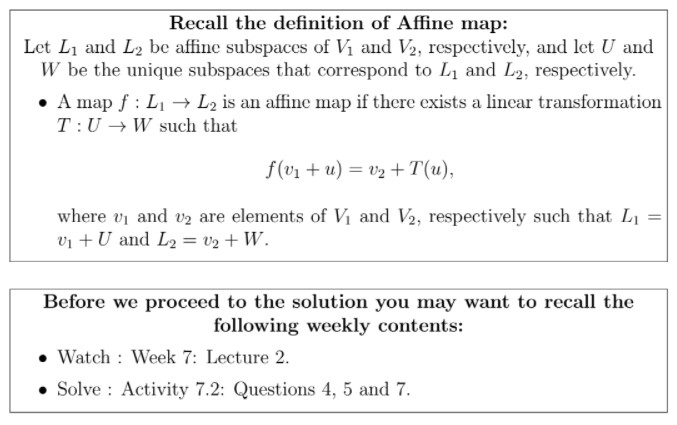
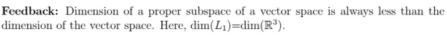
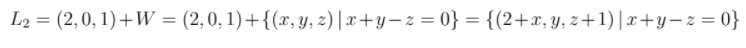
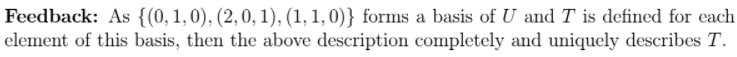
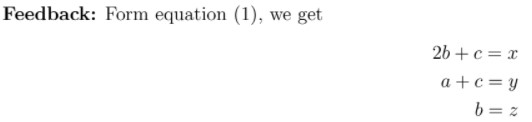

# Reflect with us - Week 7 _ IITM Online Degree (13_4_2026 7_22_26 am)

 

    

 
 
 
 
 *
 
 
 1 point
 
 *
 
 
Let $L_1$ and $L_2$ be affine subspaces of $\mathbb{R}^3$, where $L_1=U$ and $L_2=(2,0,1)+W$, for some vector subspaces $U$ and $W$ of $\mathbb{R}^3$. Let a basis for $U$ be given by $\{(2,0,1),(1,1,0), (0,1,0)\}$ and a basis for $W$ be given by $\{(1,0,1), (0,1,1)\}$. Suppose there is a linear transformation $T: U \to W$ such that $(0, 1,0) \in ker(T)$, $T(2,0,1) = (0,1,1)$ and $T(1, 1, 0) = (1, 0,1)$. An affine mapping $f: L_1 \rightarrow L_2$ is obtained by defining $f(u)=(2,0,1)+T(u)$, for all $u\in U$.
 Which of the following options are true?
 
 
 
 
 
 
 
$L_1 = \mathbb{R}^3$
 
 
 
 
 
 
 
 
$L_2 = \lbrace (x, y, z) \mid x+y-z = 1\rbrace$
 
 
 
 
 
 
 
 
$L_2 = \mathbb{R}^3$
 
 
 
 
 
 
 
 
$f(x, y, z) = (x-2z+2, z, x-z+1)$
 
 
 
 
 
 
 
 
$f(x, y, z) = (x-2z, z, x-z)$
 
 
 
 
 
###  No, the answer is incorrect. 
Score: 0

### Accepted Answers:

 
$L_1 = \mathbb{R}^3$
 
 
 
$L_2 = \lbrace (x, y, z) \mid x+y-z = 1\rbrace$
 
 
 
$f(x, y, z) = (x-2z+2, z, x-z+1)$
 
 
 
 

Solution:

$\textbf{Discussion on Option 1:}$ It is given that $L_1=U$ and $\{(2,0,1),(1,1,0),(0,1,0)\}$ is a basis of the vector subspace $U$. 

    

 
 
 
 
 
 
The dimension of $U$ is 
 
 
 
 
 
 
 
 
 
 
 
 
###  No, the answer is incorrect. 
Score: 0

### Accepted Answers:
(Type: Numeric) 3
 
 
 *
 
 
 1 point
 
 *
 

$L_1=U$ is a subspace of $\mathbb{R}^3$. To know whether $L_1=U$ is a proper subspace of $\mathbb{R}^3$ or not, we just have to compare their dimensions.

    

 
 
 
 
 *
 
 
 1 point
 
 *
 
 
Now, can you see why $L_1=U=\mathbb{R}^3$ ?
 
 
 
 
 
 Yes
 
 
 
 
 
 
 No
 
 
 
 
 
###  No, the answer is incorrect. 
Score: 0

### Feedback:

### Accepted Answers:

 Yes
 
 
 

$\textbf{Discussion on Options 2 and 3: }$ It is given that $L_2=(2,0,1)+W$ and $\{(1,0,1),(0,1,1)\}$ is a basis for the vector subspace $W$. Now to find the explicit description of $L_2$, we have to find the explicit description of $W$ first. 
 

                                                         $\begin{aligned}
 W &=\{ a(1,0,1)+b(0,1,1) \mid a,b \in\mathbb{R} \} \\
 &=\{ (a,b,a+b) \mid a,b \in \mathbb{R} \} 
 \end{aligned}$

 As $W$ is a subspace of $\mathbb{R}^3$, we want to express it using the usual $x,y,z$ co-ordinate and the relation between them. From the above description we have, $x=a$, $y=b$, $z=a+b$, which implies that $z=x+y$. So 
 

                                                           $W=\{(x,y,z)\mid x+y-z=0. \text{ where } x,y,z\in \mathbb{R} \}$

    

 
 
 
 
 *
 
 
 1 point
 
 *
 
 
Now, are you able to find the equation of $L_2$?
 
 
 
 
 
 Yes
 
 
 
 
 
 
 No
 
 
 
 
 
###  No, the answer is incorrect. 
Score: 0

### Feedback:

### Accepted Answers:

 Yes
 
 
 

    

 
 
 
 
 *
 
 
 1 point
 
 *
 
 
Do you agree that the sets $\{ (2+x,y,z+1) \, | \, x+y-z=0 \}$ and $\lbrace (a, b, c) \mid a+b-c = 1\rbrace$ are the same?
 
 
 
 
 
 Yes
 
 
 
 
 
 
 No
 
 
 
 
 
###  No, the answer is incorrect. 
Score: 0

### Feedback:

### Accepted Answers:

 Yes
 
 
 

$\textbf{Discussion on Option 4 and 5:}$ 
 

$\textbf{Step 1:}$ Here, we have to find an algebraic expression for the affine map $f: L_1 \to L_2$. To get an algebraic expression for $f$, we have to find the algebraic expression which represents the linear transformation $T: U \to W$. 

Given: 
                                   $T(0,1,0)=(0,0,0), \quad T(2,0,1)=(0,1,1). \quad T(1,1,0)=(1,0,1)$

    

 
 
 
 
 *
 
 
 1 point
 
 *
 
 
Is $T$ uniquely determined by the above information?
 
 
 
 
 
 Yes
 
 
 
 
 
 
 No
 
 
 
 
 
###  No, the answer is incorrect. 
Score: 0

### Feedback:

### Accepted Answers:

 Yes
 
 
 

$\textbf{Step 2:}$ Since $\{(0,1,0),(2,0,1),(1,1,0) \}$ is a basis of $U=\mathbb{R}^3$, we can write any element $(x,y,z) \in U$ as a linear combination of $\{(0,1,0),(2,0,1),(1,1,0) \}$.

                                 \begin{equation}
 (x,y,z)=a\, (0,1,0)+b\,(2,0,1)+c\,(1,1,0) 
\end{equation}                                           (1)

 Apply $T$ on both sides:

                                   $T(x,y,z)=a \, T(0,1,0)+ b\,T(2,0,1)+c \, T(1,1,0)$

                                   $T(x,y,z)=a \, (0,0,0)+ b\,(0,1,1)+ c \, (1,0,1)$
To get an algebraic expression for $T(x,y,z)$, we just have to know the values of $a$, $b$ and $c$ in terms of $x$,$y$ and $z$.

    

 
 
 
 
 *
 
 
 1 point
 
 *
 
 
Now, can you find the values of $a$, $b$ and $c$ using equation $(1)$?
 
 
 
 
 
 Yes
 
 
 
 
 
 
 No
 
 
 
 
 
###  No, the answer is incorrect. 
Score: 0

### Feedback:

### Accepted Answers:

 Yes
 
 
 

Solve the above system for $a,b$ and $c$.

    

 
 
 
 
 *
 
 
 1 point
 
 *
 
 
What is the value of $a$ ? 
 
 
 
 
 
 
$z$
 
 
 
 
 
 
 
 
$x-2z$
 
 
 
 
 
 
 
 
$y+2z-x$
 
 
 
 
 
 
 
 
$x-y$
 
 
 
 
 
###  No, the answer is incorrect. 
Score: 0

### Accepted Answers:

 
$y+2z-x$
 
 
 
 

    

 
 
 
 
 *
 
 
 1 point
 
 *
 
 
 What is the value of $b$ ? 

 
 
 
 
 
 
$z$
 
 
 
 
 
 
 
 
$x-2z$
 
 
 
 
 
 
 
 
$y+2z-x$
 
 
 
 
 
 
 
 
$x-y$
 
 
 
 
 
###  No, the answer is incorrect. 
Score: 0

### Accepted Answers:

 
$z$
 
 
 
 

    

 
 
 
 
 *
 
 
 1 point
 
 *
 
 
 What is the value of $c$ ? 
 
 
 
 
 
 
 
$z$
 
 
 
 
 
 
 
 
$x-2z$
 
 
 
 
 
 
 
 
$y+2z-x$
 
 
 
 
 
 
 
 
$x-y$
 
 
 
 
 
###  No, the answer is incorrect. 
Score: 0

### Accepted Answers:

 
$x-2z$
 
 
 
 

$\textbf{Step 3:}$
 
                          $T(x,y,z)=(0,z,z)+(x-2z,0,x-2z)=(x-2z,z,x-z)$

 By definition:

                         $f(x,y,z) = (2,0,1) +T(x,y,z) \quad \text{where} \, (x,y,z) \in U.$
By substituting the value $T(x,y,z)$ in the above expression, we get

                          $f(x,y,z) = (x-2z+2,z,x-z+1) \quad \text{for all} \, (x,y,z) \in U.$