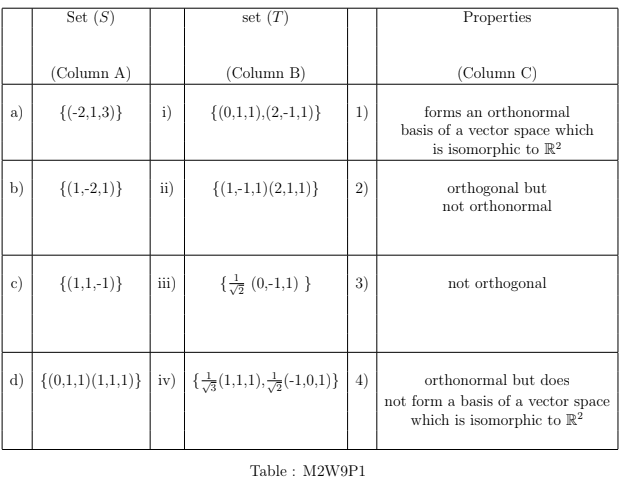

# Practice assignment 8 - Not Graded _ IITM Online Degree (13_4_2026 7_28_27 am)

 
$\textbf{Note:}$ Suppose $W_1 \textbf{ and } W_2$ are subspaces of a vector space $V$. Then sum of two subspaces is defined as: 

               $W_1 + W_2 = \{w_1 + w_2 \mid w_1\in W_1, w_2 \in W_2\}.$ 

One can verify that $W_1 + W_2$ is a subspace of $V$.

Multiple Choice Questions (MCQ):

    

 

 
 
 
 
 
 

    

 
 
 
 
 *
 
 
 1 point
 
 *
 
 
An inner product on $\mathbb{R}^3$ is defined as:

          $\langle ., . \rangle$: $\mathbb{R}^3 \times \mathbb{R}^3$ $\rightarrow \mathbb{R}$
 

          $\langle (x_1,x_2,x_3), (y_1,y_2,y_3)\rangle$ = $x_1y_1+x_2y_2+x_3y_3$.

 Match a set $S$ in Column A with the set $T$ given in column B, so that $T \subset Span(S)^{\perp}$. Match a set in column B with the property it satisfies in column C.

Which of the following option are true?

 
 
 
 
 
 
d$\rightarrow$ ii $\rightarrow$ 3
 
 
 
 
 
 
 
d$\rightarrow$ iii $\rightarrow$ 4
 
 
 
 
 
 
 
c $\rightarrow$ ii $\rightarrow$ 4
 
 
 
 
 
 
 
 
a $\rightarrow$ iv $\rightarrow$ 1
 
 
 
 
 
 
 
a $\rightarrow$ ii $\rightarrow$ 3
 
 
 
 
 
 
 
b $\rightarrow$ iv $\rightarrow$ 2
 
 
 
 
 
###  No, the answer is incorrect. 
Score: 0

### Accepted Answers:

 
d$\rightarrow$ iii $\rightarrow$ 4
 
 
a $\rightarrow$ ii $\rightarrow$ 3
 
 
 
 
 

    

 
 
 
 
 
 
Suppose $W_1 \text{ and } W_2$ are subspaces of a vector space $V$. Let $P_{W_1} \text{ and } P_{W_2}$ denote the projection from $V$ to $W_1$ and $V$ to $W_2$ respectively and consider the following statements: 

-  **Statement P**: If $P_{W_1}+ P_{W_2}$ is a projection from $V$ to $W_1 + W_2$, then $P_{W_1}\circ P_{W_2} + P_{W_2} \circ P_{W_1} = 0.$

-  **Statement Q**: $P_{W_1}^2 := P_{W_1} \circ P_{W_1}$ is not a projection from $V$ to $W_1$. 

- **Statement R: **If $A$ is the matrix representation of $P_{W_2}$, then $A$ can not be a symmetric matrix.

- **Statement S**: $P_{W_1}- P_{W_2}$ is a projection from $V$ to $W_1 + W_2$. 

 Find the number of correct statements

 
 
 
 
 
 
 
 
###  No, the answer is incorrect. 
Score: 0

### Accepted Answers:
(Type: Numeric) 1
 
 
 *
 
 
 1 point
 
 *
 

 
 

    

 
 
 
 
 *
 
 
 1 point
 
 *
 
 Which of the followings option(s) is (are) true?

 
 
 
 
 
 
Let $u, v, \text{ and } w$ be three vectors in $\mathbb{R}^2$ and $\langle ., .\rangle$ be an inner product on $\mathbb{R}^2$. If $\langle u, v\rangle = \langle u, w \rangle$, then $v = w$

 
 
 
 
 
 
 
Let $V$ be an inner product space. If $\langle u, v \rangle = 0$ for all $u \in V$, then $v = 0$ 

 
 
 
 
 
 
 
Let $V$ be an inner product space and $u,v \in V$. If $\langle u+v,u- v \rangle = 0$, then $\|u\| \neq \|v\|$

 
 
 
 
 
 
 
Let $V$ be an inner product space. If $S\subset V$ then $S^\perp = (span(S))^\perp$

 
 
 
 
 
 
 
Suppose $\{u_1, u_2, \ldots u_m\}$ be an orthogonal set of vectors in an inner product space $V$, then $\| u_1 + u_2 + \ldots + u_m\|^2 = \|u_1\|^2+ \|u_2\|^2 + \ldots + \|u_m\|^2$.
 
 
 
 
 
###  No, the answer is incorrect. 
Score: 0

### Accepted Answers:

 
Let $V$ be an inner product space. If $\langle u, v \rangle = 0$ for all $u \in V$, then $v = 0$ 

 
 
Let $V$ be an inner product space. If $S\subset V$ then $S^\perp = (span(S))^\perp$

 
 
Suppose $\{u_1, u_2, \ldots u_m\}$ be an orthogonal set of vectors in an inner product space $V$, then $\| u_1 + u_2 + \ldots + u_m\|^2 = \|u_1\|^2+ \|u_2\|^2 + \ldots + \|u_m\|^2$.
 
 
 
 
 

    

 
 
 
 
 *
 
 
 1 point
 
 *
 
  Which of the following option(s) is/are true?

 
 
 
 
 
 
Let $A$ and $B$ be orthogonal matrices of order 3. Then $A \text{ and } B$ are equivalent matrices.

 
 
 
 
 
 
 
Let $A$ and $B$ be orthogonal matrices. Then $A \text{ and } B$ are similar matrices.

 
 
 
 
 
 
 
Let $A$ be a rotation matrix corresponding to the anti-clock wise rotation of the XY-plane about the Z-axis with angle $\theta$. Then nullity of the matrix $A$ is 0.

 
 
 
 
 
 
 
Let $A$ be a rotation matrix corresponding to the anti-clock wise rotation of the XY-plane about the Z-axis with angle $\theta$ and $B$ be a rotation matrix corresponding to the anti- clock wise rotation of the YZ-plane about the X -axis with angle $\beta$. Then $A$ and $B$ are equivalent matrices.
 
 
 
 
 
###  No, the answer is incorrect. 
Score: 0

### Accepted Answers:

 
Let $A$ and $B$ be orthogonal matrices of order 3. Then $A \text{ and } B$ are equivalent matrices.

 
 
Let $A$ be a rotation matrix corresponding to the anti-clock wise rotation of the XY-plane about the Z-axis with angle $\theta$. Then nullity of the matrix $A$ is 0.

 
 
Let $A$ be a rotation matrix corresponding to the anti-clock wise rotation of the XY-plane about the Z-axis with angle $\theta$ and $B$ be a rotation matrix corresponding to the anti- clock wise rotation of the YZ-plane about the X -axis with angle $\beta$. Then $A$ and $B$ are equivalent matrices.
 
 
 
 
 
 

Numerical Answer Type:

    

 

 
 
 
 
 
 

    

 
 
 
 
 
 
Let $u=(1,2,1)$ and $v= (1,2,3)$ be the vectors of the inner product space $\mathbb{R}^3$ with usual inner product. Let $T: \mathbb{R}^3 \to \mathbb{R}^3$ be an orthogonal linear transformation. If $\theta$ is an angle between $T(u)$ and $T(v)$, then find the value of $||T(u)||||T(v)||\cos{\theta}$. 
 
 
 
 
 
 
 
 
###  No, the answer is incorrect. 
Score: 0

### Accepted Answers:
(Type: Numeric) 8
 
 
 *
 
 
 1 point
 
 *
 

 
 

    

 
 
 
 
 
 
Consider a set $W = \{ (1,1,1)\}$ from the inner product space $\mathbb{R}^3$. Find the dimension of the subspace $W^\perp$, where $W^\perp$ is the collection of the vectors which are orthogonal to the vector (1,1,1).
 
 
 
 
 
 
 
 
###  No, the answer is incorrect. 
Score: 0

### Accepted Answers:
(Type: Numeric) 2
 
 
 *
 
 
 1 point
 
 *
 

 
 

    

 
 
 
 
 
 
Let $v= (3,1,2)$ be a vector in $\mathbb{R}^3$. If $(a, b, c)$ is the vector obtained from $v$ after the anti- clock wise rotation of ZX-plane with angle $45^\circ$ about the Y- axis, then find the value of $\sqrt{2}(a+b+c-1)$.
 
 
 
 
 
 
 
 
###  No, the answer is incorrect. 
Score: 0

### Accepted Answers:
(Type: Numeric) 6
 
 
 *
 
 
 1 point
 
 *
 

 
 
 

Comprehension Type Question:

With a particular frame of reference (in $\mathbb{R}^2$) the position of Rahul's house is at the point (8,1). There are two roads Road 1 and Road 2 along the lines $y = 2x \text{ and } y = -2x$ respectively on the $XY-$plane.
 Answer questions 8,9 and 10 using the given information.

    

 

 
 
 
 
 
 

    

 
 
 
 
 *
 
 
 1 point
 
 *
 
 Which of the following option(s) is (are) true?

 
 
 
 
 
 If Rahul wants to travel the minimum distance from his house to Road 1, then he will meet Road 1 at (2,4).
 
 
 
 
 
 
 
If Rahul wants to travel the minimum distance from his house to Road 1, then he will meet Road 1 at $\frac{6}{5}(1,-2)$.

 
 
 
 
 
 
 
If Rahul wants to travel the minimum distance from his house to Road 2, then he will meet Road 2 at $\frac{6}{5}(1,-2)$.

 
 
 
 
 
 
 If Rahul wants to travel the minimum distance from his house to Road 2, then he will meet Road 2 at (2,4).
 
 
 
 
 
###  No, the answer is incorrect. 
Score: 0

### Accepted Answers:

 If Rahul wants to travel the minimum distance from his house to Road 1, then he will meet Road 1 at (2,4).
 
 
If Rahul wants to travel the minimum distance from his house to Road 2, then he will meet Road 2 at $\frac{6}{5}(1,-2)$.

 
 
 
 
 

    

 
 
 
 
 
 
Let $\theta$ be the acute angle between Road 1 and Road 2, then what will be the value of $5 \cos(\theta)$? 
 
 
 
 
 
 
 
 
###  No, the answer is incorrect. 
Score: 0

### Accepted Answers:
(Type: Numeric) 3
 
 
 *
 
 
 1 point
 
 *
 

 
 

    

 
 
 
 
 *
 
 
 1 point
 
 *
 
 
Let $\langle . , . \rangle$ denote the standard inner product on $\mathbb{R}^2$, i.e., $\langle (x_1,x_2), (y_1,y_2) \rangle= x_1y_1+x_2y_2$. Suppose $W_1 = \{(x,y)\mid y = 2x\}$ and $W_2 = \{(x,y)\mid y = -2x\}$ are two subspaces of $\mathbb{R}^2$. Which of the following options is correct? 

 
 
 
 
 
 
$W_1^\perp = \{(x,y)\mid 2y = x\}$
 
 
 
 
 
 
 
 
$W_2^\perp = \{(x,y)\mid 2y = -x\}$
 
 
 
 
 
 
 
 
$W_1^\perp = \{(x,y)\mid 2y = -x\}$
 
 
 
 
 
 
 
 
$W_2^\perp = \{(x,y)\mid 2y = x\}$
 
 
 
 
 
###  No, the answer is incorrect. 
Score: 0

### Accepted Answers:

 
$W_1^\perp = \{(x,y)\mid 2y = -x\}$
 
 
 
$W_2^\perp = \{(x,y)\mid 2y = x\}$