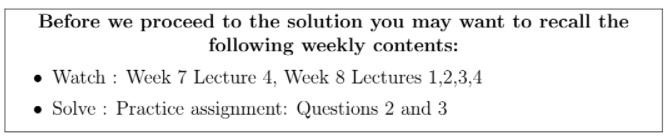

# Reflect with us - Week 8 _ IITM Online Degree (13_4_2026 7_28_06 am)

 

    

 
 
 
 
 *
 
 
 1 point
 
 *
 
 Choose the set of correct options.
 
 
 
 
 
 
Suppose $\beta = \lbrace v_1, v_2, \ldots, v_n \rbrace$ is an orthogonal basis of an inner product space $V$. If there exists some $v\in V$, such that $\langle v, v_i \rangle =0$ for all $i= 1,2, \ldots, n$, then $v=0$. 
 
 
 
 
 
 
 
 
There exists an orthonormal basis for $\mathbb{R}^n$ with the standard inner product. 
 
 
 
 
 
 
 
 
If $P_W$ denotes the linear transformation which projects the vectors of an inner product space $V$ to a subspace $W$ of $V$, then $range(P_W) \cap null~space (P_W)= \lbrace 0 \rbrace$, where $0$ denotes the zero vector of $V$.
 
 
 
 
 
 
 
 
$\begin{bmatrix} 1 & -1 \\ 0 & 1 \end{bmatrix}$ cannot represent a matrix corresponding to some projection. 
 
 
 
 
 
###  No, the answer is incorrect. 
Score: 0

### Accepted Answers:

 
Suppose $\beta = \lbrace v_1, v_2, \ldots, v_n \rbrace$ is an orthogonal basis of an inner product space $V$. If there exists some $v\in V$, such that $\langle v, v_i \rangle =0$ for all $i= 1,2, \ldots, n$, then $v=0$. 
 
 
 
There exists an orthonormal basis for $\mathbb{R}^n$ with the standard inner product. 
 
 
 
If $P_W$ denotes the linear transformation which projects the vectors of an inner product space $V$ to a subspace $W$ of $V$, then $range(P_W) \cap null~space (P_W)= \lbrace 0 \rbrace$, where $0$ denotes the zero vector of $V$.
 
 
 
$\begin{bmatrix} 1 & -1 \\ 0 & 1 \end{bmatrix}$ cannot represent a matrix corresponding to some projection. 
 
 
 

**Solution:
**

$\textbf{Option 1:}$ 
$\beta = \{v_1, v_2, \ldots, v_n\}$ is an orthonormal basis of the inner product space $V$.

$\textbf{Step 1:}$ As $v\in V$, we can express $v$ as a linear combination of the vectors $v_1, v_2, \ldots, v_n$ as follows: 

$v= \alpha_1v_1+ \ldots + \alpha_nv_n$, where $\alpha_1, \ldots, \alpha_n \in \mathbb{R}$
Taking inner product of $v$ with $v_1$, we have
$\langle v, v_1\rangle= \langle \alpha_1v_1+ \ldots + \alpha_nv_n, v_1 \rangle$

Recall two properties of inner products on $V$: 
i) $\langle u_1+u_2, u_3 \rangle = \langle u_1, u_3 \rangle+ \langle u_2, u_3 \rangle$ for any vectors $u_1, u_2, u_3 \in V$. 
ii) $\langle cu_1, u_2 \rangle= c \langle u_1, u_2 \rangle$ for any vectors $u_1, u_2 \in V$ and $c\in \mathbb{R}$.
Using these properties we have, 

$\langle v, v_1 \rangle= \alpha_1 \langle v_1, v_1 \rangle + \alpha_2 \langle v_2, v_1 \rangle + \ldots +\alpha_n \langle v_n, v_1 \rangle$.

    

 
 
 
 
 
 
What is the value of $\langle v_1, v_1 \rangle$?
 
 
 
 
 
 
 
 
###  No, the answer is incorrect. 
Score: 0

### Accepted Answers:
(Type: Numeric) 1
 
 
 *
 
 
 1 point
 
 *
 

    

 
 
 
 
 
 
What is the value of $\langle v_2, v_1 \rangle$?
 
 
 
 
 
 
 
 
###  No, the answer is incorrect. 
Score: 0

### Accepted Answers:
(Type: Numeric) 0
 
 
 *
 
 
 1 point
 
 *
 

    

 
 
 
 
 
 
What is the value of $\langle v_i, v_1\rangle$, for any $i\in \{ 2,3 \ldots, n\}$?
 
 
 
 
 
 
 
 
###  No, the answer is incorrect. 
Score: 0

### Accepted Answers:
(Type: Numeric) 0
 
 
 *
 
 
 1 point
 
 *
 

$\textbf{Feedback:}$ Recall the definition of an orthonormal basis and also observe that $\beta$ is an orthonormal basis. 

    

 
 
 
 
 
 
If $\langle v,v_1\rangle = 0$, then what is the value of $\alpha_1$?
 
 
 
 
 
 
 
 
###  No, the answer is incorrect. 
Score: 0

### Accepted Answers:
(Type: Numeric) 0
 
 
 *
 
 
 1 point
 
 *
 

$\textbf{Feedback:}$ Observe that $\langle v,v_1\rangle = \alpha_1$ 
Similarly we can conclude that, $\alpha_i = 0, \text{ for each } i= 1, 2, \ldots, n$

Hence, $v=0$.

$\textbf{Option 2:}$ Let $\gamma = \{v_1, v_2, \ldots, v_n\}$ be a given ordered basis of a vector space. The steps in the process are described below to yield an orthonormal basis $\beta =\{u_1, u_2, \ldots, u_n\}$.
Step-1 $w_1= v_1$ , and $u_1=\frac{w_1}{\| w_1 \|}$.

Step-2 $w_2 = v_2- \langle v_2, u_1\rangle u_1$ and $u_2=\frac{w_2}{\| w_2 \|}$.

Step-3 $w_3 = v_3- \langle v_3, u_1\rangle u_1 - \langle v_3, u_2\rangle u_2$ and $u_3=\frac{w_3}{\| w_3 \|}$.
 
            $\vdots$

Step-i $w_i = v_i- \sum_{j = 1}^ {i-1} \langle v_i, u_j\rangle u_j$ and $u_i=\frac{w_i}{\| w_i \|}$.
 
           $\vdots \\$

Step-n $w_n = v_n- \sum_{j = 1}^{n-1} \langle v_n, u_j\rangle u_j$ and $u_n=\frac{w_n}{\| w_n \|}$.

Hence, Option 2 is correct. 
 

$\textbf{Option 3:}$ $\textbf{The projection of a vector to a subspace:}$
 Let $V$ be an inner product space, $v\in V$ and $W \subseteq V$ be a subspace. Then the projection of $v$ onto $W$ is the vector in $W$, denoted by $P_W(v)$, computed as follows:

               $\text{ Find an orthonormal basis } \{v_1, v_2, \ldots, v_n\} \text{ for }W.$

                             $\text{Then } P_W(v) = \sum_{i=1}^n\langle v,v_i \rangle v_i$

$\textbf{Step 1:}$

               $\begin{aligned}
 P_W^2(v) &= P_W(P_W(v)) \\
 &= P_W( \sum_{i=1}^n\langle v,v_i \rangle v_i) \\
 &= \sum_{i=1}^n P_W( \langle v, v_i \rangle v_i) \\
 &= \sum_{i=1}^n \langle v, v_i \rangle P_W(v_i) 
\end{aligned}$

    

 
 
 
 
 *
 
 
 1 point
 
 *
 
 
At this point can you identify $P_W(v_i)$? 
 
 
 
 
 
 
$v_i$
 
 
 
 
 
 
 0
 
 
 
 
 
###  No, the answer is incorrect. 
Score: 0

### Accepted Answers:

 
$v_i$
 
 
 

 $\textbf{Feedback:}$ As $v_i$ is itself in $W$, the projection of it onto $W$ is nothing but the vector $v_i$ itself. On applying the definition, we get, 
 $P_W(v_i)= \sum_{j=1}^n\langle v_i,v_j \rangle v_j=v_i$ as $\langle v_i, v_j\rangle =0$ when $i\neq j$ and $\langle v_i, v_i\rangle=1$.

Hence we have 

                     $P_W^2(v)=\sum_{i=1}^n \langle v, v_i \rangle P_W(v_i)= \sum_{i=1}^n \langle v, v_i \rangle v_i=P_W(v)$

So we can conclude $P_W^2=P_W$. 

$\textbf{Step 2:}$
Let $v \in range (P_W)~ \cap~ null~ space(P_W)$.
So $v\in range(P_W)$ and $v \in null~ space (P_W)$.

As $v\in range(P_W)$ there exists $v'\in V$ such that $P_W(v')=v$, and as $v\in null~ space(P_W)$, we have $P_W(v)=0$.

                        $\begin{aligned}
 P_W(v')&=v\\
 P_W^2(v') &= P_W(P_W(v')) \\
 P_W(v') &= P_W(v) [\text{as, } P_W^2=P_W] \\
 P_W(v') &=0 \\
 v &=0
\end{aligned}$

Hence $range(P_W) ~ \cap ~ null~space(P_W)=\{0 \}$.
 
 

$\textbf{Option 4:}$
If a matrix $A$ represents a projection, then $A^2$ must be $A$. 
Let $A=\begin{bmatrix}
 1 & -1 \\
 0 & 1
\end{bmatrix}$.

    

 
 
 
 
 *
 
 
 1 point
 
 *
 
 
Is $A^2 = A$?
 
 
 
 
 
 Yes
 
 
 
 
 
 
 No
 
 
 
 
 
###  No, the answer is incorrect. 
Score: 0

### Accepted Answers:

 No
 
 
 

Hence, $\begin{bmatrix} 1 & -1 \\ 0 & 1 \end{bmatrix}$ cannot represent a matrix corresponding to some projection.