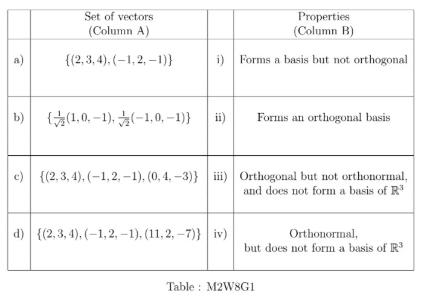

# Week 8 - Graded Assignment 8 _ IITM Online Degree (13_4_2026 7_28_45 am)

 
Note: This assignment will be evaluated after the deadline passes. You will get your score 48 hrs after the deadline. Until then the score will be shown as Zero.

    

 

 
 
 **Multiple Select Questions (MSQ):**
 
 
 

    

 
 
 
 
 *
 
 
 1 point
 
 *
 
 
An inner product on $\mathbb{R}^3$ is defined as:

                    $\langle ., . \rangle$: $\mathbb{R}^3 \times \mathbb{R}^3$ $\rightarrow \mathbb{R}$
 

                    $\langle (x_1,x_2,x_3), (y_1,y_2,y_3)\rangle$ = $x_1y_1+x_2y_2+x_3y_3$.

Match the sets of vectors in column A with their properties of orthogonality or orthonormality in column B with respect to the above inner product.

Choose the set of correct options. 

 
 
 
 
 
 
a $\rightarrow$ iv)
 
 
 
 
 
 
 
a $\rightarrow$ iii)
 
 
 
 
 
 
 
b $\rightarrow$ iv)
 
 
 
 
 
 
 
b $\rightarrow$ iii)
 
 
 
 
 
 
 
 c $\rightarrow$ ii)
 
 
 
 
 
 
 
 c $\rightarrow$ i)
 
 
 
 
 
 
 
d $\rightarrow$ i)
 
 
 
 
 
 
 
d $\rightarrow$ ii)
 
 
 
 
 
###  Yes, the answer is correct. 
Score: 1

### Accepted Answers:

 
a $\rightarrow$ iii)
 
 
b $\rightarrow$ iv)
 
 
 c $\rightarrow$ i)
 
 
d $\rightarrow$ ii)
 
 
 
 
 

    

 
 
 
 
 *
 
 
 1 point
 
 *
 
 Choose the set of correct options. 
 
 
 
 
 
 
Suppose $\beta = \lbrace v_1, v_2, \ldots, v_n \rbrace$ is an orthogonal basis of an inner product space $V$. If there exists some $v\in V$, such that $\langle v, v_i \rangle =0$ for all $i= 1,2, \ldots, n$, then $v=0$.
 
 
 
 
 
 
 
There exists an orthonormal basis for $\mathbb{R}^n$ with the standard inner product.
 
 
 
 
 
 
 
If $P_W$ denotes the linear transformation which projects the vectors of an inner product space $V$ to a subspace $W$ of $V$, then $range(P_W) \cap null~space (P_W)= \lbrace 0 \rbrace$, where $0$ denotes the zero vector of $V$.
 
 
 
 
 
 
 
$\begin{bmatrix} 1 & -1 \\ 0 & 1 \end{bmatrix}$ cannot represent a matrix corresponding to some projection. 

 
 
 
 
 
###  Yes, the answer is correct. 
Score: 1

### Accepted Answers:

 
Suppose $\beta = \lbrace v_1, v_2, \ldots, v_n \rbrace$ is an orthogonal basis of an inner product space $V$. If there exists some $v\in V$, such that $\langle v, v_i \rangle =0$ for all $i= 1,2, \ldots, n$, then $v=0$.
 
 
There exists an orthonormal basis for $\mathbb{R}^n$ with the standard inner product.
 
 
If $P_W$ denotes the linear transformation which projects the vectors of an inner product space $V$ to a subspace $W$ of $V$, then $range(P_W) \cap null~space (P_W)= \lbrace 0 \rbrace$, where $0$ denotes the zero vector of $V$.
 
 
$\begin{bmatrix} 1 & -1 \\ 0 & 1 \end{bmatrix}$ cannot represent a matrix corresponding to some projection. 

 
 
 
 
 
 

**Numerical Answer Type (NAT):
**

    

 

 
 
 
 
 
 

    

 
 
 
 
 
 
If $A$ is an orthogonal matrix of order 5, then find nullity of the matrix $A$.
 
 
 
 
 
 
 
 
###  Yes, the answer is correct. 
Score: 1

### Accepted Answers:
(Type: Numeric) 0
 
 
 *
 
 
 1 point
 
 *
 

 
 

    

 
 
 
 
 
 
Let $v \in \mathbb{R}^3$ be a vector such that $||v|| = 5$. If $u$ is the vector obtained from $v$ after the anti- clock wise rotation of XY-plane with angle $70^\circ$ about the Z- axis, then find the length of the vector $u$.
 
 
 
 
 
 
 
 
###  Yes, the answer is correct. 
Score: 1

### Accepted Answers:
(Type: Numeric) 5
 
 
 *
 
 
 1 point
 
 *
 

 
 

    

 
 
 
 
 
 
Let $v= (1,2,2)$ be a vector in $\mathbb{R}^3$. If $(a, b, c)$ is the vector obtained from $v$ after the anti- clock wise rotation of YZ-plane with angle $60^\circ$ about the X- axis, then find the value of $a+b+c$.
 
 
 
 
 
 
 
 
###  Yes, the answer is correct. 
Score: 1

### Accepted Answers:
(Type: Numeric) 3
 
 
 *
 
 
 1 point
 
 *
 

 
 
 

    

 

 
 
 
 
 
 

    

 
 
 
 
 
 
Consider a vector space $M_{2 \times 2}(\mathbb{R})$ and a norm on the vector space defined as 
 $\|A\| = \max \{|a_{11}| + | a_{21}|, |a_{12}| + | a_{22}| \}$, where $A = \begin{bmatrix} a_{11} & a_{12} \\ a_{21} & a_{22} \end{bmatrix} \in M_{2 \times2}(\mathbb{R})$.
 Let $B= \begin{bmatrix} x & \sqrt{2}~x \\ -\sqrt{2}~y & y \end{bmatrix}$ be an orthogonal matrix i.e. $BB^T = B^TB = I$ and assume $x, y>0$. 
 Then find the norm of the matrix $C= \begin{bmatrix} \sqrt{3}~ x & \sqrt{3}~x \\ \sqrt{3}~y & \sqrt{3}~y \end{bmatrix}$ (i.e., $||C||$) 
 
 
 
 
 
 
 
 
###  Yes, the answer is correct. 
Score: 1

### Accepted Answers:
(Type: Numeric) 2
 
 
 *
 
 
 1 point
 
 *
 

 
 
 

    

 

 
 
 
 
 
 

    

 
 
 
 
 
 
Let $V= \mathbb{R}^2$ be the inner product space with usual inner product and a linear transformation $T:\mathbb{R}^2 \to \mathbb{R}^2$ defined as $T(x, y) = (\frac{a}{\sqrt{a^2+2^2}}x+ \frac{3}{\sqrt{b^2+3^2}}y, \frac{2}{\sqrt{a^2+2^2}}x + \frac{b}{\sqrt{b^2+3^2}}y)$. If $T$ is an orthogonal linear transformation, then find the value of $3a+2b.$
 
 
 
 
 
 
 
 
###  Yes, the answer is correct. 
Score: 1

### Accepted Answers:
(Type: Numeric) 0
 
 
 *
 
 
 1 point
 
 *
 

 
 
 

    

 

 
 
 **Comprehension Type Question:
**

With a particular frame of reference (in $\mathbb{R}^3$), position of a target is given as the vector $(3,4,5)$. Three shooters $S_1$, $S_2$, and $S_3$ are moving along the lines $x=y$, $x=-y$, and $x=2y$, on the $XY$-plane (i.e., $z=0$) to shoot the target. Suppose that, there is another shooter $S_4$, who is moving on the plane $x+y+z=0$. Suppose all of them shoot the target so that the target is at the closest distance from the respective path or plane on which they are travelling. 
Answer questions 10,11 and 12 using the given information. 
 
 
 

    

 
 
 
 
 *
 
 
 1 point
 
 *
 
 Choose the set of correct options.
 
 
 
 
 
 
$S_1$ will shoot the target from the point $(\frac{7}{2}, -\frac{7}{2}, 0)$.
 
 
 
 
 
 
 
 $S_1$ will shoot the target from the point $(\frac{7}{2}, \frac{7}{2}, 0)$.
 
 
 
 
 
 
 
$S_1$ will shoot the target from the point $(1, 1, 0)$.
 
 
 
 
 
 
 
$S_2$ will shoot the target from the point $(-\frac{1}{2}, -\frac{1}{2}, 0)$.
 
 
 
 
 
 
 
$S_2$ will shoot the target from the point $(1, -1, 0)$.
 
 
 
 
 
 
 
$S_2$ will shoot the target from the point $(-\frac{1}{2}, \frac{1}{2}, 0)$.

 
 
 
 
 
 
 
$S_3$ will shoot the target from the point $(4, 2, 0)$.
 
 
 
 
 
 
 
$S_3$ will shoot the target from the point $(2, 1, 0)$.
 
 
 
 
 
 
 
 $S_3$ will shoot the target from the point $(0, 0, 0)$.
 
 
 
 
 
###  Yes, the answer is correct. 
Score: 1

### Accepted Answers:

 
 $S_1$ will shoot the target from the point $(\frac{7}{2}, \frac{7}{2}, 0)$.
 
 
$S_2$ will shoot the target from the point $(-\frac{1}{2}, \frac{1}{2}, 0)$.

 
 
$S_3$ will shoot the target from the point $(4, 2, 0)$.
 
 
 
 
 

    

 
 
 
 
 
 
If $(a, b, c)$ is the point from which the shooter $S_4$ will shoot the target, then find the value of $a+2b+3c$.
 
 
 
 
 
 
 
 
###  Yes, the answer is correct. 
Score: 1

### Accepted Answers:
(Type: Numeric) 2
 
 
 *
 
 
 1 point
 
 *
 

 
 

    

 
 
 
 
 
 
 Let $d_i$ be the distance of the target from the point where the shooter $S_i$ shoots the target, for i = 1,2,3,4 and let $d$ be the minimum amongst the $d_i$. Find the value of $d^2$.
 
 
 
 
 
 
 
 
###  Yes, the answer is correct. 
Score: 1

### Accepted Answers:
(Type: Numeric) 25.5
 
 
 *
 
 
 1 point
 
 *