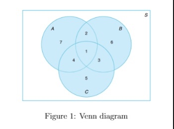

# Activity Question Lecture 4 - Not Graded _ IITM Online Degree (14_4_2026 3_29_17 pm)

 
Note : This activity is only for practice purpose and it will not be counted towards the Final score

**Use the below information for Question (1, 2 and 3)**

Consider a sample space $S$ and three events $A, B,$ and $C$ as shown in Figure $1.4.1.$ Answer the following questions from figure given below:

                                                      

    

 

 
 
 
 
 
 

    

 
 
 
 
 *
 
 
 1 point
 
 *
 
 
Which of the following region represents $A ∩ B$?
 
 
 
 
 
 
region $1$ and region $2$
 
 
 
 
 
 
 
region $1$ and region $3$
 
 
 
 
 
 
 
region $4$ and region $7$
 
 
 
 
 
 
 
region $1$ and region $4$
 
 
 
 
 
###  No, the answer is incorrect. 
Score: 0

### Accepted Answers:

 
region $1$ and region $2$
 
 
 
 
 

    

 
 
 
 
 *
 
 
 1 point
 
 *
 
 
Which of the following region represents $(A ∩ B) ∩ C$?
 
 
 
 
 
 
region $1$
 
 
 
 
 
 
 
region $1$ and region $2$
 
 
 
 
 
 
 
region $4$
 
 
 
 
 
 
 
region $5$
 
 
 
 
 
###  No, the answer is incorrect. 
Score: 0

### Accepted Answers:

 
region $1$
 
 
 
 
 

    

 
 
 
 
 *
 
 
 1 point
 
 *
 
 
Which of the following region represents $(A ∪ B)∩C'$ ̄?
 
 
 
 
 
 
region $2$, region $6$ and region $7$
 
 
 
 
 
 
 
region $1$, region $3$, region $4$ and region $7$
 
 
 
 
 
 
 
region $4$ and region $7$
 
 
 
 
 
 
 
region $1$, region $4$ and region $7$
 
 
 
 
 
###  No, the answer is incorrect. 
Score: 0

### Accepted Answers:

 
region $2$, region $6$ and region $7$