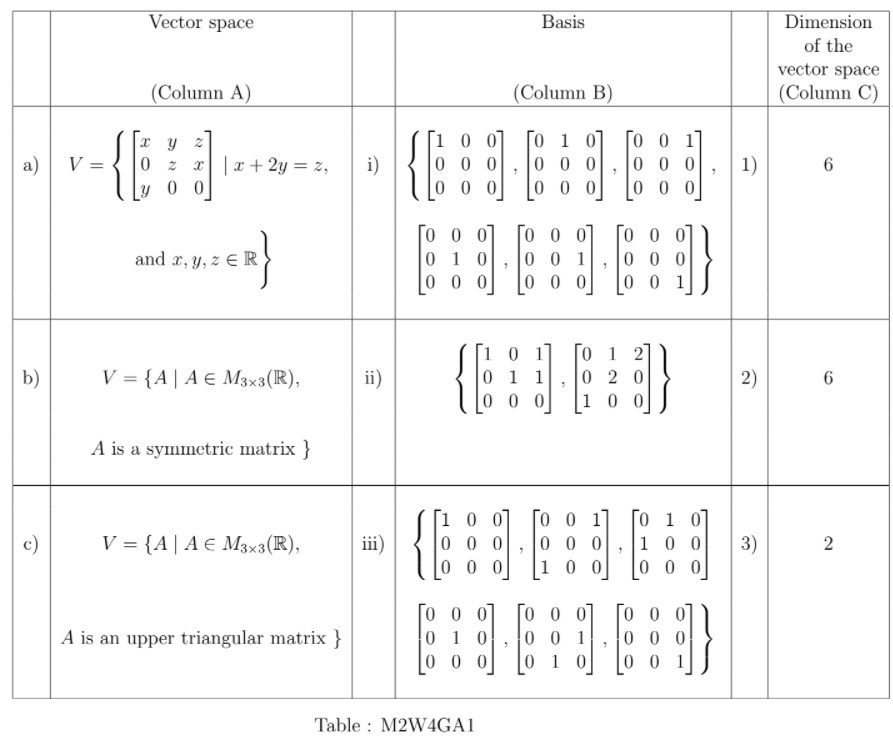

# Week 4 - Graded Assignment 4 _ IITM Online Degree (3_4_2026 5_52_37 pm)

 Note: This assignment will be evaluated after the deadline passes. You will get your score 48 hrs after the deadline. Until then the score will be shown as Zero.

Multiple Select Questions (MSQ)
**
**

    

 

 
 
 
 
 
 

    

 
 
 
 
 *
 
 
 1 point
 
 *
 
 Which of the following statements are correct? 

 
 
 
 
 
 
If $A$ and $B$ are two square matrices, then Rank$(AB)$=Rank$(BA)$.

 
 
 
 
 
 
 
If $A$ and $B$ are two $2\times2$ square matrices, then Rank$(AB) \leq$ Rank$(B)$.

 
 
 
 
 
 
 
If $A$ and $B$ are two $2\times2$ square matrices, then Rank$(AB) \leq$ Rank$(A)$.

 
 
 
 
 
 
 
If $A$ and $B$ are $n \times n$ matrices of rank $n$, then $AB$ has rank $n$.
 
 
 
 
 
###  Yes, the answer is correct. 
Score: 1

### Accepted Answers:

 
If $A$ and $B$ are two $2\times2$ square matrices, then Rank$(AB) \leq$ Rank$(B)$.

 
 
If $A$ and $B$ are two $2\times2$ square matrices, then Rank$(AB) \leq$ Rank$(A)$.

 
 
If $A$ and $B$ are $n \times n$ matrices of rank $n$, then $AB$ has rank $n$.
 
 
 
 
 

    

 
 
 
 
 *
 
 
 1 point
 
 *
 
 
 Match the vector spaces (with the usual scalar multiplication and vector addition as in $M_{3\times 3}(\mathbb{R})$ ) in column A with their bases in column B and the dimensions of the vector spaces in column C in Table : M2W4GA1.

Choose the correct option.

 
 
 
 
 
 
a $\rightarrow$ i $\rightarrow$ 2.

 
 
 
 
 
 
 
b $\rightarrow$ i $\rightarrow$ 2.

 
 
 
 
 
 
 
a $\rightarrow$ ii $\rightarrow$ 3. 

 
 
 
 
 
 
 
c $\rightarrow$ iii $\rightarrow$ 1 

 
 
 
 
 
 
 
b $\rightarrow$ iii $\rightarrow$ 2. 

 
 
 
 
 
 
 
c $\rightarrow$ i $\rightarrow$ 1.
 
 
 
 
 
### Partially Correct. 
Score: 0.33

### Accepted Answers:

 
a $\rightarrow$ ii $\rightarrow$ 3. 

 
 
b $\rightarrow$ iii $\rightarrow$ 2. 

 
 
c $\rightarrow$ i $\rightarrow$ 1.
 
 
 
 
 

    

 
 
 
 
 *
 
 
 1 point
 
 *
 
 
Consider the vector space $V =\left\{\begin{bmatrix}a & b \\b & c \end{bmatrix} \:\middle |\: a, b, c ∈ \mathbb{R}\right\}$. The subset $S =\left\{\begin{bmatrix}2 & 1 \\1 & 3 \end{bmatrix} , \begin{bmatrix}1 & 0 \\0 & 1 \end{bmatrix}\right\}$ is a linearly independent subset of $V$ . Which of the following matrices $A$ are vectors in $V$ such that $S ∪ \big\{A\big\}$ is a basis for $V$ ?
 
 
 
 
 
 
$\begin{bmatrix}1 & 0 \\1 & 1 \end{bmatrix}$
 
 
 
 
 
 
 
$\begin{bmatrix}0 & 1 \\1 & 0 \end{bmatrix}$
 
 
 
 
 
 
 
$\begin{bmatrix}2 & 0 \\0 & 3 \end{bmatrix}$
 
 
 
 
 
 
 
$\begin{bmatrix}0 & 1 \\1 & 1 \end{bmatrix}$
 
 
 
 
 
 
 
$\begin{bmatrix}1 & -1 \\-1 & 1 \end{bmatrix}$
 
 
 
 
 
 
 
$\begin{bmatrix}1 & -1 \\-1 & 0 \end{bmatrix}$
 
 
 
 
 
###  Yes, the answer is correct. 
Score: 1

### Accepted Answers:

 
$\begin{bmatrix}0 & 1 \\1 & 0 \end{bmatrix}$
 
 
$\begin{bmatrix}2 & 0 \\0 & 3 \end{bmatrix}$
 
 
$\begin{bmatrix}1 & -1 \\-1 & 1 \end{bmatrix}$
 
 
 
 
 

    

 
 
 
 
 *
 
 
 1 point
 
 *
 
 
Let $S = \{v_1, v_2, v_3\}$ be a set of three vectors in $\mathbb{R}^4$. In order to determine the linear dependence/independence of $S$, we construct a matrix $A$ whose $i^{th}$ column is given by $v_i$, for $i ∈ \{1, 2, 3\}$. Let $R$ denote the reduced row echelon form (RREF) of $A$, and
let $r_{ij}$ denote the $(i, j)^{th}$ entry of $R$. Choose the correct statements from the following.
 
 
 
 
 
 
$R$ does not have any row comprising entirely of zeros if $S$ is linearly independent.
 
 
 
 
 
 
 
If $k$ is the number of rows in $R$ comprising entirely of zeros, then the dimension of
Span$(S)$ is given by $4 − k$.
 
 
 
 
 
 
 
If $r_{11}$ and $r_{23}$ are the pivots, then $\{v_1, v_2\}$ is a basis for Span$(S)$.
 
 
 
 
 
 
 
If $r_{11}$ and $r_{23}$ are the pivots, then $\{v_1, v_3\}$ is a basis for Span$(S)$.
 
 
 
 
 
 
 
rank$(A)$ = rank$(R)$, i.e., row operations do not alter the rank of a matrix.
 
 
 
 
 
###  Yes, the answer is correct. 
Score: 1

### Accepted Answers:

 
If $k$ is the number of rows in $R$ comprising entirely of zeros, then the dimension of
Span$(S)$ is given by $4 − k$.
 
 
If $r_{11}$ and $r_{23}$ are the pivots, then $\{v_1, v_3\}$ is a basis for Span$(S)$.
 
 
rank$(A)$ = rank$(R)$, i.e., row operations do not alter the rank of a matrix.
 
 
 
 
 
 

**
**Numerical Answer Type (NAT):
**
**

    

 

 
 
 
 
 
 

    

 
 
 
 
 
 
Find the rank of the matrix $A$, where $A = [a_{ij}]$ is of order $2021\times 2021$ and $a_{i,j} = \text{min}\{i, j\}$, $i, j = 1, 2, \ldots 2021$ 
 [$\textbf{Hint:}$ First do it for smaller matrices, such as $3\times 3$ or $4\times 4$.]

 
 
 
 
 
 
 
 
###  Yes, the answer is correct. 
Score: 1

### Accepted Answers:
(Type: Numeric) 2021
 
 
 *
 
 
 1 point
 
 *
 

 
 
 

    

 

 
 
 
 
 
 

    

 
 
 
 
 
 
Consider a subspace $W= \{(x_1, x_2, x_3, x_4, x_5) ~ | ~8x_1+10x_5=0 ~ \text{and} ~ 9x_2+6x_4=0 \}$ of $\mathbb{R}^5$. The dimension of $W$ is 
 
 
 
 
 
 
 
 
###  Yes, the answer is correct. 
Score: 1

### Accepted Answers:
(Type: Numeric) 3
 
 
 *
 
 
 1 point
 
 *
 

 
 
 

    

 

 
 
 
 
 
 

    

 
 
 
 
 
 
Consider a matrix $A=\begin{bmatrix} 2 & -4 & 1 & 1 \\ 1 & -3 & 1 & -4 \\ 3 & -7 & 2 & 3 \end{bmatrix}$. The rank of the matrix is 
 
 
 
 
 
 
 
 
###  Yes, the answer is correct. 
Score: 1

### Accepted Answers:
(Type: Numeric) 3
 
 
 *
 
 
 1 point
 
 *
 

 
 
 

    

 

 
 
 
 
 
 

    

 
 
 
 
 
 
Consider two matrices $A=\begin{bmatrix} 3 & 9 & 8 \\ -7 & -10 & -9 \\ 2 & 6 & -7 \\ \end{bmatrix}$ and $B=\begin{bmatrix} 3 & -7 & 2 \\ 9 & -10 & 6 \\ 8 & -9 & -7 \end{bmatrix}$. Then Rank$(A)$ - Rank $(B)$ is 
 
 
 
 
 
 
 
 
###  Yes, the answer is correct. 
Score: 1

### Accepted Answers:
(Type: Numeric) 0
 
 
 *
 
 
 1 point
 
 *
 

 
 
 

    

 

 
 
 
 
 
 
 

    

 

 
 
 
 
 
 
 

    

 

 
 
 
 
 
 

    

 
 
 
 
 
 
Consider the subspace $V = \{ (x,y,z)~ | ~z = 7x + 5y,~\text{where}~ x,y,z \in \mathbb{R}\}$ of $\mathbb{R}^3$ and span($\{(p,0,1), (0,q,1)\}$) = $V$. Find the value of $\frac{1}{pq}$.
 
 
 
 
 
 
 
 
###  Yes, the answer is correct. 
Score: 1

### Accepted Answers:
(Type: Numeric) 35
 
 
 *
 
 
 1 point
 
 *
 

 
 
 

    

 

 
 
 
 
 
 

    

 
 
 
 
 
 
Suppose $V$ is a vector space defined as $V = \{ A \mid A \in M_{4 \times 4}(\mathbb{R}),~A$ is an upper triangular matrix, and the sum of the diagonal entries is zero $\}$. What is the cardinality of a basis of $V$? 
 
 
 
 
 
 
 
 
###  Yes, the answer is correct. 
Score: 1

### Accepted Answers:
(Type: Numeric) 9.0
 
 
 *
 
 
 1 point
 
 *
 

 
 
 

    

 
 
 
 
 
 
$\mathcal{U}$ is the vector space of all upper triangular matrices of order 3. $\mathcal{V}$ is the vector space of all lower triangular matrices of order 3. The dimensions of the vector spaces $\mathcal{U}, \mathcal{V}, \mathcal{U} \cap \mathcal{V}$ are $a, b, c$ respectively. Find $a + b + c$. The usual rules of addition and scalar multiplication apply for all three spaces.
 
 
 
 
 
 
 
 
###  Yes, the answer is correct. 
Score: 1

### Accepted Answers:
(Type: Numeric) 15
 
 
 *
 
 
 1 point
 
 *